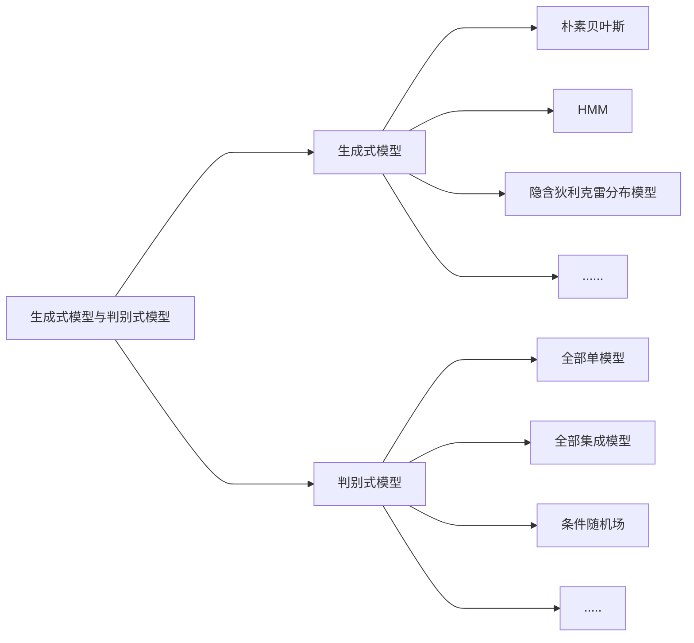

# 置换不变池化
置换不变池化（permutation-invariant pooling）是一种池化操作,它可以将输入数据中的不同元素进行聚合,生成一个固定大小的输出。与传统的池化操作不同,置换不变池化不考虑输入数据中元素的顺序,而只关注元素的值。因此,它可以处理任意排列的输入数据,并生成相同的输出。在数字病理学图像级任务中,置换不变池化通常用于将多个小图像块的特征进行聚合,生成一个整体的特征表示。

# 亚型
癌症亚型（Cancer subtype）是指同种癌症在分子水平上呈现出不同的表型和生物学特征。相同的癌症可能由于基因突变、基因表达、蛋白质表达等因素的不同而被分为不同的亚型。这些亚型可以在临床上具有不同的表现和预后,因此对于癌症的诊断和治疗具有重要的意义。例如,乳腺癌可以分为雌激素受体阳性、HER2阳性和三阴性等亚型,不同亚型的治疗策略也会有所不同。

# 知识蒸馏
知识蒸馏（Knowledge Distillation）是一种模型压缩技术,通过将一个较大、较复杂的模型（教师模型）的知识迁移到一个较小、较简单的模型（学生模型）中,来提高学生模型的性能和泛化能力。知识蒸馏的基本思想是,利用教师模型的预测结果和特征表示来指导学生模型的训练,使学生模型能够学习到教师模型的“知识”。

知识蒸馏的目的是在保持模型性能的同时,减少模型的计算和存储开销,提高模型的运行效率和可部署性。知识蒸馏可以应用于各种深度学习任务,例如图像分类、目标检测、语音识别等。


# 余弦距离
余弦距离是计算两个向量之间相似度的一种方法,通常用于文本数据或高维数据的相似度比较。它通过考虑两个向量之间的夹角来计算它们之间的关系,而不是简单地使用欧几里得距离。
具体来说,余弦距离是两个向量的点积除以它们的长度乘积,如下所示：
cosine_distance = dot_product(vector1, vector2) / (||vector1|| * ||vector2||)
其中,dot_product表示点积运算,而||vector||对应着向量vector的长度。
一个例子就是,假设我们有两个向量v1=`[1, 2, 3]`和v2=`[4, 5, 6]`,则它们之间的余弦距离为：
cosine_distance = `(1*4 + 2*5 + 3*6) / (√(1^2+2^2+3^2) * √(4^2+5^2+6^2)) = 0.9746`
这个值说明了v1和v2之间的相似度很高,因为它们之间的夹角很小。


# KNN算法

KNN（K-Nearest Neighbor）最邻近分类算法是数据挖掘分类（classification）技术中最简单的算法之一,其指导思想是”近朱者赤,近墨者黑“,即由你的邻居来推断出你的类别。

KNN最邻近分类算法的实现原理：为了判断**未知样本**的类别,以所有**已知类别的样本**作为参照,计算**未知样本与所有已知样本的距离**,从中**选取与未知样本距离最近的K个已知样本**,根据少数服从多数的投票法则（majority-voting）,将未知样本与K个最邻近样本中所属类别占比较多的归为一类。

以上就是KNN算法在分类任务中的基本原理,实际上K这个字母的含义就是要选取的最邻近样本实例的个数,在 scikit-learn 中 KNN算法的 K 值是通过 n_neighbors 参数来调节的,默认值是 5。

如下图所示,如何判断绿色圆应该属于哪一类,是属于红色三角形还是属于蓝色四方形？如果K=3,由于红色三角形所占比例为2/3,绿色圆将被判定为属于红色三角形那个类,如果K=5,由于蓝色四方形比例为3/5,因此绿色圆将被判定为属于蓝色四方形类。


# 正样本(Positive Pairs)、负样本、简单样本、困难样本

> [!summary]+ 名词解释
> **正样本**： 与真值对应的目标类别来说该样本为正样本。     
> **负样本**： 与真值不对应的其他所有目标类别来说该样本为负样本。      
> **简单样本**： 预测时与真值标签误差较小的样本。       
> **困难样本**： 预测时与真值标签误差较大的样本。     

我们以猫狗分类来举例说明什么是正负样本：

> [!example]+
> label = dog 的所有图片**都是这个类**的正样本,其他图片作为负样本          
> label = cat 的所有图片**都是这个类**的正样本,其他图片作为负样本        


同理,在目标检测任务中

> [!summary]
> box 中有目标对象就是正样本,没有目标对象,也就是前景,看做负样本


接下来我们在用图片分类来说明什么是简单困难样本：

> [!summary]+
> 假如我们需要识别马、羊、牛三个类别。          
> 给一张马的图片。对于预测马来说这个样本为正样本,对于预测羊和牛来说该样本为负样本。         
> 真值one-hot标签：[1, 0, 0],而在预测出概率分布为[0.3, 0.3, 0.4]时,       
> 真值one-hot标签相差较大,则此时该样本是困难样本。            
> 而预测出[0.98, 0.01, 0.01]时,与真值one-hot标签相差较小,则此时该样本为简单样本。        

对于困难样本因为真值one-hot标签[1,0,0] 其中按照我们人为思路给定的这张为马的图片概率是1,但是预测出来的概率为0.3,这与实际相差太大了,所以称这样的样本为困难样本。


# sharpening and the centerin
在深度学习中,`Sharpening`和`Centering`是两种常用的数据预处理方法,它们可以帮助优化神经网络训练模型的性能。
**Sharpening**
`Sharpening`是一种**数据增强**技术,可以通过对图像进行微小的**旋转、缩放或移动**等变换,来创造更多的训练样本。具体而言,这个技术通常会在训练集中随机选择一些图像,然后对这些图像根据一定的参数（例如角度、缩放比例等）进行扰动,生成新的样本,从而让模型在学习时变得更加鲁棒和健壮。Sharpening的主要优点是能够增加真实世界中的差异性,从而提高模型的泛化能力。

**Centering**

Centering是一种对**数据进行标准化**的方法,主要用于调**整数据均值和方差**,使其分布在一个合理的范围内。这个技术通常会将每个特征减去其均值,并除以其方差,这样就能使不同的特征具有相似的尺度,从而减少过拟合的风险,同时加快了训练速度。

总的来说,Sharpening和Centering都是非常重要的数据预处理技术,可以帮助提高深度学习模型的性能和准确率。在训练神经网络之前,将数据进行Sharpening和Centering处理,通常是一个值得尝试的好方法。


# Global Crop和Local Crop
在深度学习中,Global Crop（全局裁剪）和Local Crop（局部裁剪）是两种常用的图像预处理方法,主要用于改变输入图像的尺寸以适应神经网络的输入要求。

1. Global Crop（全局裁剪）：  
    全局裁剪是将整个图像按照一定的尺寸进行裁剪。通常,全局裁剪会保留图像的中心区域,同时去掉边缘部分。这种方法的优点是可以保留图像的主要信息,减少无关信息的干扰。全局裁剪通常用于固定尺寸的图像输入,如卷积神经网络（CNN）等。
    
2. Local Crop（局部裁剪）：  
    局部裁剪是指从原始图像中选择一个或多个较小的区域进行裁剪。这种方法可以根据目标任务的需求,有针对性地保留感兴趣的区域,同时去除无关信息。局部裁剪通常用于目标检测、图像分割等任务,可以提高模型的性能和准确性。
    
总之,全局裁剪和局部裁剪是两种不同的图像预处理方法,它们在不同的任务中发挥着不同的作用。全局裁剪更关注于整体信息的保留,而局部裁剪则更关注于特定区域的信息提取。


# Color Jitter
在深度学习中,Color Jitter是一种**数据增强**技术,用于增加图像数据的多样性和泛化能力。具体来说,它是通过对**图像的色彩通道进行扰动**来生成新的训练数据。
Color Jitter可应用于图像分类、目标检测等各种计算机视觉任务,其主要思想是在训练过程中,对每张训练图像进行随机变换,以产生更多的数据样本,从而提高模型的鲁棒性和泛化性能。通常的颜色抖动方式包括**改变亮度（brightness）、对比度（contrast）、饱和度（saturation）和色调（hue）**等,这些变换可以独立或组合使用。

例如,我们可以随机调整一张图像的亮度、对比度和饱和度来生成新的训练样本。通过将此操作应用于所有训练数据,我们可以增加数据样本的多样性,并使模型更好地适应不同的输入。
因此,Color Jitter是深度学习中常用的一种数据增强技术,可以有效地增加训练数据量,提高模型的性能和泛化能力。


# 各种监督学习
不同的机器学习任务需要使用不同的学习方式,以下是对各种监督学习方式的详细解释：

## 有监督学习
- 有监督学习：这种学习方式适用于分类和回归等问题。在有监督学习中,给模型提供有标签的训练数据,让它从中学习出与输入数据相关的输出数据（如类别或数值）。最常见的例子是图像分类,其中计算机需要从标记的图像数据集中学习如何将不同的物体分类成不同的类别。

## 无监督学习
- 无监督学习：这种学习方式适用于聚类、降维和异常检测等问题。在无监督学习中,没有标签的数据用于训练模型,目标是从数据中学习结构和规律性,然后将数据分组。一个例子是希望找到一组具有类似特征的客户并将其分为一类,而将另一组客户作为另一类。


## 半监督学习
- 半监督学习：这种学习方式综合了有监督和无监督学习的优点,适用于当有大量未标注的数据和少量已标注的数据时。在半监督学习中,模型既使用已标注的数据来训练,也使用未标注的数据来提高模型性能。例如,在医疗图像分类中,计算机可以使用少量影像标注数据来训练分类器,而使用未标注的所有其他影像数据来提高分类准确性。

## 自监督学习
- 自监督学习：这种学习方式是最新的机器学习方法之一,旨在通过利用数据本身的特点来生成标签。在自监督学习中,模型需要从未经过标记的原始数据中学习特征,并将该数据作为其自身的标签。这种方法现在被广泛应用于自然语言处理、计算机视觉和语音识别等任务中。

## 弱监督学习
- 弱监督学习：这种学习方式适用于当已有的标注数据存在噪声或不完整时。弱监督学习的目标是利用局部标注的数据集（如多个实例）来获得更全面的标注信息。在弱监督学习中,计算机使用带噪声的数据进行训练,以学习出概括性模式。对于语音识别问题,弱监督学习可用于只有一些特定语音环境的标注的情况。


# Projection head

在深度学习中,Projection head是一种特殊的神经网络结构,通常与卷积神经网络（Convolutional Neural Network）或自编码器（Autoencoder）结合使用。它通过将高维特征向量投影到低维空间上,来提取数据特征并用于分类、聚类等任务。

Projection head通常被用于无监督或半监督学习任务中,并作为模型的最后一层或附加在模型末端的额外层进行模型微调。在训练阶段,Projection head会学习将高维特征映射到低维空间上的新表示法,这些新表示法可以更好地表示原始数据的关键特征。然后,这些新的低维表示可以用于分类或聚类等任务。

对于无监督或半监督的场景,Projection head通常与对比损失函数（Contrastive Loss Function）结合使用。该损失函数旨在使同一样本的不同视图比其他样本更相似,通过挖掘样本之间的相关性来促进特征学习。这使得Projection head在提取特征时能够更好地保留有用信息,并更好地完成模型所需的任务。


# 多示例学习（Multiple Instance Learning）

多示例学习(multiple-instance learning)是1997年被提出的。其与监督学习、半监督学习和非监督学习有所不同,它是以**多示例包(bag)** 为训练单元的学习问题。

在多示例学习中,训练集由一组具有分类标签的多示例包(bag)组成 ,每个多包(bag)含有若干个没有分类标签的示例(instance)。如果多示例包(bag)至少含有一个正示例(instance),则该包被标记为正类多示例包（正包）。如果多示例包的所有示例都是负示例,则该包被标记为负类多示例包（负包）。**多示例学习的目的是,通过对具有分类标签的多示例包的学习,建立多示例分类器,并将该分类器应用于未知多示例包的预测。**

举例一：
        很多传统的分类问题可以转化为多示例学习问题。例如,在图像分类中,我们把含有“大象”的图像被分为正类,不含有“大象”的图像被分为负类。在训练集中,假设60幅图像含有“大象”,40幅图像不含有“大象”。

- 对于上图,在传统分类中,一幅图像可以转化为一个向量（示例）。因此,数据集中有60个正类示例（图像）和40个负类示例（图像）。每一个示例（图像）的label都是已知的,训练集给定的。在60个正类示例和40个负类示例的基础上,建立分类器,区分正类示例和负类示例
- 但是,一幅可能包含复杂的内容信息,譬如这幅画不仅含有“大象”,还包含了天空、和草地等多个图像内容。对于“大象”来说,“天空”和“草地”可以被认为是噪声,这导致预测时分类精确度的降低。
- 因此如果把整幅图像看作单个向量,难以充分描述多个图像内容。为此,研究者把图像按照不同内容区域进行分割,如下：

我们把图2看作一个多示例包bag,1个分割区域看作一个示例`instance`。由于图2含有3个分割区域,因此图2的多示例包含有3个示例`instance`。每一个分割区域（`instance`）可以转化为1个向量。因此,图2的多示例包含有3个向量,这就把传统的图像分类转化为多示例学习问题。


# Energy functions
Energy functions指的是在物理、计算机视觉、图形学等领域中一类用来描述系统状态的函数。这些函数通常基于系统中所有元素的状态变量（如位置、速度、温度等）来计算系统的总能量。在优化问题中,这些能量函数可以被构造为满足特定的性质,例如对系统状态的约束、最小化系统总能量等。在计算机视觉和图形学领域中,能量函数通常用于表示图像或模型的整体特征,以便进一步进行优化和模型求解。


# False negatives and True positives
在实例分割中,模型预测出的结果可能会包含以下情况：

- False negatives：这是指模型未能检测到物体的实例,即实际上存在但被模型忽略了。例如,在一张包含汽车和行人的图像中,如果模型仅检测到汽车而未检测到任何行人,则行人的实例将被认为是false-negative。

- True positives：这是指模型正确检测到物体实例的情况,即模型的预测与真实值相同。例如,在一张包含汽车和行人的图像中,如果模型正确地检测到所有的汽车和行人实例,则这些实例将被认为是true-positives。

在实例分割中,模型的性能通常通过不同标准来评估其中的精度。例如,常用的标准是Intersection over Union (IoU),它衡量模型预测的边界框与真实边界框之间的重叠。其他标准还包括平均精确度均值（mAP）等。理想情况下,我们希望模型的TP率最大化,FN率最小化,从而获得更高水平的分割结果。

# proposals
在本文中,提到的proposals指的是实例提议,是指表示图像中**潜在实例的框或像素点的情况**。

# 特征金字塔
特征金字塔（Feature Pyramid）是一种用于多尺度目标检测和图像分割的技术。它通过在网络中构建多个特征层,每个特征层都具有不同的分辨率和感受野大小,从而捕获不同细节级别的特征。

通常,在深度学习中,卷积神经网络（CNN）可以提取出多层的特征表示,其中靠近输入层的层更适合处理**细节信息**,而靠近输出层的层则更擅长处理**语义信息**。然而,这些特征层通常只针对单一的感受野尺度进行操作,因此可能无法有效地检测或分割具有不同尺度的目标或物体。

特征金字塔通过在网络中引入额外的跨尺度连接或者特征合并操作来解决这个问题。通过将上层的特征图与下层的特征图进行结合,特征金字塔能够在不同的分辨率上具有更丰富的感受野,从而获取到更全局和更细粒度的特征信息。这样就可以同时识别和定位不同尺度的目标或物体,提高了模型在多尺度场景下的表现能力。

特征金字塔通常用于目标检测任务中的主干网络,如Faster R-CNN、RetinaNet等。它还可以应用于图像分割领域,如Mask R-CNN等。

总结起来,特征金字塔是一种通过在深度学习网络中构建多个具有不同分辨率和感受野的特征层来捕获多尺度信息的技术。这使得网络能够有效处理不同尺度的目标或物体,并提高模型在多尺度场景下的性能。


# absolute regression和relative regression

在DETR（Detection Transformer）中,绝对回归（absolute regression）和相对回归（relative regression）是两种不同的目标框定位方法。

绝对回归是指将目标框的位置信息表示为绝对坐标,在DETR中使用的是框的左上角和右下角的绝对像素坐标。使用绝对回归时,模型直接预测目标框在图像中的精确位置,这样可以提供具体的位置信息,但对目标的尺度变化和特定场景的适应性较差。

相对回归则是指将目标框的位置信息表示为相对于特定参考点或参考框的偏移量。在DETR中,相对回归使用的是目标框相对于图像均分成的网格单元的中心点偏移量以及宽度和高度的相对变换。相对回归通过归一化的方式来表示目标框位置,使得模型更加关注目标在图像中的相对位置和尺度变化,从而提高了模型的泛化能力。

相对回归有助于处理目标在图像中自由运动的情况,对于目标的尺度变化和不同场景的适应性更强。另外,相对回归还具有可解释性,因为它提供了目标与参考对象之间的位置关系。

在DETR中,相对回归被证明是有效的,可以准确地定位目标框。绝对回归也可以使用,但相对回归在处理目标检测任务时更受青睐。


# CNN的归纳偏置

## 局部性 Locality：
假设图片上**相邻的区域会有相邻的特征**,靠的越近的东西**相关性越强**。

## 平移等变性 Translation equivariance
平移同变性 即$$f(g(x))=g(f(x))$$,$f$$为卷积$ $g$为平移
无论先做卷积还是平移,卷积核相当于模板,不论图片中同样的物体移到哪里,只要是同样的输入进来,遇到同样的卷积核,其输出永远是一样的


# 生成式模型与判别式模


**生成式模型**和**判别式模型**是机器学习中两种常见的模型类型。
- 生成式模型，又称概率模型，是指通过学习**数据的分布**来建立模型`P(y|x)`，然后利用该模型来生成新的数据。生成式模型的典型代表是朴素贝叶斯模型，该模型通过学习数据的分布来建立概率模型，然后利用该模型来生成新的数据。
- 判别式模型，又称非概率模型，是指通过学习**输入和输出之间的映射关系**来建立模型`y=f(x)`，然后利用该模型来预测新的输出。判别式模型的典型代表是支持向量机模型，该模型通过学习输入和输出之间的映射关系来建立分类模型，然后利用该模型来预测新的分类结果。

总的来说，生成式模型和判别式模型都有各自的优缺点，选择哪种模型取决于具体的应用场景和数据特征。
- 常见生成式模型：决策树、朴素贝叶斯、隐马尔可夫模型、条件随机场、概率潜在语义分析、潜在狄利克雷分配、高斯混合模型；
- 常见判别式模型：感知机、支持向量机、K临近、Adaboost、K均值、潜在语义分析、神经网络；
- 逻辑回归既可以看做是生成式也可以看做是判别式。





# 上游任务和下游任务

## 计算机视觉四大任务：
分类（解决"what"）、定位（解决"where"）、检测（解决"what"和"where"）、分割（实例分割、语义分割和场景分割等像素级别的处理）

## 上游任务：
**预训练模型**。一般就是利用上游数据进行预训练，以生成一个包含**视觉表征能力**的模型。

比如，我们想要的是一个能够提取图片特征能力的卷积神经网络或者Transformer，我们会用大量图片用图片分类这个下游任务或者其他比如自监督的方法（可以参考CLIP）去进行训练，得到一个**权重合适的模型**（能够很好地提取出图像的特征），那么最后我们把得到的这个模型最后一层的`FC层`（原本用于图片分类输出类别）去掉，这个模型就成为了一个很好的预训练模型，输入一张图，就能够提取出图像的特征，就可以用于我们的下游任务（在这个模型后面加一些诸如检测头之类的模块，处理我们想要的下游任务，或者修改下FC层，用于另外一堆类别的图像分类）。
## 下游任务：
下游任务是计算机视觉应用程序，用于评估通过自监督学习学习到的特征的质量。当训练数据稀缺时，这些应用程序可以极大地受益于预训练模型。
下游任务更多的是评估任务，相当于项目落地，需要去做具体任务来评价模型好坏。

如**图像分类，目标检测、语义分割**等具体任务。
下游上游的取名就在于下游任务往往是先用上游任务得到的模型（一般会称为backbone，主干网络）提取图像特征，然后再从这些特征中得到我们想要的结果。


# 指数移动平均（EMA）

## EMA的定义

**指数移动平均**（Exponential Moving Average）也叫权重移动平均（Weighted Moving Average），是一种给予**近期数据更高权重**的平均方法。

假设我们有n个数据： $[\theta_1,\theta_2,...,\theta_n]$

- 普通的平均数：$\bar{v}=\frac{1}{n}\sum_{i=1}^{n}\theta_i$
- EMA: $v_t=\beta \cdot v_{t-1}+(1-\beta) \cdot \theta_t$,其中，$v_t$表示前t条的平均值（$v_0=0$),$β$是加权权重值（一般设为$0.9-0.999$)。 

EMA可以近似看成过去 $1/(1-B)$个时刻$v$值的平均。 
普通的过去n时刻的平均是这样的： 
$$v_t= \frac{(n-1) \cdot v_{t-1}+\theta_t}{n}$$
类比EMA,可以发现当$β=\frac{n-1}{n}$时，两式形式上相等。需要注意的是，两个平均并不是严格相 等的，这里只是为了帮助理解。 

实际上，EMA计算时，过去1/(1-\theta)个时刻之前的数值平均会decay到\frac{1}{e}的加权比例，证明如下。 
如果将这里的v_t展开，可以得到： 
$$v_t=\alpha^nv_{t-n}+(1-\alpha)(\alpha^{n-1}\theta{t-n+1}+...+\alpha^0\theta_t)$$
其中，$n=\frac{1}{1-\alpha}$,代入可以得到$\alpha^n=\alpha^{\frac{1}{1-\alpha}}\approx \frac{1}{e}$


## 在深度学习的优化中的EMA

上面讲的是广义的ema定义和计算方法，特别的，在深度学习的优化过程中， $\theta_t$是t时刻的模型权重weights， $v_t$是t时刻的影子权重（shadow weights）。在梯度下降的过程中，会一直维护着这个影子权重，但是这个影子权重并不会参与训练。基本的假设是，**模型权重在最后的n步内，会在实际的最优点处抖动，所以我们取最后n步的平均，能使得模型更加的鲁棒。**

## MA的偏差修正

实际使用中，如果令 $v_0=0$ ，且步数较少，ema的计算结果会有一定偏差。


理想的平均是绿色的，因为初始值为0，所以得到的是紫色的。
因此可以加一个偏差修正（bias correction）:

$$v_t=\frac{v_t}{1-\beta^t}$$
显然，当t很大时，修正近似于1。

## EMA为什么有效

网上大多数介绍EMA的博客，在介绍其为何有效的时候，只做了一些直觉上的解释，缺少严谨的推理，瓦砾在这补充一下，不喜欢看公式的读者可以跳过。

令第n时刻的模型权重（weights）为 $v_n$，梯度为$g_n$，可得：


令第n时刻EMA的影子权重为 $v_n$，可得：


代入上面$\theta_n$的表达，令 $v_0=\theta_1$ 展开上面的公式，可得：


对比两式：


EMA对第i步的梯度下降的步长增加了权重系数$1-\alpha^{n-i}$ ，相当于做了一个`learning rate decay`。

## PyTorch实现

```python
class EMA():
    def __init__(self, model, decay):
        self.model = model
        self.decay = decay
        self.shadow = {}
        self.backup = {}

    def register(self):
        for name, param in self.model.named_parameters():
            if param.requires_grad:
                self.shadow[name] = param.data.clone()

    def update(self):
        for name, param in self.model.named_parameters():
            if param.requires_grad:
                assert name in self.shadow
                new_average = (1.0 - self.decay) * param.data + self.decay * self.shadow[name]
                self.shadow[name] = new_average.clone()

    def apply_shadow(self):
        for name, param in self.model.named_parameters():
            if param.requires_grad:
                assert name in self.shadow
                self.backup[name] = param.data
                param.data = self.shadow[name]

    def restore(self):
        for name, param in self.model.named_parameters():
            if param.requires_grad:
                assert name in self.backup
                param.data = self.backup[name]
        self.backup = {}

# 初始化
ema = EMA(model, 0.999)
ema.register()

# 训练过程中，更新完参数后，同步update shadow weights
def train():
    optimizer.step()
    ema.update()

# eval前，apply shadow weights；eval之后，恢复原来模型的参数
def evaluate():
    ema.apply_shadow()
    # evaluate
    ema.restore()
```


# teacher-student网络,蒸馏(distillation)网络

下面的`soft target`是什么？
属于**迁移学习**的一种。**迁移学习**也就是将一个模型的**性能迁移**到另一个模型上， 对于教师——学生网络，教师网络往往是一个**更加复杂**的网络，具有非常好的性能和泛化能力，可以用这个网络来作为一个`soft target`来指导另外一个更加简单的学生网络来学习，使得更加简单、参数运算量更少的学生模型也能够具有和教师网络相近的性能，也算是一种模型压缩的方式。

## 学习过程

学生网络的训练含有两个目标：一个是`hard target`，即原始的目标函数，为小模型的类别概率输出与**label真值**的交叉熵；另一个为soft target，为小模型的类别概率输出与**大模型的类别概率输出**的交叉熵。


## 改进版本
来自`《Paying More Attention to Attention: Improving the Performance of Convolutional Neural Networks via Attention Transfer》`
原来的方法有`distillation`，就是说希望输出的softmax要类似。这篇文章说，我不仅要softmax类似，我要当中的`attention map`也要类似。`attention map`他这里是用gradient来定义的。
借鉴`Distilling`的思想，使用复杂网络中能够提供视觉相关位置信息的`Attention map`来监督小网络的学习，并且结合了低、中、高三个层次的特征。


具体
  教师网络从三个层次的Attention Transfer对学生网络进行监督。
  其中，“三个层次”对应了ResNet中三组Residual Block的输出。这三个层次的`Attention Transfer`是基于`Activation`的，即`Activation Attention`就是`feature map`在各个通道上的值求和。


# 归一化(normalization)

在机器学习领域中，不同**评价指标**（即特征向量中的不同特征就是所述的不同评价指标）往往具有不同的量纲和量纲单位，这样的情况会影响到数据分析的结果，
为了**消除指标之间的量纲影响**，需要进行**数据标准化处理**，以解决数据指标之间的**可比性**。原始数据经过数据标准化处理后，各指标处于**同一数量级**，适合进行**综合对比评价**。其中，最典型的就是数据的**归一化处理**。

简而言之，归一化的目的就是使得预处理的数据被限定在一定的范围内（比如`[0,1]`或者`[-1,1]`），从而消除奇异样本数据导致的不良影响。

**奇异样本数据**是指相对于其他输入样本**特别大或特别小**的样本矢量（即特征向量）
譬如，下面为具有两个特征的样本数据`x1、x2、x3、x4、x5、x6`（特征向量—>列向量）,其中x6这个样本的两个特征相对其他样本而言相差比较大，因此，x6认为是奇异样本数据。
 
|x1| x2  | x3  | x4  |x5|<font color=#ff0000>x6</font>|
|:-:|:-:|:-:|:-:|:-:|:-:|
| 2.0 | 1.8 | 2.1 | 1.9 | 2.2 | 45.5 |
| 1.0 | 1.2 | 0.9 | 0.8 | 1.5 | 10.5 |
奇异样本数据的存在会引起**训练时间增大**，同时也**可能导致无法收敛**，因此，当存在奇异样本数据时，在进行训练之前需要对预处理数据进行归一化；反之，不存在奇异样本数据时，则可以不进行归一化。

## **归一化的对比**

- 如果不进行归一化，那么由于特征向量中不同特征的取值相差较大，会导致目标函数变“扁”。这样在进行梯度下降的时候，梯度的方向就会偏离最小值的方向，走很多弯路，即训练时间过长。

	

- 如果进行归一化以后，目标函数会呈现比较“圆”，这样训练速度大大加快，少走很多弯路。
	

综上可知，归一化有如下好处，即
- 归一化后加快了梯度下降求最优解的速度，也即加快训练网络的收敛性；
- 归一化有可能提高精度

## **几种归一化的方法**

### **1 最大最小标准化（Min-Max Normalization）**

$$
x^{\prime}=\frac{x-min(x)}{max(x)-min(x)}
$$
1. 线性函数将原始数据线性化的方法转换到`[0 1]`的范围, 计算结果为归一化后的数据，X为原始数据
2. 本归一化方法比较适用在**数值比较集中**的情况；
3. **缺陷**：如果max和min不稳定，很容易使得归一化结果不稳定，使得后续使用效果也不稳定。实际使用中可以用经验常量来替代max和min。

**应用场景：** 在不涉及距离度量、协方差计算、数据不符合正太分布的时候，可以使用第一种方法或其他归一化方法（不包括**Z-score方法**）。比如图像处理中，将RGB图像转换为灰度图像后将其值限定在`[0,255]`的范围

### **2 z—score 标准化**

$$
x^{*}=\frac{x-\mu}{\sigma}
$$

其中，μ、σ分别为原始数据集的均值和方法。

1. 将原始数据集归一化为均值为0、方差1的数据集
2. 该种归一化方式要求原始数据的分布可以**近似为高斯分布**，否则归一化的效果会变得很糟糕。

**应用场景**：在分类、聚类算法中，需要使用距离来度量相似性的时候、或者使用PCA技术进行降维的时候，`Z-score standardization`表现更好。

### **3 神经网络归一化**

**本归一化方法经常用在数据分化比较大的场景，有些数值很大，有些很小。通过一些数学函数，将原始值进行映射。**
该方法包括log，正切等，需要根据数据分布的情况，决定非线性函数的曲线：

### **（1）log对数函数归一化**

$$y=log10(x)$$

即以10为底的对数转换函数，对应的归一化方法为：

$$x^{\prime}=\frac{log_{10}(x)}{log_{10}(max)}$$

其中max表示样本数据的最大值，并且所有样本数据均要大于等于1.

### **（2）反正切函数归一化**

$$x^{\prime}=atan(x)(2/pi)$$

使用这个方法需要注意的是如果想映射的区间为`[0，1]`，则数据都应该大于等于0，小于0的数据将被映射到`[－1，0]`区间上.

### **4 L2范数归一化**

定义：特征向量中每个元素均除以向量的L2范数：


## **什么时候用归一化？**

1. **如果对输出结果范围有要求**，用归一化。
2. **如果数据较为稳定，不存在极端的最大最小值**，用归一化。
3. **如果数据存在异常值和较多噪音，用标准化，可以间接通过中心化避免异常值和极端值的影响。**


# 高斯模糊、高斯函数、高斯核、高斯卷积操作

通常，图像处理软件会提供"模糊"（blur）滤镜，使图片产生模糊的效果。


"模糊"的算法有很多种，其中有一种叫做"**高斯模糊**"（Gaussian Blur）。它将正态分布（又名"高斯分布"）用于图像处理。
本文介绍"高斯模糊"的算法，你会看到这是一个非常简单易懂的算法。本质上，它是一种**数据平滑技术**（`data smoothing`），适用于多个场合，图像处理恰好提供了一个直观的应用实例。

## 1. 高斯模糊的原理

所谓"模糊"，可以理解成**每一个像素都取周边像素的平均值**


上图中，2是中间点，周边点都是1。


"中间点"取"周围点"的平均值，就会变成1。在数值上，这是一种"**平滑化**"。在图形上，就相当于产生"模糊"效果，"中间点"**失去细节**。


显然，**计算平均值时，取值范围越大，"模糊效果"越强烈**。


上面分别是原图、模糊半径3像素、模糊半径10像素的效果。模糊半径越大，图像就越模糊。从数值角度看，就是数值越平滑。

> **接下来的问题就是，既然每个点都要取周边像素的平均值，那么应该如何分配权重呢？**
> 如果使用简单平均，显然不是很合理，因为图像都是连续的，越靠近的点关系越密切，越远离的点关系越疏远。因此，加权平均更合理，距离越近的点权重越大，距离越远的点权重越小。

## 2. 高斯分布（又名正态分布）的权重

正态分布显然是一种可取的权重分配模式。


在图形上，正态分布是一种钟形曲线，越接近中心，取值越大，越远离中心，取值越小。  
计算平均值的时候，**我们只需要将"中心点"作为原点**，其他点按照其在正态曲线上的位置，分配权重，就可以得到一个加权平均值。

## 3. 高斯分布及其概率密度函数

### 3.1 高斯分布及其概率密度函数定义


**其概率密度函数又称为“高斯函数”**。 
如上所示，如果只有**一个变量**，称之为**一维高斯分布**，其概率密度函数称为**一维高斯函数**。

### 3.2 高斯函数各部分的意义

这里将能够对曲线产生影响的3个部分指代为a,b,c。
$$f(x)=ae^{-\frac{(x-b)^2}{2c^2}}$$

a具体公式为$\frac{1}{\sigma \sqrt{2}{\pi}}$,b公式为$\mu$即均值,c表示$\sigma$的标准差
a表示得到曲线的高度，b是指曲线在x轴的中心，c指width(与半峰全宽有关),图形如下：


### 3.3 3sigma的引入
再次回到这张图，这张图的横轴的`0.5，1.5，2，2.5`表示几个标准差大小，0.5即0.5个标准差大小，具体数值等于0.5sigma。1即1个标准差大小，具体数值为sigma，以此类推。其中19.1%表示分布在`0-0.5sigma`区间内占整个分布的19.1%，15%表示分布在0.5-1sigma区间内占整个分布的15%，以此类推。
这个分布可以一直取值，不停地向两边延伸，但是分了方便计算以及精度的考量，当我们取-3sigma到3sigma区间内时，此时该段区间内占整个分布的99.8%，我们就大致认为该段分布已经包含了所有的情况。（如果有理解错误请指正啊）

### 3.4 二维高斯函数的引入

一维高斯函数只能在一个方向上，而图像是二维的，此时引入二维高斯函数是一个很好地解决方案。
一维高斯函数的公式如下所示：

$$f(x)=\frac{1}{\sigma \sqrt{2\pi}}e^{-(x-\mu)^2/2\sigma^2}$$

其中，μ是x的均值，σ是x的方差。**因为计算平均值的时候，中心点就是原点，所以μ默认等于0**。得到以下公式：

$$f(x)=\frac{1}{\sigma \sqrt{2\pi}}e^{-x^2/2\sigma^2}$$
根据一维高斯函数，可以推导得到二维高斯函数：


$$G(x,y)=\frac{1}{2\pi\sigma^2}e^{-(x^2+y^2)/2\sigma^2}$$

有了这个函数 ，就可以计算每个点的权重了。


## 4. 高斯函数运用模糊的基本认识

将高斯核函数得出的卷积核模板称之为**高斯核**。
有了高斯函数的工具，那么怎么将他运用到图像中呢？
假设一个高斯函数的卷积和模板是5`*`5，那么他这25个点的x，y具体取值为：

此时只需要假定一个sigma值，即可确定一个高斯核。但是这个高斯核不完整，因为他求出的5`*`5的卷积核进行卷积操作时，改变了图像原始的0-255的范围。为解决该问题只需要将卷积核归一化即可，也就是卷积核中每一个值除以卷积的总和。
具体的高斯核例如:


### 4.1 实际使用的例子
假定中心点的坐标是（0,0），那么距离它最近的8个点的坐标如下


远的点以此类推。
为了计算权重矩阵，需要设定σ的值。假定σ=1.5，则模糊半径为1的权重矩阵如下：


这9个点的权重总和等于0.4787147，如果只计算这9个点的加权平均，还必须让它们的权重之和等于1，因此上面9个值还要分别除以0.4787147，得到最终的权重矩阵。


有了权重矩阵，就可以计算高斯模糊的值了。
假设现有9个像素点，灰度值（0-255）如下：


每个点乘以自己的权重值：

得到


将这9个值加起来，就是中心点的高斯模糊的值。
对所有点重复这个过程，就得到了高斯模糊后的图像。如果原图是彩色图片，可以对RGB三个通道分别做高斯模糊。

## 5. 二维高斯核的可分离核形式
引入**二维高斯核**的可分离形式，主要是为了计算加速。
原始的卷积过程为：

这需要对**矩阵切割**，就是取一部分行取一部分列，影响执行速度。将高斯核分解为一个行向量和一个列向量的操作时，减少时间复杂度，能产生明显加速。


```
tensor([[ 0, 80, 80,  ..., 80, 80, 80],
        [80, 80, 80,  ..., 80, 80, 80],
        [80, 80, 80,  ..., 80, 80, 80],
        ...,
        [80, 80, 80,  ..., 80, 80, 80],
        [80, 80, 80,  ..., 80, 80, 80],
        [80, 80, 80,  ..., 80, 80, 80]], device='cuda:0')
```


# elementwise操作
`element-wise` 是神经网络编程中非常常见的张量操作。
让我们首先定义一下 element-wise 操作。element-wise 是两个张量之间的操作，它在相应张量内的对应的元素进行操作。
如果两个元素在张量内占据相同位置，则称这两个元素是对应的。该位置由用于定位每个元素的索引确定。
假设我们有以下两个张量：
```python
> t1 = torch.tensor([ [1,2], [3,4] ], dtype=torch.float32) 
> t2 = torch.tensor([ [9,8], [7,6] ], dtype=torch.float32)
```

这两个张量均为2 x 2形状的2阶张量。
这意味着我们有两个轴，每个轴的长度均为两个元素。
第一轴的元素是数组，第二轴的元素是数字。如下：

```python
# Example of the first axis
print(t1[0])
tensor([1., 2.])

# Example of the second axis
print(t1[0][0])
tensor(1.)
这是我们现在在本系列中经常看到的那种东西。好吧，让我们以此为基础。
```

我们知道，<font color=#ff0000>如果两个元素在张量内占据相同位置，则认为这两个元素是对应的，并且该位置由用于定位每个元素的索引确定。让我们看一个对应元素的例子</font>。

```python
t1[0][0] tensor(1.) 
t2[0][0] tensor(9.)
```

这使我们看到 t1 中1的对应元素是 t2 中9的元素。
对应关系由索引定义。这很重要，因为它揭示了`element-wise`操作的重要特征。我们可以推断出张量必须具有相同数量的元素才能执行`element-wise`的操作。
我们将继续进行此声明，使其更具限制性。两个张量必须具有相同的形状，以便对其执行`element-wise`操作。

## 加法也是一种Element-Wise操作
让我们看看第一个 element-wise 操作，加法。别担心。它会变得更有趣。

 

```python
t1 + t2
tensor([[10., 10.],
        [10., 10.]])
```

这让我们看到张量之间的加法是一个`element-wise`操作。在相应位置的每一对元素被加在一起，产生<font color=#ff0000>一个新的相同形状的张量</font>。
加法是一种element-wise 运算，<font color=#ff0000>事实上，所有的算术运算，加、减、乘、除都是element-wise 运算</font>。
**算术运算是基于 Element-Wise的运算**，我们通常看到的张量运算是使用标量值的算术运算。
我们有两种方法分别为（1）和（2）可以做到这一点:
(1) 使用这些符号运算:

```python
print(t1 + 2)
tensor([[3., 4.],
        [5., 6.]])
 
print(t1 - 2)
tensor([[-1.,  0.],
        [ 1.,  2.]])
 
print(t1 * 2)
tensor([[2., 4.],
        [6., 8.]])
 
print(t1 / 2)
tensor([[0.5000, 1.0000],
        [1.5000, 2.0000]])
```

或者等价地，
(2) 这些张量内置的方法:

```python
> print(t1.add(2))
tensor([[3., 4.],
        [5., 6.]])
 
> print(t1.sub(2))
tensor([[-1.,  0.],
        [ 1.,  2.]])
 
> print(t1.mul(2))
tensor([[2., 4.],
        [6., 8.]])
 
> print(t1.div(2))
tensor([[0.5000, 1.0000],
        [1.5000, 2.0000]])
```

这两个选项的作用是相同的。我们可以看到，在这两种情况下，标量值 2 通过相应的算术运算应用于每个元素。
这里好像有点不对劲。这些例子打破了我们建立的规则，即<font color=#ff0000>element-wise 作操作相同形状的张量</font>。
标量的值是0阶张量，这意味着它们没有形状，而我们的张量t1是一个形状为2×2的2阶张量。
这是怎么回事呢?让我们分解一下。
可能想到的第一个解释是，这个运算只是使用单个标量值，对张量中的每个元素进行运算。
这种逻辑是可行的。然而，这有点误导人，而且在更一般的情况下，我们注意到它使用标量。
<font color=#ff0000>为了从不同的角度考虑这些操作，我们需要引入tensor broadcasting 或 broadcasting的概念</font>。


# BPE
Byte Pair Encoding (BPE) 是一种流行的文本子词分割算法，它常被用于神经网络机器翻译和其他NLP任务中，以有效地处理开放词汇表问题并获得更好的词汇覆盖率。

BPE 的基本思想是从字符级别的表示开始，通过统计并合并最频繁出现的字符对，逐渐得到更高级别的子词单元。下面是 BPE 的基本步骤：

1. **初始化词汇表**：开始时，词汇表只包含单个字符。
2. **统计字符对频率**：在训练数据中统计所有相邻字符对的出现次数。
3. **合并**：选择频率最高的字符对，将其合并为一个新的字符单元。
4. **重复**：反复进行第2步和第3步，直到达到预定的词汇表大小或没有更多的合并操作为止。

让我们通过一个简单的例子来了解BPE是如何工作的：

假设我们有以下文本数据：

`a a a b b c a b c a b c`

首先，我们从字符级别开始构建词汇表。在统计字符对频率后，我们会发现 `a b` 是最常出现的字符对。因此，我们将 `a b` 合并为一个新的单元 `ab`。现在，文本变为：


`ab ab c ab c ab c`

然后我们再次统计，并可能发现 `ab c` 是最常出现的序列。再次合并，文本可能变为：


`abc abc abc`

最终，我们得到了 `abc` 这样的子词单元。

在真实数据中，BPE 可以帮助我们得到各种有意义的子词，如“larg-”, “-est”等，这些子词可以帮助模型更好地处理未见过的或稀有的词汇。

使用BPE的好处：

1. **提高模型的词汇覆盖率**：即使对于模型从未见过的单词，它也可以通过已知的子词单元来表示。
2. **平衡字符级和词汇级的表示**：BPE 子词大小介于字符和完整单词之间，提供了一个平衡的粒度。
3. **减少开放词汇表的问题**：对于那些有大量词汇或频繁发生拼写错误的语言，使用 BPE 可以大大减少稀有词汇的出现。

在实际应用中，工具如 SentencePiece 和 tokenizers 可以用来执行BPE或与其类似的分词算法。


# prompt

在深度学习和自然语言处理中，特别是在与预训练模型（如GPT-3和BERT）的上下文中，"prompt" 的概念在最近几年变得非常流行。

**Prompt（提示）** 是一个或多个词、句子或问题，用于触发模型产生某种预期的响应或行为。在预训练语言模型的上下文中，prompt通常用于指导模型按照某种特定的方式回应或完成某个任务。

让我们具体看一下在不同场景中如何使用prompt：

1. **自然语言处理**：
    - 当你询问GPT-3一个问题，如“什么是量子物理？”，这个问题就是一个prompt，用于触发模型给出关于量子物理的答案。
    - 如果你希望模型写出一首诗，你可以使用prompt：“写一首关于春天的诗。”
  
2. **计算机视觉**（如你提到的OpenAI的例子）：
    - 与文本相似，图像也可以有与之相关的文本prompt。例如，如果有一个图像和一个与其相关的描述性文本，这个文本可以作为一个prompt，用于指导计算机视觉模型按照某种方式识别或解释图像。

    - 在你提到的OpenAI的场景中，模型使用图像和文本的对比预训练，然后使用prompt构建一个分类头，使模型能够在没有明确类标签的情况下对图像进行分类。

这里的关键概念是，通过为模型提供一个指示性的输入或"提示"，可以使模型按照**预期的方式**产生输出。这在零样本学习或少样本学习中尤其有用，因为在这些场景中，你可能没有充足的明确标签数据来训练模型，但通过适当的prompt，你可以“引导”模型按照预期的方式工作。

总之，prompt在深度学习中是一个用于指导、触发或引导模型产生特定输出的输入。


# Bag-of-words


`Bag-of-words` (BoW) 是自然语言处理中的一个传统技术，用于表示文本数据。它的基本思想是将文本转化为一个向量，其中每个维度代表一个词汇，而向量的值代表该词汇在文本中的频率或出现次数。在这种表示中，文本的顺序信息会被丢失，因此它被称为 "bag"。

具体地，`Bag-of-words` 的操作如下：

1. **构建词汇表**：首先，从所有的文本数据中创建一个词汇表，列出所有独特的词汇。
    
2. **文本向量化**：对于每篇文档或文本，计算词汇表中每个词的出现次数，并创建一个向量，其中每个维度对应一个词汇，其值为该词在文档中的出现次数。

例如，考虑以下两个句子：

1. "I love machine learning."
2. "Learning machine techniques is fun."

如果我们构建词汇表，它可能如下所示： [I, love, machine, learning, techniques, is, fun]

- 第一个句子的 BoW 向量可能是： [1, 1, 1, 1, 0, 0, 0]
- 第二个句子的 BoW 向量可能是： [0, 0, 1, 1, 1, 1, 1]

在CLIP的上下文中，使用 `bag-of-words` 的整体表征意味着在预训练图像-文本对时，系统不是试图精确匹配图像的每一个细节与文本中的每一个词汇，而是考虑整个文本描述的整体内容，以及这个描述可能与图像中的哪些内容相关。

这种方法的优势在于，它不需要每个图像的描述标注非常精确，只要大致上的描述词汇与图像内容匹配，模型就可以从大量的图像-文本对中学习到有用的信息。这种方法大大降低了对标注数据质量的需求，使得从互联网上收集的大量不太精确的标注数据也能被有效利用。

# 序数回归

一、定义与相关介绍
在统计学中，序数回归，也称为序数分类，是一种用于预测序数变量的回归分析类型，即其值存在于任意尺度上的变量，其中只有不同值之间的相对排序是显著的。它可以被认为是介于回归和分类之间的一个中间问题。有序回归的例子有有序logit和有序probit。顺序回归经常出现在社会科学中，例如在人类偏好水平的建模中（例如，1-5表示“非常差”到“优秀”），以及在信息检索中。在机器学习中，有序回归也可以称为排名学习。

`Ordered logit model`：我们也可以将此模型称为**有序logistic模型**，适用于顺序因变量和纯回归模型。例如，我们在调查中对任何关于任何产品的问卷进行了差、好、好和优秀的评价，我们想分析这些回答对下一个产品的预测效果。如果问题是定量的，那么我们可以使用这个模型。我们可以将其视为逻辑回归的扩展，它允许以有序的方式出现两个以上的响应类别。
`Ordered probit model`我们可以将该模型视为probit模型的一个变体，它具有一个序数因变量，我们可以有两个以上的结果。序数因变量可以定义为其中的值具有自然顺序的变量，例如坏、好、好、优。

## 二、序数回归的线性模型

有序回归可以使用**广义线性模型（GLM）**来执行，该模型将系数向量和一组阈值都拟合到数据集。


# weight_decay

weight_decay 是一种正则化技术，用来防止过拟合。它实际上是在损失函数中加入权重的L2范数作为惩罚项，促使网络在训练过程中保持权重较小。

通俗来说，可以这样理解：

想象你在教一个机器人如何平衡行走。如果它只学习在一个非常平坦的路面上行走，它可能会发展出一些奇怪的步态，这些步态只在那个特定的路面上有效。这就像过拟合，在特定的数据上表现很好，但在新的情况下就不行了。我们希望机器人发展出一种更为“自然”的步态，这样不管路面怎样它都能很好地行走。

在深度学习中，weight_decay 的作用就像是告诉机器人在学习行走时要保持姿势上的“自然”，不要过于依赖某些特定的动作或姿势。在数学上，这通过让损失函数包含一个额外的项来实现，这个额外的项会随着权重的增大而增大。因此，如果机器人（或者说模型）尝试将某些权重变得非常大，以便完美匹配训练数据，这个惩罚项就会增大，增加了总的损失。这迫使机器人（模型）必须找到一种在保持权重较小的同时还能够良好工作的方法。

在实践中，weight_decay 参数控制了这种权重惩罚的强度。较小的weight_decay 值意味着较轻的惩罚，而较大的值意味着更强的惩罚，迫使权重更小，这有助于模型泛化，但是过大的惩罚可能导致模型学不到足够的复杂度来捕捉数据的特性。因此，选择适当的weight_decay 值通常需要通过实验来确定。


