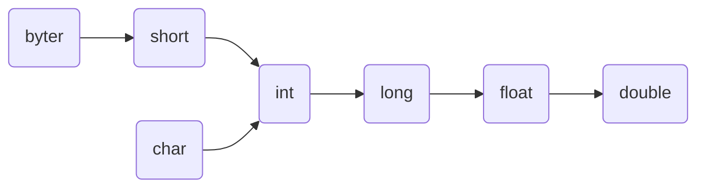

- ## 🖥️计算机基础知识

### win下的可执行文件

在命令行启动软件中，win下不用后缀名文件格式包括

```shell
> set pathext
PATHEXT=.COM;.EXE;.BAT;.CMD;.VBS;.VBE;.JS;.JSE;.WSF;.WSH;.MSC
```

这些后缀名优先顺序的排列就如上面所示，这些都是win下的**可执行文件**

### path环境变量

**Path 环境变量** : 可以理解为系统中的一个大管家, 帮我们记录了很多软件的完整路径，当我们要运行一个程序，而没有告诉它程序所在的完整路径时，系统除了在当前目录下面寻找此程序外，还会到path中指定的路径去找.


### 计算机语言

计算机语言的发展

* 机器语言

  机器语言就是 0/1 代码。计算机只能识别 0 和 1。

  在计算机内部，无论是一部**电影**还是一首歌曲或是一张**图片**，最终保存的都是 0/1 代码。

* 汇编语言

  汇编语言就是将一串很枯燥无味的机器语言转化成英文单词。

  比如说：

  `add 1,2`   `010101000101`  `计算机执行`

*  高级语言

  使用普通英语进行编写代码，然后通过**编译器**<font color=#FF0000>翻译</font>成类似于汇编语言的指令，之后再由计算机执行

  

## ☕JAVA语言介绍

### java三大平台

* **Java SE**

  Java 语言的（标准版），用于桌面应用的开发，是其他两个版本的**基础**。

  <font color=#FF0000>桌面应用</font>：用户只要打开程序，程序的界面会让用户在最短的时间内找到他们需要的功能，同时主动带领用户完成他们的工作并得到最好的体验。

  <font color=#FF0000>学习 Java SE 的目的</font>: 为今后要从事的 **Java EE** 开发，打基础

* **Java ME**

  Java 语言的（小型版），用于嵌入式消费类电子设备(已经没人学了)

* **Java EE**

  Java 语言的（企业版），用于 Web 方向的网站开发。

  **网页**：用于数据展示

  **网站**：网页 + 后台服务器

  

### 跨平台原理


总结：在需要==运行 Java 应用程序==的操作系统上，安装一个与操作系统对应的**Java虚拟机(JVM Java Virtual Machine)**即可。这里我们理解为平常在==pc用安卓模拟器==即可

JVM 虚拟机本身不允许跨平台，允许跨平台的是 **Java 程序**

### 程序开发的三个步骤

编写代码，编译代码，运行代码


### JDK的组成


* JVM（Java Virtual Machine）：Java虚拟机, 真正运行Java程序的地方

* 核心类库：Java自己写好的程序，给程序员自己的程序调用的

* JRE（Java Runtime Environment）: Java的运行环境

* JDK（Java Development Kit）: Java开发工具包（包括上面所有）

## IDEA介绍

### IDEA项目结构介绍

* project（项目、工程）

* module（模块）

* package（包）

* class（类）

  这些结构的划分，是为了方便管理类文件的，本质都是**文件夹**

  
IDEA有专门用于管理和构建Java项目的工具[[maven#Maven 简介|MAVEN]]
## Java基础语法

### 变量和标识符

* 变量就是内存中的**存储空间**，空间中存储着经常发生改变的数据

  

**标识符**：就是给类，方法，变量等起名字的符号。

```java
public class Demo {
    public static void main(String[] args) {
        int salary=12000;
        System.out.println(salary);
        salary=15000;
        System.out.println(salary);
        int age=18;
        System.out.println(age);
    }
}
```

**标识符命名规范**

**小驼峰命名法：**<font color=#FF0000> 变量</font>

* 规范1：标识符是一个单词的时候，所有字母小写
* 范例1：<font color=#FF0000> name</font>
* 规范2：标识符由多个单词组成的时候，从第二个单词开始，首字母大写
* 范例1：<font color=#FF0000> firstName</font>

**大驼峰命名法：**<font color=#FF0000> 类</font>

* 规范1：标识符是一个单词的时候，首字母大写
* 范例1：<font color=#FF0000> Student</font>
* 规范2：标识符由多个单词组成的时候，每个单词首字母大写
* 范例1：<font color=#FF0000> GoodStudent</font>

### 数据类型
<font color=#FF0000 size=4>数据类型介绍</font>

* **基本数据类型：** 那些**没有被封装**的数据类型，它们是 Java 语言内置的类型，在 JVM 内部实现，不需要进行额外的初始化就可以直接使用。
	* 

* **引用数据类型:**指那些需要使用关键字 `new` 创建对象并**动态分配内存空间**才能使用的类型
	* **数组**，**类**，**接口**


* **编码表**

  是计算机中<font color=#FF0000>字节</font>到<font color=#FF0000>字符</font>的一套对应关系

```
a --->字节 --->二进制 --->01100001 --->十进制 --->97
```

### Scanner键盘录入

在java从键盘录入需要**导包** 
```java
import java.util.Scanner;//导入Scanner包
public class ScannerTest {
    public static void main(String[] args) {
        Scanner sc=new Scanner(System.in);//创建Scanner变量,利用new方法
        int age=sc.nextInt();//从控制台接受函数,string类用next,其他类似int
        System.out.println(age);     
    }
}
```

在 Java 中，`next()` 和 `nextLine()` 都是 Scanner 类中用于读取用户输入的方法。二者的区别在于：

- `next()` 只会读取输入字符串的第一个单词（以空格作为分隔符），并且返回值不包含空格；而 `nextLine()` 会读取一整行输入，包括空格和其他字符，直到遇到回车符为止。
- 因为 `next()` 只读取了第一个单词，所以通常需要配合使用多个 `next()` 才能读取完整的输入参数，而 `nextLine()` 可以直接读取整行。

```java
Scanner scanner = new Scanner(System.in);

System.out.print("请输入你的姓名：");
String name = scanner.next();

System.out.print("请输入你的年龄：");
int age = scanner.nextInt();

System.out.print("请输入你的地址：");
String address = scanner.nextLine();
```


### 字符串拼接

在java中字符串的拼接使用`+`

```java
public class Test {
    public static void main(String[] args) {
        System.out.println(1+23); // 24
        System.out.println("年龄为:" + 23); // 年龄为：23
        System.out.println(1 + 99 + "年黑马");// 100年黑马
    }
}
```

### 类型转换分类

#### 隐式转换

```java
public class Test {
    public static void main(String[] args) {
        int a = 10;        
        double b = a;
        System.out.println(b);
    }
}
```
<font color=#FF0000>表示数据范围从小到大图
</font>



==这里为什么4字节的`float`的取值范围大于8字节的`long`呢？==

float类型的取值范围更大是因为浮点数使用了**IEEE 754标准**来存储它们的值，这种标准使用了科学计数法来表示数值。(计组有讲)

**运算过程中的隐式转换**

* 取值范围小的数据，和取值范围大的数据进行运算，小的会先提升为大的之后，再进行运算
* **byte short char** 三种数据在运算的时候，都会提升为int，然后再进行运算

#### 强制转换

* 把一个**取值范围大**的数值或者变量，**赋值**给另一个**取值范围小**的变量

不允许直接赋值，需要加入强制转换

* <font color=#FF0000>格式：目标数据类型 变量名 = (目标数据类型) 被强转的数据;</font>

### 不同进制书写

不同进制书写

对110进行书写

十进制：110 

二进制：<font color=#FF0000>0b</font>110

八进制：<font color=#FF0000>0</font>110

十六进制：<font color=#FF0000>0x</font>110

### 赋值运算符

扩展的赋值运算符（`+=`，`-=`...）**隐含**了强制类型转换

### 逻辑运算符

**逻辑运算符分类**

| 符号 |   介绍   |              说明              |
| :--: | :------: | :----------------------------: |
|  &   |  逻辑与  |    并且, 遇 false 则 false     |
|  \|  |  逻辑或  |     或者，遇 true 则 true      |
|  ！  |  逻辑非  |              取反              |
|  ^   | 逻辑异或 |   相同为 false，不同为 true    |
|  &&  |  短路与  | 作用和 & 相同，但是有短路效果  |
|\|\||  短路或  | 作用和 \| 相同，但是有短路效果 |

* 逻辑与 **&**，无论左边 true false，右边都要执行。

  短路与 **&&**，如果左边为 true，右边执行；如果**左边为false，右边不执行**。

* 逻辑或 **|**，无论左边 true false，右边都要执行。

  短路或 **||**，如果左边为 false，右边执行；**如果左边为true，右边不执行**。

==扩展==：在c++中只有<font color=#FF0000>短路逻辑运算符</font>，单个运算符叫做<font color=#FF0000>位移运算符</font>(将两个数的二进制每一位进行操作)

**位移运算符**

| 符号 | 介绍   | 说明                     |
| ---- | ------ | ------------------------ |
| &    | 位与   | 每一位双1才1             |
| ^    | 位异或 | 每一位相同为 0，不同为 1 |
| \|   | 位或   | 遇 1 则 1                |

**逻辑运算符优先级**


| 优先级 | 运算符 |
|:-:|:-:|
| 1 | `.  () {}` |
| 2 | `!、-、++、--` |
| 3 | `*、/、%` |
| 4 |+ -|
| 5 |`<<、>>、>>>`|
| 6 | `<、<=、>、>=、instanceof` |
| 7 |== != |
| 8 | `&` |
| 9 | `^` |
| 10 | `\|` |
| 11 | `&&` |
| 12 |`\|\|`|
| 13 | `?:` |
| 14 |=、+=、-=、*=、/=、%=、&=|


定义格式：

```java
public static void 方法名()
{
    //方法体
}
```

调用格式

```java
方法名()
```

举例：

```java
public static void show()
{
    //方法体
}
```

举例

```java
show()
```

方法的优点：


1. 可以将原本挤在一起的臃肿代码, 按照功能做分类管理, 提高代码的**可阅读性**
1.  提高了代码的**复用性**

**方法调用内存图解**

* 方法<font color=#0070C0>没有被调用</font>的时候，在<font color=#FF0000>方法区</font>中的**字节码**文件中存放
* 方法<font color=#0070C0>被调用</font>的时候，需要进入到<font color=#FF0000>栈内存</font>中运行

**方法区**:字节码文件加载时进入的内存

**栈内存**:方法运行时进入的内存,是先进后出的

==main方法被虚拟机自动调用执行==


**形参和实参**

形参：全称形式参数，是指在定义方法时，所声明的参数

实参：全称实际参数，调用方法时，所传入的参数

**方法重载**


* 在同一个类中，定义了多个<font color=#FF0000>同名的方法</font>，但每个方法具有<font color=#FF0000>不同的参数类型</font>或<font color=#FF0000>参数个数</font>，这些同名的方法，就构成了重载关系

* 简单记：同一个类中，方法名相同，参数不同的方法

参数不同：个数不同、类型不同、顺序不同

<font color=#0070C0>注意：识别方法之间是否是重载关系，只看方法名和参数，跟返回值无关。</font>

**方法重载的好处**：不用记忆过多繁琐的方法名字

### 流程控制语句

#### switch

```java
格式：
switch(表达式) {
    case 值1：
	语句体1;
	break;
    case 值2：
	语句体2;
	break;
    …
    default：	
	语句体n+1;
	break;
}
```

switch () 中可以接收的类型

1). 基本数据类型: `byte` `short` `char` `int` 
2). 引用数据类型: jdk5版本开始可以是**枚举**, jdk7版本开始可以是**String字符串**

<font color=#FF0000>注意</font>：C++不支持string，以及多个值

**case穿透现象**:如果`case`语句后没有`break`语句，会自动跳到下个case语句执行，case的穿透也可以优化代码

例如需求: 键盘录入一个数值, 1~5 : 输出工作日  6~7 : 输出休息日

```java
int week=sc.nextInt();
        switch (week)
        {
            case 1:
            case 2:
            case 3:
            case 4:
            case 5:
                System.out.println("工作日");
                break;
            case 6:
            case 7:
                System.out.println("休息日");
                break;
            default:
                System.out.println("输入有误");
        }
```

jdk14版本开始, `case`后面允许==编写**多个**数据, 多个数据中间使用逗号分隔==,并且在Java 8中引入的新特性。使用**箭头语法**可以简化`switch`语句中的`case`部分的语法,省略break语句。

上面的最终简化可以是这样

```java
int week=sc.nextInt();
        switch (week) {
            case 1, 2, 3, 4, 5 -> System.out.println("工作日");
            case 6, 7 -> System.out.println("休息日");
            default -> System.out.println("输入有误");
        }
```

`if` :适用于**范围的判断**
`switch` ：适用于**固定值的匹配**

### 跳转控制语句

* break  : **终止**循环体内容的执行，也就是说结束当前的整个循环

* continue: **跳过**某次循环体内容的执行，继续下一次的执行

java中有一个控制跳转语句(跳出指定循环)的**标号**可以与 `break` 和 `continue` 语句配合使用，跳转到标号指定的语句。

如下例子：

```java
public static void initMenu() {
            Scanner sc = new Scanner(System.in);
            lo:  // 标号 : 给循环起名字
            while (true) {
                System.out.println("请输入您的选择: 1. 添加学生  2. 删除学生  3. 修改学生  4. 查看学生  5. 退出");
                int choice = sc.nextInt();
                switch (choice) {
                    case 1:
                        System.out.println("添加学生逻辑执行...");
                        break;
                    case 2:
                        System.out.println("删除学生逻辑执行...");
                        break;
                    case 3:
                        System.out.println("修改学生逻辑执行...");
                        break;
                    case 4:
                        System.out.println("查看学生逻辑执行...");
                        break;
                    case 5:
                        System.out.println("感谢您的使用, 再见!");
                        break lo;//跳出标号为lo的循环
                    default:
                        System.out.println("您的输入有误, 请检查!");
                        break;
                }
            }
        }
```


lo:  // 标号 : 给循环起名字

### Random随机数

在java中使用随机数需要导入`import java.util.Random;`

产生0~99随机数

```java
import java.util.Random;
Random r=new Random();
int num=r.nextInt(100);
```

产生-20~50的随机数

```java
int num=r.nextInt(71)-20;
```
### 数组

数组的定义格式

* 格式1: <font color=#FF0000>数据类型</font>[]  <font color=#0070C0>数组名</font>
* 格式2: <font color=#FF0000>数据类型</font>  <font color=#0070C0>数组名</font>[]

```java
public class Demo1Array {    
    public static void main(String[] args) {
        int[] array1;
        int array2[];
    }
```

一般java采用**格式2**

 **数组的静态初始化格式** :手动**指定数组元素**，系统会根据元素个数，计算出数组的长度

 1. 完整格式 : 

       数据类型[] 数组名 = new 数据类型[]{元素1, 元素2, 元素3...};

 2. 简化格式 :

        数据类型[] 数组名 = {元素1, 元素2, 元素3...};

**注意事项**：打印数组名, 会看到数组在内存中的十六进制地址值

```java
int[] a1={11,22,33};
double[] a2={3.44,5,7.0};
System.out.println(a1);
>> [I@776ec8df
 /* 
@ : 分割符
[ : 当前空间, 是数组类型的
I : 当前数组类型, 是int类型
776ec8df : 数组的十六进制内存地址
*/
```

**数组的动态初始化格式** :手动**指定数组长度**，由系统给出**默认初始化值**。

> 默认数值分类：
> 整数:0
> 小数:0.0
> 字符：'\u0000'     ----->Unicode字符 ----> 常见空白字符
> 引用数据类型:null
> 引用数据类型：数组，类，接口
> string:类

> ==**扩展**==：在`java`中**局部变量**不需要**显式初始化**，编译器会自动为局部变量赋一个初始值。这样做可以避免未初始化变量导致**程序崩溃**的问题。在`c++`中堆和栈中的**局部变量**不会初始化而拥有**不可预测的值**，这是因为编译器在编译过程中需要尽可能地**节省内存和时间**。如果所有局部变量都被显式初始化，那么编译器就需要在程序运行时为其分配**额外的内存来存储**这些初始值，并且在程序结束时需要清除这些内存

#IDEA快捷键 ctrl + alt + M : 在main中抽取方法的快捷键

### java内存分配

* 栈：**方法运行时所进入的内存**
* 堆：**new出来的东西会在这块内存中开辟空间并产生地址**
* 方法区：**字节码文件加载时进入的内存**
* 本地方法栈：虚拟机运行的
* 寄存器：cpu上运行的

在 Java 中，数组是**对象**，因此它存在于**堆**中。 `int a3[]={1,2,3}` 这种语法是一种简写形式，等价于 `int[] a3 = new int[]{1, 2, 3}`;


数组名只是个**地址**，数组的遍历就是根据这个地址去**堆空间**找相应的元素


方法的参数传递问题 :
	1. 基本数据类型: 传递的是**数据**值
	2. 引用数据类型: 传递的是**地址**值

**空指针异常**

* 当引用数据类型变量被赋值为 `null` 之后，地址的指向被**切断**，还继续访问堆内存数据，就会引发空指针异常


> ==**扩展**==:在 Java 中，数组元素存储在堆上，主要是为了**垃圾回收机制**的需要--会定期扫描内存中的对象，如果发现某个对象没有被**引用**，就会自动回收它所占用的内存。由于数组是**对象**，因此如果数组元素存储在栈上，那么当数组对象被销毁时，其元素也会被销毁，而垃圾回收机制就无法识别并回收这些元素所占用的内存。在c++中没有垃圾回收机制，堆上的内存需要**手动释放**，而栈上的内存会在离开作用域时自动释放。
>
> 注意事项：在c++和java打印**字符类型**数组名, 不会看到地址值, 而是元素全部的内容,这是因为io流的源码规定，


### 二维数组

**二维数组**:是一种**容器**，该容器用于存储一维数组

**静态初始化格式**

```java
//格式：数据类型[][] 数组名 = new 数据类型[][] {{元素1,元素2},{元素1, 元素2}};
int[][] arr = new int[][]{{11,22},{33,44}};
//简化格式：数据类型[][] 数组名 = {{元素1,元素2}, {元素1, 元素2}};
int[][] arr = {{11,22},{33,44}};
```

**动态初始化格式**

```java
//格式：数据类型[][] 数组名 = new 数据类型[m][n];
int[][] arr = new int[2][3];
```

**细节**: 二维数组在存储一维数组的时候, 具体存储的是一维数组的地址值


### 面向对象


**面向对象**：并不是一个技术，而是一种编程的**指导思想**

**类的介绍**

* java 中想要创建对象，必须先要有类的存在

* 类指的是一组相关**属性**和**行为**的集合，我们将其理解为是一张对象的设计图

**属性：**

```
成员变量:
跟之前定义变量的格式一样
只不过位置需要放在
方法的外面
```

**行为：**

```
成员方法:
跟之前定义方法的格式一样
只不过需要
去掉static关键字
```

```java
public class Student {
    String name = "张三";
    int age = 23;
    public void study(){
        System.out.println("学习Java");
    }
    public void eat(){
        System.out.println("吃饭");
    }
}
```

**创建对象和使用对象的格式**

```java
public class TestStudent {
    public static void main(String[] args) {
		// 创建对象格式:
        // 类名 对象名 = new 类名();
        Student stu = new Student();
        // 使用成员变量格式:
        // 对象名.变量名
        System.out.println(stu.name);
        System.out.println(stu.age);
		stu.name = "李四";
        stu.age = 24;
		// 使用成员变量格式:
        // 对象名.变量名
        System.out.println(stu.name);
        System.out.println(stu.age);
		stu.name = "李四";
        stu.age = 24;
     }
}
```

### 对象内存图


**成员变量和局部变量的区别**


### 构造方法
* 本质作用：创建对象
* 结合构造方法执行时机：<font color=#FF0000>给对象</font>中的属性<font color=#FF0000>（成员变量）</font>进行<font color=#0070C0>初始化</font>

**构造方法的执行流程**


**匿名对象**：没有对象名接收的对象，我们称为匿名对象，有对象名接收的对象，我们称为有名对象

```java
Student s1 = new Student(“尼古拉斯.赵四”);
//有名对象，对象名为s1
new Student(“尼古拉斯.老王”); 
// 匿名对象
```

匿名对象可以像有名对象一样使用，但是只能使用一次。具体场景如下：

① 匿名对象直接调用成员方法

② 匿名对象直接当做方法参数传递

③ 匿名对象直接当做返回值

```java
public class test
{
  public static void main(String[] args) {
  new Student().printMessage();//①
  useStudent(new Student());//②
  System.out.println(getStudent());
  }
  public static void useStudent(Student s)
  {
    s.printMessage();
  }
  public static Student getStudent()
  {
    return new Student();//③
  }
}
class Student
{
  void printMessage() {
    System.out.println("Hello, World!");
  }
}
```


### 封装

**封装:** 使用类设计对象时,将需要处理的**数据**,以及处理这些数据的**方法**, **设计到对象中**

**优点:**

1. 更好的维护数据

2. 使用者无需关心内部实现, 只要知道如何使用即可

**封装的设计规范**:合理隐藏, 合理暴露

### 解耦合

解耦合是指将系统的不同部分解除或减少它们之间的**相互依赖性**，以增加系统的`灵活性、可维护性`和`可扩展性`。在软件工程领域，解耦合通常是指将代码模块之间的依赖关系降至最低，以便在修改代码时不会对整个系统造成影响。

例如，在一个大型的软件系统中，如果每个模块都互相依赖，那么修改其中一个模块可能会影响到其他模块的功能，这将使得代码的维护和扩展变得非常困难。通过解耦合，可以将系统分解成更小的模块，每个模块只需要关注自己的功能，并且尽可能减少与其他模块的依赖关系。这样，当需要修改一个模块时，只需修改该模块本身，而不会对其他模块造成影响，从而提高了代码的可维护性和可扩展性。

好的，以下是一个简单的解耦合代码的例子：

假设有一个需求，需要读取一个文件并将其中的数据进行处理。在不使用解耦合的情况下，代码可能会像这样：
```python
# 不使用解耦合的代码
with open("data.txt", "r") as f:
    data = f.read()
    # 对数据进行处理
    # ...
```

在这个例子中，代码直接打开了一个名为 "data.txt" 的文件，并读取了其中的数据。这种实现方式有一个问题，即代码与文件名 "data.txt" 直接耦合在一起，如果文件名需要更改，那么所有使用该文件的代码都需要进行修改。

下面是一个使用解耦合的代码的例子：
```python
# 使用解耦合的代码
def read_file(filename):
    with open(filename, "r") as f:
        return f.read()

data = read_file("data.txt")
# 对数据进行处理
# ...
```

在这个例子中，代码将文件读取的功能封装在一个名为 `read_file` 的函数中，并将文件名作为参数传递给函数。这种实现方式的优点是，代码与文件名解耦合，使得代码更加灵活和可维护。如果文件名需要更改，只需要修改调用 `read_file` 函数的地方即可，而不需要修改函数内部的实现。

总之，解耦合的代码更加灵活和可维护，因为它减少了代码之间的依赖关系，使得代码修改更加容易。

### 权限修饰符

* `private` : 同一个类中
* `(default)` : 同一个类中, 同一个包中
* `protected` : 同一个类中, 同一个包中, 不同包的子类
                                 TODO: 继承
* `public` : 任意位置访问

| 权限修饰符 | 同一个类中 | 同一个包中 | 不同包的子类 | 不同包的无关类 |
| :--------: | :--------: | :--------: | :----------: | :------------: |
|  private   |     √      |            |              |                |
| (default)  |     √      |     √      |              |                |
| protected  |     √      |     √      |      √       |                |
|   public   |     √      |     √      |      √       |       √        |

==一个Java文件中可以定义多个类，但是只能有**一个类是用public**修饰的，public修饰的类名必须和所在的Java文件保持同名。==

#### 标准 JavaBean

1. 这个类中的成员变量都要**私有**，并且要**对外提供**相应的getXxx ，setXxx方法
2. 这个Java类必须具有一个无参的构造函数
3. 类中提供无参, 带参构造方法。
`POJO（Plain Old Java Objects）`简单的Java对象，实际就是普通JavaBeans，是为了避免和EJB混淆所创造的简称。
**实体类的应用场景是什么？**:实体类只负责数据存取，而对数据的处理交给其他类来完成，以实现数据和数据业务处理相分离


**实体类的快捷实现**:

1. 通过IDEA的右键**Generate**


2. 安装插件ptg一键生成


#IDEA快捷键 包围代码加for等等结构:`ctl+alt+t`

### 常用API

**API** (**A**pplication **P**rogramming **I**nterface) ：应用程序编程接口,就是别人写好的一些类，给咱们程序员直接拿去调用即可解决问题的

#### String类

**String类的特点 :**

  1. Java 程序中所有**双引号**字符串, 都是String这个类的对象
  2. 字符串一旦被创建, 就不可更改, 字符串**内容不可改变**
	- 如果想要更改, 只能使用**新**的对象, 做替换
  1. String字符串虽然不可改变, 但是可以被共享
	- 字符串常量池(在堆中): 当我们使用双引号创建字符串对象时, 会检查常量池中是否存在该数据
	  - 不存在 : 创建
	  - 存在 : 复用

**String 类的常见构造方法**

|            构造方法            |               说明               |
| :----------------------------: | :------------------------------: |
|        public String()         |   创建空白字符串，不含任何内容   |
| public String(String original) | 根据传入的字符串，创建字符串对象 |
|   public String(char[] chs)    |   根据字符数组，创建字符串对象   |

**string 的各种对比**

字符串常量池中的字符串对比


构造方法的出来字符串本质是copychar数组地址，但借此生成的string地址是另一回事


string变量与字符串相加本质是借由这个string变量创建stringbuilder对象后再apend方法后tostring()转成string变量


而普通的字符常量相加在编译成字节码文件后已经被**优化**好了


**String 类用于比较的方法**

* `public boolean equals`方法(要比较的字符串)                完全一样结果才是true，否则为false 

* `public boolean equalsIgnoreCase`(要比较的字符串) 忽略**大小写**的比较
* `public native String intern()`  用于返回字符串对象的**规范化表示形式**，也就是字符串池中的唯一实例
	* 当调用` intern()` 方法时，如果字符串池中已经包含了该字符串，则返回池中的引用；否则，会将该字符串添加到池中并返回新创建的引用。

	```java
	String str1 = &quot;apple&quot;;
	String str2 = new String(&quot;apple&quot;);
	System.out.println(str1 == str2); // 结果为false，因为两个字符串对象的引用不同
	String str3 = str2.intern();
	System.out.println(str1 == str3); // 结果为true，因为通过 intern() 方法获取了字符串池中的引用
	```


输出string对象的地址采用：
```java
System.out.println(Integer.toHexString(System.identityHashCode(s1)));
System.out.println(Integer.toHexString(System.identityHashCode(s3))); 
```


**String 字符串的遍历**

* `public char[] toCharArray ()`  将字符串转换为字符数组 

* `public char chatAt (int index)` 根据索引找字符

* `public int length()` : 返回字符串的长度

**String 字符串的截取方法**

* `public String substring(int beginIndex, int endIndex) `  截取

  * 注意点：包头不包尾，包左不包右

  * 只有返回值才是截取的小串

* `public String substring(int beginIndex)`   截取到末尾

**String 字符串的替换方法**

* `public String replace(旧值,新值)` 替换
  * 注意点：返回值才是替换之后的结果

**String 字符串的切割方法**

* `public String[] split(String regex) `：

  * 根据传入的字符串作为规则进行切割

  * 将切割后的内容存入字符串数组中，并将字符串数组返回

#### StringBuilder 类

StringBuilder是字符串的**缓冲区**, 我们可以将其理解为是一种**容器**,这个容器可以存储**任意数据类型**, 但是只要进入到这个容器, 全部**变成字符串**,StringBuilder是一种**可变**的字符序列,

**StringBuiler 构造方法**

|             构造方法             |                      说明                      |
| :------------------------------: | :--------------------------------------------: |
|      public StringBuilder()      |         创建一个空的字符串缓冲区(容器)         |
| public StringBuilder(String str) | 创建一个字符串缓冲区, 并初始化好指定的参数内容 |

**StringBuiler 常用方法**

|                 方法名                 |                        说明                         |
| :------------------------------------: | :-------------------------------------------------: |
| public StringBuilder append (任意类型) |              添加数据，并返回对象本身               |
|     public StringBuilder reverse()     |                  反转容器中的内容                   |
|          public int  length()          |             返回长度 ( 字符出现的个数)              |
|        public String toString()        | 通过toString()就可以实现把StringBuilder转换为String |
#IDEA快捷键 生成返回值类型: `.var`或者ctrl+alt+v


==扩展：链式编程==: 调用的方法, 返回的结果是**对象**, 就可以继续向下调用方法

java有链式编程，c++一般没有(除了io流) 

```java
StringBuilder sb = new StringBuilder();
sb.append("红色").append("绿色").append("蓝色");
```

**为什么StringBuiler 拼接比String快？**


**StringBuffer与StringBuiler区别？**

StringBuffer线程安全的可变字符序列，StringBuiler多线程不安全

### 集合

**什么是集合？** 集合是一种容器，用来装数据的，**类似于数组**。

数组定义完成并启动后，**长度就固定了。** 集合大小可变，开发中用的更多

**集合常用成员方法**

|                       方法                        |                             描述                             |
| :-----------------------------------------------: | :----------------------------------------------------------: |
|                `boolean add(E e)`                 |                 把给定的对象添加到当前集合中                 |
|                  `void clear()`                   |                     清空集合中所有的元素                     |
|               `boolean remove(E e)`               |                 把给定的对象在当前集合中删除                 |
|          `boolean contains(Object obj)`           |               判断当前集合中是否包含给定的对象               |
|                `boolean isEmpty()`                |                     判断当前集合是否为空                     |
|                   `int size()`                    |                     返回集合中元素的个数                     |
|             `Object[] toArray(T[] a)`             |                 把集合中的元素，存储到数组中                 |
| `public void forEach(Consumer<? super E> action)` | 针对`Iterable`接口的新增方法，用于对包含值的集合进行迭代，并依次将集合中的每个元素交给指定的操作执行。 |

 **集合体系**

1. 单列集合 : **Collection接口**
   * **List接口** : 1 有序  2 有索引  3 元素可以重
     * ArrayList类  : 数组结构(查询快 , 增删慢)
     * LinkedList类 : 链表结构(查询慢 , 增删快)
   * **Set接口**  : 1 无序  2 无索引  3 元素唯一
     * HashSet类 : 哈希表结构(保证数据唯一 , 查询速度快)
     * TreeSet类 : 红黑树结构(可以对元素进行**排序**)
2. 单列集合的遍历方式
   * 1 迭代器    : 所有的单列集合
   * 2 增强for    : 所有的单列集合
   * 3 普通for    : 只能遍历List体系
3. 双列集合 : Map接口
   * **HashMap类** : 哈希表结构(保证键唯一 , 查询速度快)
   * **TreeMap类** : 红黑树结构(可以对键进行**排序**)

#### ArrayList

**ArrayList** **长度可变原理**

1. 当创建 ArrayList 集合容器的时候, 底层会存在一个长度为**10个**大小的**空**数组

2. 超过**原始范围**，扩容原数组 **1.5 倍**大小的新数组
3.  将原数组数据，**拷贝**到**新**数组中(地址已经变换了)
4. 将新元素添加到新数组

**集合和数组的使用选择**

数组: 存储的元素个数固定不变

集合: 存储的元素个数经常发生改变

**ArrayList** **集合常用成员方法**

|                 方法名                 |                  说明                  |
| :------------------------------------: | :------------------------------------: |
|       `public boolean add(E e)`        |     将指定的元素添加到此集合的末尾     |
| `public void add(int index,E element)` |   在此集合中的指定位置插入指定的元素   |
|       `public E get(int  index)`       |          返回指定索引处的元素          |
|          `public int  size()`          |         返回集合中的元素的个数         |
|     `public E remove(int  index)`      | 删除指定索引处的元素，返回被删除的元素 |
|   `public boolean remove(Object o)`    |    删除指定的元素，返回删除是否成功    |
|  `public E set(int index,E element)`   | 修改指定索引处的元素，返回被修改的元素 |

**ArrayList集合的使用:**

`ArrayList list = new ArrayList();`
现象: 可以添加**任意类型**数据
弊端: 数据不够严谨

`ArrayList<String> list = new ArrayList<>();`

####  List集合

- List集合是Collection集合子类型，继承了所有Collection中功能，同时List增加了带索引的功能

- 特点 : 
  - 元素的存取是有序的【有序】
  - 元素具备索引 【有索引】
  - 元素可以重复存储【可重复】


- 常见的子类 
  - ArrayList：底层结构就是数组【查询快，增删慢】
  - Vector：底层结构也是数组（线程安全，同步安全的，低效，用的就少)
  - LinkedList：底层是链表结构（双向链表）【查询慢，增删快】

- List中常用的方法
  - public void add(int index, E element): 将指定的元素，添加到该集合中的指定位置上。
  - public E get(int index):返回集合中指定位置的元素
  - public E remove(int index): 移除列表中指定位置的元素, 返回的是被移除的元素。\
  - public E set(int index, E element):用指定元素替换集合中指定位置的元素,返回值的更新前的元素

- LinkedList类 
  - LinkedList底层结构是双向链表。每个节点有三个部分的数据，一个是保存元素数据，一个是保存前一个节点的地址，一个是保存后一个节点的地址。可以双向查询，效率会比单向链表高。
  - LinkedList特有方法
    - public void addFirst(E e):将指定元素插入此列表的开头。
    - public void addLast(E e):将指定元素添加到此列表的结尾。
    - public E getFirst():返回此列表的第一个元素。
    - public E getLast():返回此列表的最后一个元素。
    - public E removeFirst():移除并返回此列表的第一个元素。
    - public E removeLast():移除并返回此列表的最后一个元素。

#### Set集合

- Set集合也是Collection集合的子类型，没有特有方法。Set比Collection定义更严谨
- 特点 : 
  - 元素不能保证插入和取出顺序（无序）
  - 元素是没有索引的(无索引)
  - 元素唯一(元素唯一)


- Set常用子类
  - HashSet：底层由HashMap，底层结构哈希表结构。
    去重(对于自定义类型必须重写`hashCode`和`equals`方法)，无索引，无序。
    哈希表结构的集合，操作效率会非常高。
  - LinkedHashSet:底层结构链表加哈希表结构。
    具有哈希表表结构的特点，也具有链表的特点。
  - TreeSet：底层是有TreeMap，底层数据结构 红黑树。
    去重，让存入的元素具有排序（升序排序）

#### map集合

**Map集合常用实现类** 

**HashMap**：
此前的HashSet集合底层实现就是HashMap完成的，HashSet保存的元素其实就是HashMap集合中保存的键，底层结构是哈希表结构，具有键唯一，**无序**，特点。

**LinkedHashMap**：
底层结构是有链表和哈希表结构，具有键唯一，**有序**特点

**TreeMap**：
底层是有**红黑树**，具有键唯一，排序特点

**Map中常用的方法**

```java
- public V put(K key, V value):  把指定的键与指定的值添加到Map集合中。
- public V remove(Object key): 把指定的键 所对应的键值对元素 在Map集合中删除，返回被删除元素的值。
- public V get(Object key) 根据指定的键，在Map集合中获取对应的值。
- public Set<K> keySet(): 获取Map集合中所有的键，存储到Set集合中。
- public boolean containKey(Object key): 判断该集合中是否有此键。
- Set<Map.Entry<K, V>> entrySet();它返回一个 Set<Map.Entry<K, V>> 集合，该集合包含键值对组成的映射关系条目（Entry）。
```


#### 泛型

**`<>` : 泛型**		

目前: 使用泛型, 可以对集合中存储的数据, 进行类型限制
细节: 泛型中, **不允许编写基本数据类型**，泛型在代码运行时，泛型会被**擦除**。
问题: 那我要是想集合中, 存储 整数, 小数, 字符... 这些数据, 怎么办呢?
解决: 使用基本数据类型, 所对应的**包装类**

```java
byte           Byte
short          Short
int            Integer    ***
long           Long
float          Float
double         Double
boolean        Boolean
char           Character  ***
```

##### 自定义泛型类

自定义的泛型类可以理解为c++中的**模板**

**定义的格式**

- 在**类型名**后面加上一对尖括号，里面定义泛型。一般使用一个英文大写字母表示，如果有多个泛型使用逗号分隔
- public class 类名<泛型名>{ ... }

```java
public class Student<X,Y>
{
    X obj;
}
```

```java
/*
    需求 : 定义一个人类，定义一个属性表示爱好，但是具体爱好是什么不清楚，可能是游泳，乒乓，篮球。
 */
public class GenericityDemo {
    public static void main(String[] args) {
        Person<BasketBall> person = new Person<>();
        person.setHobby(new BasketBall());
        Person<Swim> person2 = new Person<>();
        person2.setHobby(new Swim());
        Person person3 = new Person<>();// 如果没有指定泛型 , 那么默认使用Object数据类型
    }
}
class Person<H> {
    // 定义属性表达爱好
    private H hobby;
    public H getHobby() {
        return hobby;
    }
    public void setHobby(H hobby) {
        this.hobby = hobby;
    }
}
class Swim {
}
class PingPang {
}
class BasketBall {
}
```

##### 自定义泛型接口

- 当定义接口时，内部方法中有其参数类型，返回值类型不确定时，就可以使用泛型替代了。

- 定义泛型接口

  - 在接口后面加一对尖括号 , 尖括号中定义泛型 , 一般使用大写字母表示, 多个泛型用逗号分隔
  - public interface<泛型名> {  ... }
  - 举例 :

  ```java
  public interface Collection<E>
  {
      public boolean add(E e);
  }
  ```

  泛型的确定

  - 实现类去**指定**泛型接口的泛型
  - 实现了不去指定泛型接口的泛型 , 进行**延续泛型** , 回到泛型类的使用(这个延续类必须也是==泛型`<E>`==)

  ```java
  /*
      需求:
      模拟一个Collection接口，表示集合，集合操作的数据不确定。
      定义一个接口MyCollection具体表示。
  
   */
  // 泛型接口
  public interface MyCollection<E> {
      // 添加功能
      public abstract void add(E e);
      // 删除功能
      public abstract void remove(E e);
  }
  // 指定泛型的第一种方式 : 让实现类去指定接口的泛型
  class MyCollectionImpl1 implements MyCollection<String>{
      @Override
      public void add(String s) {
      }
      @Override
      public void remove(String s) {
      }
  }
  // 指定泛型的第二种方式 : 实现类不确定泛型,延续泛型,回到泛型类的使用
  class MyCollectionImpl2<E> implements MyCollection<E>{
  
      @Override
      public void add(E a) {
      }
      @Override
      public void remove(E a) {
      }
  }
  ```

  

##### 自定义泛型方法

  - 当定义方法时，方法中参数类型或返回值类型不确定时，就可以使用泛型替代了

  - 泛型方法的定义
    - 可以在方法的返回值类型前定义泛型
    - 格式 : `public <泛型名> 返回值类型  方法名(参数列表){ ... }`
    - 举例 : `public <T> void show(T t) { ... }`

  - 泛型的确定 
    - 当调用一个泛型方法 , 传入的参数是什么类型, 那么泛型就会被确定

	```java
	public class Test {
	public static void main(String[] args) {
	  // Collection集合中 : public <T> T[] toArray(T[] a) : 把集合中的内容存储到一个数组中 , 进行返回
	  ArrayList<String> list = new ArrayList<>();
	  list.add("abc");
	  list.add("ads");
	  list.add("qwe");
	  String[] array = list.toArray(new String[list.size()]);
	  System.out.println(Arrays.toString(array));
	}
	
	// 接收一个集合 , 往集合中添加三个待指定类型的元素
	public static <X> void addElement(ArrayList<X> list, X x1, X x2, X x3) {
	  list.add(x1);
	  list.add(x2);
	  list.add(x3);
	}
	}
	```


##### 泛型通配符

  * 当我们对泛型的类型确定不了，而是表达的可以是任意类型，可以使用泛型通配符给定

  符号就是一个问号：?  表示任意类型，用来给泛型指定的一种通配值。如下

  ```java
  public static void shuffle(List<?> list){
     //…
  } 
  
  说明：该方法时来自工具类Collections中的一个方法，用来对存储任意类型数据的List集合进行乱序
  ```

  泛型通配符结合集合使用

  - 泛型通配符搭配集合使用一般在方法的参数中比较常见。在集合中**泛型是不支持多态**的，如果为了匹配任意类型，我们就会使用泛型通配符了。
  - 方法中的参数是一个集合,集合如果携带了通配符，要特别注意如下
    - 集合的类型会提升为**Object类型**
    - 方法中的参数是一个集合,集合如果携带了通配符,那么此集合不能进行==添加和修改==操作 , 可以==删除和获取==
  
	  ```java
	   public static void main(String[] args) {
	          ArrayList<Integer> list1 = new ArrayList<>();
	          ArrayList<Number> list2 = new ArrayList<>();
	          ArrayList<String> list3 = new ArrayList<>();
	          ArrayList<Object> list4 = new ArrayList<>();
	  //泛型是不支持多态的，如果为了匹配任意类型，使用泛型通配符
	          useList5(list1);
	          useList5(list2);
	          useList5(list3);
	          useList5(list4);
	      } 
	  public static void show(List<?> list) {
	          // 如果集合的泛型是一个通配符 , 那么集合中元素以Object类型存在
	          Object o = list.get(0);
	          // 如果集合的泛型是一个通配符 , 那么此集合不能进行添加和修改操作 , 可以删除和获取
	          // list.add(??);
	          // 删除可以
	          list.remove(0);
	          // 获取元素可以
	          for (Object o1 : list) {
	              System.out.println(o1);
	          }
	      }
	  // 此方法只能接收存储Integer类型数据的集合
	      public static void useList1(ArrayList<Integer> list) {
	  
	      }
	      // 此方法只能接收存储Number类型数据的集合
	      public static void useList2(ArrayList<Number> list) {
	  
	      }
	      // 此方法只能接收存储String类型数据的集合
	      public static void useList3(ArrayList<String> list) {
	  
	      }
	      // 此方法只能接收存储Object类型数据的集合
	      public static void useList4(ArrayList<Object> list) {
	  
	      }
	      public static void useList5(ArrayList<?> list) {
	  
	      }
	  ```
  
  
  
##### 受限泛型
  
  - 受限泛型是指，在使用通配符的过程中 , 对泛型做了约束，给泛型指定类型时，只能是某个类型父类型或者子类型
  
  - 分类 : 
  
    - 泛型的下限 : 
      - `<? super 类型>`         //只能是某一类型，及其父类型，其他类型不支持
    - 泛型的上限 : 
      - `<? extends 类型>`     //只能是某一个类型，及其子类型，其他类型不支持
  
	  ```java
	   // 此方法可以接受集合中存储的是Number或者Number的父类型 , 下限泛型
	      public static void show1(ArrayList<? super Number> list) {
	      }
	      // 此方法可以接受集合中存储的是Number或者Number的子类型 , 上限泛型
	      public static void show2(ArrayList<? extends Number> list) {
	      }
	  ```
  
#### 迭代器

- 概述 : 

  - 迭代器就是对**Iterator**的称呼 , 专门用来对Collection集合进行遍历使用的。学习迭代器的目的就是为了**遍历**集合

- 注意 : 

  - 只有**继承/实现**Iterable接口才具有迭代的能力
  - Collection接口==继承==了Iterable接口所以 , Collection及其子类都具备**迭代**的能力

- 获取迭代器对象的方式

  - 通过Collection集合对象调用Iterable接口中的iterator方法 , 就可以获取迭代器对象

- Iterator(迭代器)中的方法

|类型| 方法名    |描述|
|:-:|:-:|:-:|
|`boolean` |`hasNext()`| 如果迭代具有更多元素，则返回 true 。         |
|`E`|`next()`|返回迭代中的下一个元素,并类似指针指向下一个元素|
|`default void`|`remove()`| 从底层集合中删除此迭代器返回的最后一个元素（可选操作）。|

- 迭代器的注意事项

  - 当迭代器迭代元素完成后，不能继续next获取元素，否则会报：NoSuchElementException
  - 当迭代器在使用的过程中，不能使用集合对象直接增删元素。会导致报错ConcurrentModificationException。如果要删除可以使用**迭代器**来删除(remove)

**迭代器的执行原理**


## java高级语法

### java可变参数

1. java可变参数是指在调用方法时传入不定长度的参数，本质上是基于**数组**实现的。
	```java
		//参数为可变参数
		public static void element(Integer... args){ }
		//参数为数组
		public static void element(Integer[] args){ }
	```

2. 在定义方法时，在最后一个形参上加`"…"`就表示该形参可以接受多个参数值，多个参数值被当做数组传入。
	```java
	public class Demo1 {
	    //参数为可变参数
	    public static void element(Integer... args) {
	        for (int arg : args) {
	            System.out.print(arg + "  ");
	        }
	        System.out.println();
	    }
	    public static void main(String[] args) {
	        element();
	        element(1);
	        element(1, 2, 3);
	    }
	    
	}
	```

3. 可变参数只能做为函数的**最后一个参数**，前面有没有其他参数都可以，**一个函数最多只能有一个可变参数**。

	```java
	//只有可变参数
	public static void element(Integer... args){ }
	//有其他参数
	public static void element_two(int age,int... args){ }
	```

4. 可变参数在编译为字节码后，在方法签名中是以数组形态出现的，如果两个方法签名编译后的是一致的话，是不能编译通过的，不可以作为方法的重载。
	```java
	    //参数为可变参数
	    public static void element(Integer... args){ }
	    //参数为数组
	    public static void element(Integer[] args){ }
	```

5. 可变参数作为参数的方法可以传入数组类型的数据或者直接传入多个数据，但是数组作为参数的方法只能传入数组类型的数据。
	```java
	public class Demo2 {
	
		//可变参数作为参数的方法
	    public static void element(int... args) {
	        for (int arg : args) {
	            System.out.println(arg);
	        }
	    }
	     public static void main(String[] args) {
	      //都可以
	      element(1,2,3);
	      int[] array={1,2,3};
	      element(array);
	   }
	}
	```

	```java
	public class Demo2 {
	
		//数组作为参数的方法
	    public static void element(int[] args) {
	        for (int arg : args) {
	            System.out.println(arg);
	        }
	    }
	     public static void main(String[] args) {
	     //不可以，编译错误
	      element(1,2,3);
	      //可以
	      int[] array={1,2,3};
	      element(array);
	   }
	}
	```

6. 方法重载

	1）调用一个被重载的方法时，如果此调用既能够和固定长度的重载方法匹配，又能和可变参数的重载方法匹配的话，会优先选择固定参数的重载方法。

	```java
	public class Demo2 {
	    public static void element(int... args){
	        for (int arg : args) {
	            System.out.println(arg);
	        }
	    }
	    public static void element(int age,int money){
	        System.out.println(age+"    "+money);
	    }
	    
	    public static void main(String[] args) {
	    	//会优先选择固定参数的方法
	        element(1,2);
	    }
	    
	}
	```

	2）当调用一个被重载的方法时，如果此调用能够和两个有可变参数的重载方法匹配，会出现编译错误。

	```java
	public class Demo2 {
	    public static void element(int... args) {
	        for (int arg : args) {
	            System.out.println(arg);
	        }
	    }
	    public static void element(int age, int... args) {
	        System.out.println(age);
	        for (int arg : args) {
	            System.out.println(arg);
	        }
	    }
	    public static void main(String[] args) {
	    	//会出现编译错误，不可以运行
	        element(1, 2);
	    }
	}
	```

	3）避免使用空值和null，当两个方法的方法名和其他参数都相同，只有可变参数不同的时候，传入空值或者null会产生编译错误。

	```java
	public class Demo2 {
	    public static void element(int age, int... args) {
	        System.out.println(age);
	        for (int arg : args) {
	            System.out.println(arg);
	        }
	    }
	    public static void element(int age, String... args) {
	        System.out.println(age);
	        for (String arg : args) {
	            System.out.println(arg);
	        }
	    }
	    public static void main(String[] args) {
	    	//传入空值或者null，无法区分调用哪一个方法，会编译错误
	        element(1);
	        element(1,null);
	    }
	}
	```

	修改方法：让编译器知道传入的null是什么类型的，好让他找到对应的方法。

	```java
	public static void main(String[] args) {
	        int[] array=null;
	        element(1,array);
	    }
	```


7. 方法覆写
	有一种十分特殊的情况，父类方法用的是可变参数，而子类覆写使用的是数组，虽然覆写的方法参数和父类不一样，但是可以编译通过，不过不建议采用。

	```java
	public class Demo3 {
	    public static void main(String[] args) {
	        //可以编译成功，编译看左边，运行看右边
	        Father father=new Sun();
	        father.element(1);
	        //不可以编译通过，编译看左边，参数
	        Sun sun = new Sun();
	        sun.element(1);
	    }
	    //父类
	    public static class Father {
	        public  void element(int... args) {
	            System.out.println("可变参数");
	        }
	    }
	    //子类
	    public static class Sun extends Father {
	        public  void element(int[] args) {
	            System.out.println("数组");
	        }
	    }
	}
	```

	方法覆写必须满足以下条件：
	1）覆写方法不能缩小访问权限。
	2）参数列表必须和被覆写方法保持一致(包括表现形式)。
	3）返回类型必须与被覆写方法相同或者是其子类。
	4）覆写方法不能抛出新的异常，或者超出父类范围的异常，但是可以不抛出或者抛出范围更小的异常。

8. 使用Object…作为可变参数会出现多种情况。

	```java
	public class Demo4 {
	    public static void element(Object... args){
	        System.out.println(args.length);
	    }
	    public static void main(String[] args) {
	        //Integer[]可以转型为Object[],可以作为一个对象数组
	        element(new Integer[]{1,2,3});
	        //多个参数的话，Integer[]会被当做一个单纯的数组对象
	        element(1,new Integer[]{2,3});
	        element(1,2,3);
	        //int[] 无法转型为Object[]，因此会被当做一个单纯的数组对象
	        element(new int[]{1,2,3});
	    }
	}`
	```

9. 反射时，可变参数的注意事项。

	```java
	public class Demo5 {
	    public static void element(Integer... args){
	        System.out.println(args.length);
	    }
	    public static void main(String[] args) {
	        Integer[] arrry={1,2,3};
	        try {
	            //反射是运行时获取的，在运行时看来，可变参数和数组上是一致的。因而方法的签名为([java/lang/Integer;)V
	            //Method对象的方法声明为Object invoke (Object obj,Object.. args)
	            //args虽然是一个可变长度的参数，但是args的长度受限于该方法对象代表的真实方法的参数列表长度,从运行时签名来看，([java/lang/Integer;)V实际上是一个形参，即Integer[] args,因此invoke (Object obj,Object.. args)中可变参数args的实际参数长度只能为1。
	            Method method = Demo5.class.getMethod("element", Integer[].class);
	            //array的长度为3，不符合
	            method.invoke(null,arrry);
	            //将Integer[]转为Object[]，长度还是为3，不符合
	            method.invoke(null,(Object[])arrry);
	            //将整个Integer[]转为一个Object，长度为1，符合
	            method.invoke(null,(Object)arrry);
	            //Object[]的长度为1，符合，和上面相同
	            method.invoke(null,new Object[]{arrry});
	        } catch (Exception e) {
	            e.printStackTrace();
	        }
	    }
	
	}
	```


### static 关键字

`static `是静态的意思，可以修饰成员变量，也可以修饰成员方法

**static** **修饰成员的特点**

* 被其修饰的成员, 被该**类**的所有**对象**所共享

* 多了一种调用方式, 可以通过**类名调用**

* 随着**类的加载而加载**(在方法区就产生了), **先于对象存在**(对象是new了才产生)

static的内存调用


**什么时候用static?**

* 需要共享数据用**static** **成员变量**
* 工具类(不是描述事物的, 而是帮我们完成一些事情 (打工))一般用**static** **成员方法**

如果发现一个类中, 所有的方法, 全都是 static 所修饰
                - 私有该类的构造方法 `private ArrayTools(){}`
                                - 目的: 为了不让其他类, 再创建对象

**static的限制**

1. static 方法中, 只能访问静态成员 (直接访问)，因为非静态成员还没出现
2. static 中不允许使用 this 关键字(同理第一条)

**重新认识 main 方法**

```java
public class HelloWorld {
    public static void main(String[] args) {
        System.out.println("HelloWorld");
    }
}
```

* public： 被JVM调用，访问权限足够大

* static： 被JVM调用，不用创建对象

 					因为main方法是静态的，所以测试类中其他方法也需要是静态的

* void： 被JVM调用，不需要给JVM返回值

* main： 一个通用的名称，虽然不是关键字，但是被JVM识别

* String[] args:  以前用于接收键盘录入数据的，现在没用

### 继承

继承：是将多个类的**相同属性和行为**抽取到**单独一个类**中，那么多个类无需再定义这些共性属性和行为，只要继承这个单独类即可继承这些属性和行为了

继承中的成员访问特点--就近原则

```java
public class Fu {
    int num = 10;
}
public class Zi extends Fu {
    int num = 20;
    public void method(){
        System.out.println(num);
    }
}
public class Test {
    public static void main(String[] args) {
        Zi z = new Zi();
        z.method();//20
        super.method;//10 使用父类
    }
}

```

* `this`：调用本类成员

* `super`：调用父类成员

```java
public class Fu {
    int num = 10;
}
class Zi extends Fu {
    int num = 20;
    public void method(){
        int num = 30;
        System.out.println(num);            // 30
        System.out.println(this.num);       // 20
        System.out.println(super.num);      // 10
    }
}
```

#### 继承中的成员访问特点

**方法重载(Overload)** : 在同一个类中, 方法名相同, 参数不同, 与返回值无关
                                		参数不同: 类型不同, 个数不同, 顺序不同

**方法重写(Override)** : 在子父类当中, 出现了方法声明一模一样的方法 (方法名, 参数, 返回值)

使用子类方法重写时机:当子类需要父类的方法, 但是觉得父类的方法逻辑不好 **(修改 | 增强)** 就可以对父类的方法进行重写

**重载的快捷实现**:
#IDEA快捷键 通过IDEA的右键**Generate**


* 父类中**私有方法**不能被重写
* 子类重写父类方法时，**访问权限**必须大于等于父类

**Java 中继承的特点:**

* Java只支持**单继承**，不支持**多继承**(一个儿子有多个父亲的现象)，但支持多层继承

#### 构造方法

==子类需要自己手动编写构造方法==

除了**Object类**(所有类的祖先), 在所有**构造方法**的第一行代码, 都默认隐藏了一句话 `super()`;通过这句代码, 访问父类的空参数构造方法

细节: Java当中所有的类, 都**直接或者间接**的继承到了 Object 类

#### 继承内存图解


#### this 和 super

* **this**：代表本类对象的引用

* **super**：代表父类存储空间的标识


| **关键字** |  **访问成员变量**   |   **访问成员方法**    |         **访问构造方法**         |
| :--------: | :-----------------: | :-------------------: | :------------------------------: |
|    this    | this.本类成员变量;  | this.本类成员方法();  |  this(); this(…);  本类构造方法  |
|   super    | super.父类成员变量; | super.父类成员方法(); | super(); super(…);  父类构造方法 |

**注意：** this() **和** **super()** 都在争夺构造方法第一行的位置，所以二者不能共存

在继承最好遵守**开闭原则** : 对功能扩展做开放, 对修改代码做关闭

```java
public static void main(String[] args) {
    A a1 = new A(1, 2, 3);
    A a2 = new A(4, 5, 6);
  }
/*
    项目Version1.0版本 : 有3个成员变量
    项目Version1.1版本 : 新增一个成员变量
 */
class A
{
  int a;
  int b;
  int c;
  int d;
  public A() {
  }

  public A(int a, int b, int c) {
    this.a = a;
    this.b = b;
    this.c = c;
  }

  public A(int a, int b, int c, int d) {
    this(a,b,c);//直接调用super
    this.d = d;
  }
}
```

**继承的好处** ?

- 提高代码的复用性
- 提高代码的维护性
- 让类与类产生了关系(继承关系) , 是多态的前提

#IDEA快捷键 	1.`ctrl + alt + u` : 查看一个类的继承结构图 2.`ctrl + h` : 这个类的简化版继承结构 3.`ctrl+o`:重写或需要实现的类

### final 关键字

**final** 修饰的特点

* 修饰方法：表明该方法是最终方法，**不能被重写**
* 修饰类：表明该类是最终类，**不能被继承**
* 修饰变量：表明该变量是常量，**不能再次被赋值**
  * 基本类型：final 修饰指的是基本类型的**数据值**不能发生改变
  * 引用类型：final 修饰指的是引用类型的**地址值**不能发生改变，但是地址里面的内容是可以发生改变的

  ```java
     final int[] arr = {11,22,33};
        arr = new int[3]; //报错
        arr[0] = 100;
        System.out.println(arr[0]);
    ```

  * 成员变量如果被 final 修饰(不允许修饰默认值)，需要在**构造方法**结束之前完成赋值

**final修饰变量的命名规范** :

* 如果变量名是一个单词, 所有字母大写  max  MAX
* 如果变量名是多个单词, 所有字母大写, 中间使用下划线分割   maxValue    MAX_VALUE

### 包

**导包** 

* 相同包下的类可以直接访问，不同包下的类必须导包,才可以使用！导包格式：`import 包名.类名；`

* 假如一个类中需要用到不同类，而这个两个类的名称是一样的，那么默认只能导入一个类，另一个类要**带包名访问**。

### 抽象类

**抽象类**是一种特殊的父类,内部可以编写**抽象方法**:当我们将共性的方法, 抽取到父类之后, 发现这个方法在父类中无法给出具体明确(描述不清了)而且这个方法, 还是子类必须要有的方法, 就可以设计为抽象方法.

**抽象方法介绍**


**抽象方法和抽象类**

* 抽象方法：将共性的行为（方法）抽取到父类之后，发现该方法的实现逻辑**无法在父类中给出具体明确**，该方法就可以定义为抽象方法。
  * 抽象方法的定义格式：`public abstract 返回值类型 方法名(参数列表)`;

* 抽象类：如果一个**类**中存在抽象方法，那么该类就必须声明为抽象类
  * 抽象类的定义格式：`public abstract class 类名{}`

```java
public abstract class Fu {
    public abstract void 行善();
}
public class Zi1 extends Fu {
    ~~~~~~~~~~~~~~~~~~~~~~~~~~~~~~
}
public class Zi2 extends Fu {
    @Override
    public void 行善() {
        System.out.println("送衣送饭");
    }
}
public class Zi3 extends Fu {
    @Override
    public void 行善() {
        System.out.println("送书");
    }
}
```

**抽象类注意事项**

* 抽象类不能实例化
* 抽象类**存在**构造方法
* 抽象类中可以存在普通方法
* 抽象类的子类
  * 要么重写抽象类中的所有抽象方法
  * 要么是抽象类
#IDEA快捷键 ctrl+i 重写父类，特别用于抽象类

**abstract 关键字的冲突**

* **final**：被 abstract 修饰的方法，强制要求子类重写，被 final 修饰的方法子类不能重写
* **private**：被 abstract 修饰的方法，强制要求子类重写，被 private 修饰的方法子类不能重写
* **static**：被 static 修饰的方法可以类名调用，类名调用抽象方法没有意义

### 接口

**接口**：体现的思想是对规则的声明, Java中的接口更多体现的是对行为的抽象。

**接口运用的时机**

 如果发现一个类, 所有的**组成, 都是抽象方法**
   - **没有成员变量**
   - 这种类, 我们通常会设计为Java中的接口, 因为现在这个类存在的唯一价值, 就只是**声明规则**了

**接口的定义格式:**

*  `interface 接口名 {}`

注意: 接口**不允许实例化**

接口和类之间是实现关系, 通过`implements`关键字来完成

`class 类名 implements 接口名 {}`

实现类(接口的子类):

1. 重写所有抽象方法
2. 将实现类变成抽象类

**接口的成员特点 :**

1. 成员变量 : 只能定义**常量**, 因为系统会默认加入三个关键字

      * `public` `static` `final`

          - 这三个关键字没有顺序关系

2. 成员方法 : 只能是**抽象方法**, 因为系统会**默认加入两个关键字**

      * `public abstract `

3. 构造方法 : 没有

**接口和类之间的各种关系 :**

1. 类和类之间 : 继承关系, 只支持单继承, 不支持多继承, 但是可以多层继承
2. 类和接口之间 : 实现关系, 可以单实现, 也可以多实现, 甚至可以在继承一个类的同时, 实现多个接口
3. 接口和接口之间 : 继承关系, 可以单继承, 也可以多继承

**抽象类和接口的对比**

* 成员变量 :

  * 抽象类 : 可以定义变量, 也可以定义常量

  * 接口 : 只能定义常量 

* 成员方法

  * 抽象类 : 可以是定义具体方法, 也可以定义抽象方法

  * 接口 : 只能定义抽象方法

* 构造方法

  * 抽象类 : 有

  * 接口 : 没有

* 抽象类 : 对事物做抽象 (描述事物)

* 接口 : 对行为抽象 (制定规则)

* **==设计理念==**

  * 抽象类可以存放事物的共性功能
  * 接口中可以存放事物的规则和事物的扩展功能

  ```java
  public abstract class Animal {
      //定义属性
      private String name;
      //定义抽象方法
      public abstract void makeSound();
      
      //定义非抽象方法
      public void setName(String name) {
          this.name = name;
      }
      public String getName() {
          return name;
      }
  }
  public interface Flying {
         //定义抽象方法  
         public void fly();
  }
  class Bird extends Animal implements Flying {
      //实现抽象方法
      @Override
      public void makeSound() {
          System.out.println("叽叽叽...");   
      }
      //实现接口方法
      @Override
      public void fly(){
          System.out.println("我正在飞得很高");
      }
  }
  ```

### 枚举

* 枚举 : 当一个变量有几种固定可能的取值时，就可以将它定义为枚举类型
* 定义枚举 public enum 枚举名{ ... }

```java
//使用枚举描述性别数据：
public enum Sex {
    BOY,GIRL;//枚举项
}
```

* 通过枚举名直接引用枚举项即可，例如Sex.BOY、Sex.GIRL

  注意 : 每个枚举项都相当于**枚举的对象!**!!

**枚举的本质**

枚举其实本质上是一个**类**，每一个枚举项是本枚举类类型的一个对象。我们可以使用JDK提供的反编译命令，将枚举的字节码进行反编译查看，如下：

```java
final class Sex extends java.lang.Enum<_Sex> {
    public static final Sex BOY;
    public static final Sex GIRL;
    private static final Sex[] $VALUES;
    //将所有的枚举对象返回
    public static Sex[] values(); 
    //根据枚举的常量名字符串，转换为枚举对象
    public static Sex valueOf(java.lang.String); 
    private Sex(); //构造方法
    static {};     //静态代码块
}
```

- 枚举本质上就是最终类
- 枚举项，就是枚举类的对象，而且是静态的常量。
- 有私有的构造方法
- 静态代码块
- 继承了lang包下的Enum

```java
package com.itheima.enum_demo;

public enum Sex {
    // 每一个枚举项都是枚举的对象
    GIRL("女孩"), BOY("男孩"), YAO;
    // 成员变量
    private String name;
    // 空参构造方法
    private Sex() {
    }
    // 有参构造方法
    private Sex(String name) {
        this.name = name;
    }
    // 成员方法
    public String getName() {
        return name;
    }
}
class Test {
    public static void main(String[] args) {
        System.out.println(Sex.GIRL.getName());
        System.out.println(Sex.BOY.getName());
        System.out.println(Sex.YAO.getName());
    }
}
```


### 多态

**多态:**同一个行为具有多个不同表现形式或形态的能力

**多态前提**:

1. 有继承 / 实现关系

2. 有方法重写

3. 有父类引用指向子类对象

1. **对象多态**

```java
Animal a1 = new Dog();
Animal a2 = new Cat();
```

好处: 方法的形参定义为父类类型, 这个方法就可以接收到该父类的任意子类对象了

**2. 行为多态**

```java
public static void useAnimal(Animal a) {
    a.eat();
  }
useAnimal(new Dog());
useAnimal(new Cat());
```

 好处: 同一个方法, 具有多种不同表现形式, 或形态的能力

**多态的成员访问特点**

**成员变量**：编译看左边（父类），执行看左边（父类）

**成员方法**：编译看左边（父类），执行看右边（子类）

* 在编译的时候, 会检查父类中有没有这个方法
  * 没有 : 编译出错
  * 有 : 编译通过, 但是运行的时候, 一定会执行子类的方法逻辑

**多态的好处和弊端**

* 多态的好处 ：提高了程序的扩展性

  * 对象多态 : 将方法的形参定义为父类类型, 这个方法可以接收该父类的任意子类对象 

  * 行为多态 : 同一个行为, 具有多个不同表现形式或形态的能力

```java
public static void main(String[] args) {
    useAnimal(new Dog());
    useAnimal(new Cat());
}
public static void useAnimal(Animal a) {
    // Animal a = new Dog();
    a.eat();                                  
    // Animal a = new Cat();
}

```

* 多态的弊端：不能使用子类的特有成员

**多态中的转型**

* 向上转型

 从子到父（父类引用指向子类对象）

```java
Fu f = new Zi();
```

* 向下转型 

从父到子（将父类引用所指向的对象, 转交给子类类型）

```java
Zi z = (Zi)f;
```


**多态中的转型问题**

* 概述：如果被转的引用类型变量，对应的**实际类型**和**目标类型****不是同一种类型，那么在转换的时候就会出现==ClassCastException==

* 关键字` instanceof`

* 使用格式：

  * 对象名 `instanceof` 类型

  * 判断一个对象是否是一个类的实例

  * 通俗的理解：判断关键字左边的对象，是否是右边的类型，返回boolean类型结果

```java
if(c instanceof OverseaServiceImpl osi)
{
  osi.check();
}
```

### 接口新特征

接口方法如果前期有2个方法，后期需要需要10个，那么实现类就要更改10次。

* **JDK8的新特性**：接口中可以定义有方法体的方法。（默认、静态）

  * 允许定义**非抽象**方法, 需要加入`default`关键字,==作用：解决接口升级的问题==

    * 接口中**默认方法**的定义格式：

      格式：`public default 返回值类型 方法名(参数列表) {}`

      范例：`public default void show() {}`

    * **注意事项：**

      1. 默认方法不是抽象方法，所以不强制被重写 (但是可以被重写，重写的时候去掉default关键字)

      2. public可以省略，default不能省略

      3. 如果实现了多个接口，多个接口中存在相同的方法声明，子类就必须对该方法进行重写

  * 接口中允许定义 **static 静态方法**

    * 接口中静态方法的定义格式：

      * 格式：`public static 返回值类型 方法名(参数列表) {}`

      * 范例：`public static void show() {}`

    * 注意事项

      1. 静态方法只能通过接口名调用，不能通过实现**类名**或者对象名调用

      2. public可以省略，static不能省略

* **JDK9的新特性**：接口中可以定义私有方法

接口中静态方法的定义格式：

* 格式1：`private 返回值类型 方法名(参数列表) {}`

* 范例1：`private void show() {}`


* 格式2：`private static 返回值类型 方法名(参数列表) {}`

* 范例2：`private static void method() {}`

```java
public class InterfaceTest2 {
  public static void main(String[] args) {

  }
  interface Inter {
    void show();
    void print();

    public static void start(){
      System.out.println("start方法执行...");
      log();
    }
    public static void end(){
      System.out.println("end方法执行...");
      log();
    }

    private static void log(){ //私有方法
      System.out.println("日志记录");
    }
  }
}
```

### 代码块

在Java类下，使用 { } 括起来的代码被称为代码块

分类：

#### 局部代码块

  位置：**方法中定义**

  作用：限定变量的**生命周期**，**及早释放**，提高内存利用率

  ```java
   public static void main(String[] args) {
      {
        int num=10;
        System.out.println(num);
      }
  //    System.out.println(num);
      System.out.println("结束");
      Student s1=new Student();
      Student s2=new Student(3);
  
    }
  ```

#### 构造代码块

  **位置**：**类中方法外**定义

  **特点**：每次**构造方法执行的时，**都会执行该代码块中的代码，并且在构造方法执行前执行

  **作用**：将多个构造方法中相同的代码，抽取到构造代码块中，提高代码的**复用性**

  ```java
  class Student
  {
    static String school;
    static {
      school ="黑马程序员";
      System.out.println("Student类的构造代码块");
      System.out.println("好好学习");
    }
    public Student() {
      System.out.println("空参构造方法....");
    }
    public Student(int num) {
      System.out.println("带参构造方法...");
    }
  }
  ```

#### 静态代码块

  位置：类中方法外定义

  特点：需要通过static关键字修饰，随着**类的加载而加载**，**并且只执行一次**

  作用：在类加载的时候做一些数据初始化的操作

#### 同步代码块

##### 内部类


```java
class Outer {
    int num = 150;
    class Inner {
        int num = 110;
        public void show(){
            int num = 78;
            System.out.println(num); // 78
            System.out.println(this.num); // 110
            System.out.println(Outer.this.num); // 150
        }
    }
}
```

注意：在成员内部类中访问所在外部类对象 ，格式：**外部类名.this**

**内部类的分类**

* **成员内部类**

* **静态内部类**:有 static 修饰的成员内部类

  ```java
  class Outer {
      static class Inner {
      }
  }
  ```

  **静态内部类创建对象的格式：**  

  ```java
  格式：外部类名.内部类名 对象名 = new 外部类名.内部类对象();
  范例：Outer.Inner in = new Outer.Inner();
  ```

  

* **局部内部类** :局部内部类放在方法、代码块、构造器等执行体中。

* **匿名内部类** 

​		概述：匿名内部类本质上是一个特殊的局部内部类（定义在**方法内部**）

​		前提：需要存在一个**接口或类**

​		格式 :

```java
new 类名\接口名 () {}
new 类名(){}  : 代表继承这个类
new 接口名(){} : 代表实现这个接口
```

```java
  public static void main(String[] args) {
//方法的形参是接口类型，我们该传入什么，传入的是实现类对象
   useInter(new Inter() {
     @Override
     public void show() {
       System.out.println("匿名内部类.....");
     }
   });
  }
  public static void useInter(Inter i) {  //参数是接口
    i.show();
  }
}
interface Inter {
  void show();
}
```

### Lambda表达式

Lambda表达式是 JDK8 开始后的一种新语法形式。 **作用：简化匿名内部类的代码写法。**

**Lambda表达式的简化格式**

```java
() -> {}
(匿名内部类被重写方法的形参列表) -> {
    被重写方法的方法体代码。
}
注：-> 是语法形式，无实际含义
```

**注意：Lambda 表达式只能简化**函数式接口**的匿名内部类的写法形式


**Lambda表达式和匿名内部类的区别**

使用限制不同

* 匿名内部类 : 可以操作类, 接口

* Lambda表达式 : 只能操作函数式接口

实现原理不同

* 匿名内部类：编译之后，**产生一个**单独的.class字节码文件

* Lambda表达式：编译之后**没有一个** 单独的.class字节码文件

```java
public static void main(String[] args) {
    useStringHandler(new StringHandler() {
      @Override
      public void printMessage(String msg) {
        System.out.println("匿名内部类打印:"+msg);
      }
    });
    System.out.println("-----------");
    useStringHandler(msg ->
      System.out.println("Lambda打印:"+msg)
     );
  }
  public static void useStringHandler(StringHandler stringHandler) {

    stringHandler.printMessage("itheima");
  }
}
interface StringHandler {
  void printMessage(String msg);
}
```

#### 方法引用

**一、什么是方法引用？**

方法引用时`jdk1.8`之后引入的一种<font color=#ff0000>语法糖</font>操作。作用是简化`lambada`在调用已经存在的方法时的表达式。

**二、方法引用的几种类型**

1.静态方法引用（类名::静态方法名）

代码如下：

```java
public class Test {
    public static void main(String[] args) {
        ArrayList<Student> students = new ArrayList<>();
        students.add(new Student(10));
        // 类名::静态方法名 
        //注意事项：
        // 1.compare方法是静态的
        // 2.参数列表与 java.util.Comparator.compare(T o1, T o2) 参数列表保持一致
        students.sort(Student::compare);
    }
    static class Student {
        int age;
        public Student(int age) {
            this.age = age;
        }
        public int getAge() {
            return age;
        }
		//静态方法
        public static int compare(Student student1, Student student2) {
            return student1.getAge() - student2.getAge();
        }
    }
}
```


#### 函数式接口

##### 函数式接口概述

- **函数式接口**： 有且仅有一个抽象方法的接口。
- Java中的函数式编程体现就是Lambda表达式。
- 所以函数式接口即可以适用于Lambda使用的接口。


如何检测一个接口是不是函数式接口？

- `@FunctionalInterface`
- 放在接口定义的上方：如果接口是函数式接口，编译通过；如果不是，编译失败。


```java
@FunctionalInterface
	public interface Inter {
	    void show();
	}
```

```java
public class Demo {
    public static void main(String[] args) {
        Inter i=()-> System.out.println("Hello world!"); //这里利用Lambda表达式实现函数式接口
        i.show();
    }
}
```

> 注意：自定义函数式接口时，@FunctionalInterface是可选的，就算不写这个注解，只要保证满足函数式接口定义的条件，也照样是函数式接口。

##### 函数式接口作为方法的返回值

如果方法的返回值是一个函数式接口，可以使用Lambda表达式作为结果返回。

```java
import java.util.ArrayList;
import java.util.Collections;
import java.util.Comparator;

public class Demo {
    public static void main(String[] args) {
        ArrayList<String> array=new ArrayList<String>();
        array.add("aa");
        array.add("b");
        array.add("cccc");
        array.add("ddd");

        System.out.println("排序前："+array);
        Collections.sort(array);//自然排序
        System.out.println("自然排序后："+array);
        Collections.sort(array,getComparator());
        System.out.println("指定比较器排序后："+array);

    }

    private static Comparator<String> getComparator(){
	        //匿名内部类方式实现
//        Comparator<String> comp=new Comparator<String>() {
//            @Override
//            public int compare(String s1, String s2) {
//                return s1.length()-s2.length();
//            }
//
//        };
//        return comp;

        //Lambda表达式
//        return (String s1,String s2)->{
//            return s1.length()-s2.length();
//        };
        return (s1,s2)->s1.length()-s2.length();
    }
}
```

##### 常用的函数式接口

Java8在java.util.function包下预定义了大量的函数数式接口供我们使用。

- Supplier接口
- Consumer接口
- Predicate接口
- Function接口

###### Supplier接口

Supplier：包含一个无参的方法

- `T get()`：获得结果
- 该方法不需要参数，它会按照某种实现逻辑（由Lambda表达式实现）**返回一个数据**。
- Supplier接口也称为生产型接口，如果我们指定了接口的泛型是什么类型，那么接口中的get方法就会生产什么类型的数据供我们使用。

**案例一：**
```java
import java.util.function.Supplier;
public class Demo {
    public static void main(String[] args) {
//        String s=getString(()->{
//           return "唐青枫";
//        });
        String s=getString(()->"唐青枫");
        System.out.println(s);
        Integer i=getInteger(()->10);
        System.out.println(i);

    }
    private static String getString(Supplier<String> sup){
        return sup.get();
    }
    private static Integer getInteger(Supplier<Integer> sup){
        return sup.get();
    }
}
```

**案例二：**
```java
import java.util.function.Supplier;
public class Test {
    public static void main(String[] args) {
        int[] arr={1,9,2,7,5};
        int maxValue=getMax(()->{
            int max=arr[0];
            for(int i=1;i<arr.length;i++){
                if(arr[i]>max){
                    max=arr[i];
                }
            }
            return max;
        });
        System.out.println(maxValue);
    }

    private static int getMax(Supplier<Integer> sup){
        return sup.get();
    }
}


```

###### consumer

consumer是一个函数式接口(可以采用lambda写法），它的源码如下

```java
@FunctionalInterface
public interface Consumer<T> {

    void accept(T t);
 
    default Consumer<T> andThen(Consumer<? super T> after) {
        Objects.requireNonNull(after);
        return (T t) -> { accept(t); after.accept(t); };
    }
}

```


- `accept(T)` 方法：是 Consumer 函数式接口的函数方法，传入一个任意类型，无返回值，可以用于 Lambda 表达式和方法引用。
- `andThen(Consumer)` 方法：可以传入一个 Consumer ，返回组合了两个 Consumer 后的 Consumer ，传入的 Consumer 不能为 null，否则会得到 `NullPointerException` 。

示例代码1：
```java
public class MainServer {
    public static void main(String[] args) throws InterruptedException {
        Consumer<String> first = x -> System.out.println("1."+x.toLowerCase());
        Consumer<String> second = y -> System.out.println("2." + y);
        System.out.println("开始");
        Consumer<String> result = first.andThen(second);
        result.accept("A");
    }
}
//开始
//1.a
//2.A
```

示例代码2：
```java
import com.alibaba.fastjson.JSON;
import com.Student;

import java.util.ArrayList;
import java.util.List;
import java.util.function.Consumer;
import java.util.stream.Stream;

public class MainServer {
    public static void main(String[] args)  {
       List<Student> lisiList = new ArrayList<>();
        Consumer <Student> consumer  = x -> {
            if (x.name.equals("aa")){
                lisiList.add(x);
            }
        };
        Stream.of(
                new  Student("aa",99),
                new  Student("bb",98),
                new  Student("cc",85),
                new  Student("dd",69),
                new  Student("ee",77),
                new  Student("ff",83),
                new  Student("aa",82)
        ).forEach(consumer);
        System.out.println(JSON.toJSONString(lisiList));
    }
}
// [{"name":"aa","score":99},{"name":"aa","score":82}]
```

示例代码3：
```java
import com.alibaba.fastjson.JSON;
import com.xu.tao.model.Student;

import java.util.ArrayList;
import java.util.List;
import java.util.function.Consumer;
import java.util.stream.Stream;

public class MainServer {
    public static void main(String[] args) {
        List<Student> lisiList = new ArrayList<>();
        Consumer <Student> consumer  = x -> {
            if (x.name.equals("aa")){
                lisiList.add(x);
            }
        };

        consumer = consumer.andThen(
                x -> lisiList.removeIf(y -> y.score > 90)
        );
        Stream.of(
                new  Student("aa",99),
                new  Student("bb",98),
                new  Student("cc",85),
                new  Student("dd",69),
                new  Student("ee",77),
                new  Student("ff",83),
                new  Student("aa",82)
        ).forEach(consumer);

        System.out.println(JSON.toJSONString(lisiList));
        }
    }
// [{"name":"aa","score":82}]
```

示例代码4：
```java
import com.xu.tao.model.Student;

import java.util.Arrays;
import java.util.List;
import java.util.function.Consumer;

public class MainServer {
    public static void main(String[] args) {
        List<Student> students = Arrays.asList(
                new Student( "John",5),
                new Student("Jane",2),
                new Student("Jack",3)
        );

        Consumer<Student> raiser = e -> {e.score = e.score * 2;};
        raiseStudents(students, System.out::println);
        System.out.println("开始andThen");
        raiseStudents(students, raiser.andThen(System.out::println));
    }

    private static void raiseStudents(List<Student> employees, Consumer<Student> fx) {
        for (Student e : employees) {
            fx.accept(e);
        }
    }
}

```

###### Predicate接口
Predicate：常用的四个方法：
- `boolean test(T t)`：对给定的参数进行判断（判断逻辑由Lambda表达式实现），返回一个布尔值。
- `default Predicate<T> negate()`：返回一个逻辑的否定，对应逻辑非。
- `default Predicate<T> and(Predicate other)`：返回一个组合判断，对应短路与。
- `default Predicate<T> or(Predicate other)`：返回一个组合判断，对应短路或。
- `Predicate`接口通常用于判断参数是否满足指定的条件。
**negate、test案例**
```java
import java.util.function.Predicate;
public class Demo {
    public static void main(String[] args) {
        //Lambda表达式
//        boolean b=checkString("Hello",(String str)->{
//            return str.length()>8;
//        });
        boolean b=checkString("Hello",str->str.length()>8);
        System.out.println(b);
        System.out.println("****************************");
        b=checkString1("Hello",str->str.length()>8);
        System.out.println(b);
    }

    private static boolean checkString(String str, Predicate<String> pre){
        return pre.test(str);
    }

    private static boolean checkString1(String str,Predicate<String> pre){
//        return !pre.test(str);
        //上一句等价于
        return pre.negate().test(str);
    }
}
```

**and、or案例**
```java
import java.util.function.Predicate;
public class Demo1 {
    public static void main(String[] args) {
        boolean b1=checkString("hello",s->s.length()>8,s->s.length()<15);
        boolean b2=checkString("helloworld",s->s.length()>8,s->s.length()<15);
        System.out.println(b1);
        System.out.println(b2);
    }
    private static boolean checkString(String str, Predicate<String> pre1, Predicate<String> pre2){
//        boolean b1=pre1.test(str);
//        boolean b2=pre2.test(str);
//        boolean b=b1 && b2;
//        return b;
        //上述等价于
        return pre1.and(pre2).test(str);//判断两个条件和
        
        //对应的有
//      return pre1.or(pre2).test(str);//判断两个条件或
    }
}
```

**案例：筛选满足条件的数据**  
姓名长度>2且年龄>20

```java
import java.util.ArrayList;
import java.util.function.Predicate;

public class Demo {
    public static void main(String[] args) {
        String[] arr={"唐青枫,20","慕晴,21","曲无忆,22","孔雀,23","离玉堂,25"};
        //姓名长度>2且年龄>20
        ArrayList<String> arrayList=myFilter(arr,str->str.split(",")[0].length()>2,
                                                str->Integer.parseInt(str.split(",")[1])>20);
        for(String str:arrayList){
            System.out.println(str);
        }
    }

    private static ArrayList<String> myFilter(String[] arr, Predicate<String> pre1, Predicate<String> pre2){
        ArrayList<String> arrayList=new ArrayList<String>();
        for(int i=0;i<arr.length;i++){
            if(pre1.and(pre2).test(arr[i])){
                arrayList.add(arr[i]);
            }
        }
        return arrayList;
    }
}
```

###### Function接口
`Function<T,R>`：常用的两个方法

- `R apply(T t)`：将此函数应用于给定的参数。
- `default<V> Function andThen(Function after)`：返回一个组合函数，首先将该函数应用于输入，然后将after函数应用于结果。
- `Function<T,R>`：接口通常用于对参数进行处理，转换（处理逻辑由Lambda表达式实现）,然后返回一个新的值。

```java
import java.util.function.Function;

public class Demo {
    public static void main(String[] args) {
        convert("666",(s)->Integer.parseInt(s));
        convert(666,i->String.valueOf(i));
        convert("666",s->Integer.parseInt(s),i->String.valueOf(i));
    }

    private static void convert(String s, Function<String,Integer> fun){
        int i=fun.apply(s);
        System.out.println(i);
    }

    private static void convert(Integer i,Function<Integer,String> fun){
        String s=fun.apply(i);
        System.out.println(s);
    }

    private static void convert(String s,Function<String,Integer> fun1,Function<Integer,String> fun2){
//        int i=fun1.apply(s);
//        String str=fun2.apply(i);
        String str=fun1.andThen(fun2).apply(s);
        System.out.println(str);
    }
}
```


### Stream流

**Stream流思想**


**Stream流的三类方法**

* **获取Stream流**

​	·创建一条流水线，并把数据放到流水线上准备进行操作

* **中间方法**

​		流水线上的操作。

​		一次操作完毕之后，还可以继续进行其他操作。

* **终结方法**

​		一个Stream流只能有一个终结方法

​		是流水线上的最后一个操作

**Stream流的获取方法**

* **单列集合**

	可以使用Collection接口中的默认方法stream()生成流

	`default Stream<E> stream()`

* **双列集合**

​		**间接**的生成流

​		可以先通过`keySet`或者`entrySet`获取一个Set集合，再获取Stream流

* **数组**

 		Arrays中的静态方法stream 生成流

**Stream流的常见中间操作方法**

中间操作方法就是返回值是Stream，可以==链式编程==

|                           方法                                      |                               描述                               |
|:-----------------------------------------------------------------:|:--------------------------------------------------------------:|
|             `Stream<T> limit(long maxSize)`                       |                     截取指定参数个数的数据。                               |
|                 `Stream<T> skip(long n)`                          |                     跳过指定参数个数的数据。                               |
|    `static <T> Stream<T> concat(Stream a, Stream b)`              |                     合并a和b两个流为一个流。                              |
|                  `Stream<T> distinct()`                           |   去除流中重复的元素，依赖对象的 `hashCode()` 和 `equals()` 方法实现。              |
|`Stream<T> sorted()`|           将流中元素按照自然排序的规则排序，默认升序。                               |
|  `Stream<T> sorted(Comparator<? super T> comparator)`             |               将流中元素按照自定义比较器规则排序。                               |
|`Optional<T> reduce(BinaryOperator<T> accumulator)`|  对一个序列（例如集合或流）中的元素进行合并、计算或转换的操作                                |

```java
public class StreamDemo3 {
    public static void main(String[] args) {
        ArrayList<String> list = new ArrayList<>(List.of("曹操", "曹孟德", "曹阿瞒", "曹阿瞒", "刘备", "刘玄德", "刘皇叔"));
    private static void method3(ArrayList<String> list) {
        list.stream().sorted(new Comparator<String>() {
            @Override
            public int compare(String o1, String o2) {
                return o1.length() - o2.length();
            }
        }).forEach(s->{
            System.out.println(s);
        });
    }
    // Stream<T> sorted () : 将流中元素按照自然排序的规则排序
    private static void method3() {
        ArrayList<Integer> list2 = new ArrayList<>();
        list2.add(3);
        list2.add(1);
        list2.add(2);
        list2.stream().sorted().forEach(s->{
            System.out.println(s);
        });
    }
    // // static <T> Stream<T> concat(Stream a, Stream b)：合并a和b两个流为一个流
    private static void method2(ArrayList<String> list) {
        ArrayList<String> list2 = new ArrayList<>();
        list2.add("迪丽热巴");
        list2.add("古力娜扎");
        list2.add("欧阳娜娜");
        list2.add("马尔扎哈");
        Stream.concat(list.stream(), list2.stream()).forEach(s -> {
            System.out.println(s);
        });
    }
    // Stream<T> filter(Predicate predicate)：用于对流中的数据进行过滤
    private static void method1(ArrayList<String> list) {
        list.stream().filter(s ->
                s.startsWith("张")
        ).forEach(s -> System.out.println(s));
    }
}
```

**Stream流终结方法**

* `void forEach(Consumer action)`：对此流的每个元素执行操作

​			Consumer接口中的方法 void accept(T t)：对给定的参数执行此操作

* `long count()`：返回此流中的元素数

```java
public class StreamDemo4 {
    public static void main(String[] args) {
        ArrayList<String> list = new ArrayList<>();
        list.add("张无忌");
        list.add("张翠山");
        list.add("张三丰");
        list.add("谢广坤");
        // long count()：返回此流中的元素数
        long count = list.stream().count();
        System.out.println(count);
    }
    // void forEach(Consumer action)：对此流的每个元素执行操作
    private static void method1(ArrayList<String> list) {
        // 把list集合中的元素放在stream流中
        // forEach方法会循环遍历流中的数据
        // 并循环调用accept方法 , 把数据传给s
        // 所以s就代表的是流中的每一个数据
        // 我们只要在accept方法中对数据做业务逻辑处理即可
        list.stream().forEach(new Consumer<String>() {
            @Override
            public void accept(String s) {
                System.out.println(s);
            }
        });
        System.out.println("=====================");
        list.stream().forEach( (String s) -> {
            System.out.println(s);
        });
        System.out.println("=====================");
        list.stream().forEach(  s -> { System.out.println(s); });
    }
}
```


`Stream.reduce()` 使用案例

```java
List<Integer> numbers = Arrays.asList(1, 2, 3, 4, 5, 6);
int result = numbers
  .stream()
  .reduce(Integer::sum);
assertThat(result).isEqualTo(21)
```


**Stream流收集方法**

使用Stream流的方式操作完毕之后，我想把流中的数据收集起来，该怎么办呢？

Stream流的收集方法

* `R collect(Collector collector) `: 此方法只负责收集流中的数据 , 创建集合添加数据动作需要依赖于参数

工具类Collectors提供了具体的收集方式

* `public static <T> Collector toList()`：把元素收集到List集合中

* `public static <T> Collector toSet()`：把元素收集到Set集合中

- `Stream<T> skip(long n)` :跳过指定数量的元素，并返回一个新的Stream对象，该Stream对象中包含了跳过**指定数量元素后的剩余元素**。

* `public static Collector toMap(Function keyMapper,Function valueMapper)`：把元素收集到Map集合中

```java
public class StreamDemo7 {
    public static void main(String[] args) {
        ArrayList<String> list = new ArrayList<>(list.of("zhangsan,23","lisi,24","wangwu,25"));
        Map<String, String> map = list.stream().filter(s -> Integer.parseInt(s.split(",")[1]) > 23).collect(
                Collectors.toMap(
                        (String s) -> {
                            return s.split(",")[0];
                        }
                        ,
                        (String s) -> {
                            return s.split(",")[1];
                        }//这里一个是两个都采用了lambda表达式，分别是key和value
                )
        );
        System.out.println(map);
    }
}
```

- `public static Collector groupingBy(Function<? super T, ? extends K> classifier)`:`groupingBy`方法接收一个Function对象，用于`指定分组`的规则。

```java
Map<Long,List<Shop>>map=shops.stream().collect(Collectors.groupingBy(Shop::getTypeId))
```

在这里，使用`Shop::getTypeId`表示按照Shop对象的getTypeId属性的值来进行分组。该方法执行后，将返回一个`Map<Long, List>`对象，其中Key是Shop对象的`getTypeId`属性的值，Value是具有相同`getTypeId`属性值的Shop对象组成的List。
### Optional
#### Optional类 简介

Optional类是 Java 8 引入的一个很有趣的特性。它主要解决的问题是臭名昭著的<font color=#ff0000>空指针异常</font>（NullPointerException）

- Optional 类是一个可以为null的容器对象。如果值存在则isPresent()方法会返回true，调用get()方法会返回该对象。
- Optional 是个容器：它可以保存类型T的值，或者仅仅保存null。Optional提供很多有用的方法，这样我们就不用显式进行空值检测。
- Optional 类的引入很好的解决空指针异常。

Optional 是一个对象容器，具有以下两个特点：

- 提示用户要注意该对象有可能为null
- 简化if else代码

举一个简单的例子，在 Java 8 之前，任何访问对象方法或属性的调用都可能导致 NullPointerException：
```java
用户 -> 家庭住址  -> 城市  ->邮编
String postCode = user.getAddress().getCity().getPostCode();
```

在这个示例中，为了避免异常，就得在访问每一个值之前对其进行明确地检查：
```java
if (user != null) {
    Address address = user.getAddress();
    if (address != null) {
        City city= address.getCity();
        if (city != null) {
            String postCode = city.getPostCode();
            if (postCode != null) {
            	//对postCode进行操作
               test(postCode);
            }
        }
    }
}
```

这很容易就变得冗长，难以维护。  
为了简化这个过程，我们就可以用 Optional 类。
#### Optional类的使用

1. 创建：
	Optional类的实例创建有三种方式：
	- `Optional.empty()` ：创建一个空的 Optional 实例。
	- `Optional.of(T t) `：创建一个 Optional 实例，当 t为null时抛出异常（NullPointerException）。
	- `Optional.ofNullable(T t)` ：创建一个 Optional 实例，但当 t为null时不会抛出异常，而是返回一个空的实例。
1. 获取：
	- `get()`：获取optional实例中的对象，当optional 容器为空时报错。
1. 判断：
	- `isPresent()`：判断optional是否为空，如果空则返回false，否则返回true
	- `ifPresent(Consumer c)`：如果optional不为空，则将optional中的对象传给Comsumer函数

```java
public class OptionalDemo {
    public static void main(String[] args) {
        User user = new User("王也", "5");
        User userNull= null;

        Optional<User> optional = Optional.ofNullable(user);
        System.out.println(optional.isPresent());
        
        optional.ifPresent(u -> System.out.println("optional不为null  "+u));
    }
}
/*
true 
optional不为null User(name=王也，age=5) 
*/
```

- **orElse(T other)**：如果optional不为空，则返回optional中的对象；如果为null，则返回 other 这个默认值
	```java
	   User user = new User("王也", "5");
	   User userNull= null;
	   //orElse的工作方式非常直接，如果有值则返回该值，否则返回传递给它的参数值：
	   User user1 = Optional.ofNullable(userNull).orElse(user);
	   System.out.println(user1);
	   //控制台输出：User(name=王也, age=5)
	```

- **orElseGet(Supplier other)**：如果optional不为空，则返回optional中的对象；如果为null，则使用Supplier函数生成默认值other
```java
  User user1 = Optional.ofNullable(userNull).orElseGet(()->user );
  //结果同上
```

- **orElseThrow(Supplier exception)**：如果optional不为空，则返回optional中的对象；如果为null，则抛出Supplier函数生成的异常

	```java
	//这个方法让我们有更丰富的语义，可以决定抛出什么样的异常，而不总是抛出 NullPointerException。
	 User result = Optional.ofNullable(userNull)
	      .orElseThrow( () -> new IllegalArgumentException());
	```

orElse() 和 orElseGet() 的不同之处

乍一看，这两种方法似乎起着同样的作用。然而事实并非如此。我们创建一些示例来突出二者行为上的异同。

**（1）当对象为空时：**
```java
public class OptionalDemo {
    public static void main(String[] args) {
        User userNull = null;
        
        System.out.println("使用orElse()：");
        User result = Optional.ofNullable(userNull).orElse(createNewUser());

        System.out.println("使用orElseGet()：");
        User result2 = Optional.ofNullable(userNull).orElseGet(() -> createNewUser());
    }
    private static User createNewUser() {
        System.out.println("Creating New User");
        return new User("新的user对象", "1234");
    }
}

```

上面的代码中，两种方法都调用了 createNewUser() 方法，这个方法会记录一个消息并返回 User 对象。

控制台输出:
```java
使用orElse()：
Creating New User
使用orElseGet()：
Creating New User
```
由此可见，当对象为空而返回默认对象时，行为并无差异。

**（2）当对象不为空时：**
```java
public class OptionalDemo {
    public static void main(String[] args) {

        User user = new User("王也", "5");
        
        System.out.println("使用orElse()：");
        User result = Optional.ofNullable(user).orElse(createNewUser());

        System.out.println("使用orElseGet()：");
        User result2 = Optional.ofNullable(user).orElseGet(() -> createNewUser());
    }
    private static User createNewUser() {
        System.out.println("Creating New User");
        return new User("新的user对象", "1234");
    }
}
```
控制台输出:
```java
使用orElse()：
Creating New User
使用orElseGet()：
```

这个示例中，两个 Optional 对象都包含非空值，两个方法都会返回对应的非空值。不过，orElse() 方法仍然创建了 User 对象。与之相反，orElseGet() 方法不创建 User 对象。
在执行较密集的调用时，比如调用 Web 服务或数据查询，这个差异会对性能产生重大影响。
4. 过滤：
filter(Predicate p)：filter() 接受一个 Predicate 参数，返回测试结果为 true 的值。如果测试结果为 false，会返回一个空的 Optional。

5. 映射：
	- map(Function<T, U> mapper)：如果optional不为空，则将optional中的对象 t 映射成另外一个对象 u，并将 u 存放到一个新的optional容器中。
	
	- flatMap(Function<T,Optional > mapper)：跟上面一样，在optional不为空的情况下，将对象t映射成另外一个optional

map() 对值应用(调用)作为参数的函数，然后将返回的值包装在 Optional 中。这就使对返回值进行链试调用的操作成为可能 —— 这里的下一环就是 orElse()。
flatMap() 也需要函数作为参数，并对值调用这个函数，然后直接返回结果。
4和5示例：
```java
public class OptionalDemo {
    public static void main(String[] args) {
        List<Student> studentList = initData();
        for (Student student : studentList) {
            Optional<Student> studentOptional = Optional.of(student);
            Integer score = studentOptional.filter(s -> s.getAge() >= 18).map(Student::getScore).orElse(0);

            if (score > 80) {
                System.out.println("入选：" + student.getName());
            }
        }
    }

    private static List<Student> initData(){
        Student s1 = new Student("张三", 19, 80);
        Student s2 = new Student("李四", 19, 50);
        Student s3 = new Student("王五", 23, null);
        Student s4 = new Student("赵六", 16, 90);
        Student s5 = new Student("钱七", 18, 99);
        Student s6 = new Student("孙八", 20, 40);
        Student s7 = new Student("吴九", 21, 88);

        return Arrays.asList(s1, s2, s3, s4, s5, s6, s7);
    }
}
```

使用stream流的写法：
```java
 public static void main(String[] args) {
        List<Student> studentList = initData();
        List<String> studentName = studentList.stream().filter(student -> student.getAge() >= 18)
                .filter(student -> student.getScore() != null && student.getScore() > 80)
                .map(student -> student.getName()).collect(Collectors.toList());

        System.out.println(studentName);
    }
```
控制台输出：
```java
入选：钱七
入选：吴九
```


### 窗体、组件、事件

#### 窗体对象 JFrame


```java
public class Test {
    public static void main(String[] args) {
        // 创建窗体对象
        JFrame frame = new JFrame();
        // 设置宽和高
        frame.setSize(514, 595);
        // 设置关闭模式
   frame.setDefaultCloseOperation(WindowConstants.EXIT_ON_CLOSE);
        // 设置窗体标题
        frame.setTitle("窗体");
        // 设置窗体可见
        frame.setVisible(true);
    }
}
```

#### 组件


* JButton

  * JButton() 
    * 创建一个没有设置文本或图标的按钮。

  * JButton(String text) 

    * 创建一个带文本的按钮。 

  * 窗体对象.getContentPane().add(组件);

  * ```java
    JFrame frame = new JFrame();
    Container contentPane = frame.getContentPane();
    contentPane.add(组件);
    frame.getContentPane().add(组件)
    

  - 

* JLabel
  * 用于展示**文本**和**图片**
  * `JLabel(String text) `使用指定的文本创建一个 JLabel 对象
  * `JLabel(Icon image)` 创建一个具有指定图像的 JLabel 对象
  * ==注意：如果多个组件摆放在同一个位置，后添加的组件，会被压在底部==。

#### 事件

**事件是可以被组件识别的操作当你对组件干了某件操作之后，就会执行对应的代码**


```java
ublic class ActionListenerTest {
  /*
        动作事件 : ActionListener

                1. 鼠标点击  2. 空格按键
     */
  public static void main(String[] args) {
    JFrame frame=new JFrame();
    frame.setSize(600,700);
   frame.setDefaultCloseOperation(WindowConstants.EXIT_ON_CLOSE);
    frame.setLayout(null);
    JButton btn=new JButton("按钮");
    btn.setBounds(0,0,100,100);
    frame.getContentPane().add(btn);
    btn.addActionListener(e -> {
      System.out.println("我被点了");
    });
      frame.addKeyListener(new KeyListener() {
      @Override
      public void keyTyped(KeyEvent e) {
//只能监听一些常用按键,fn,ctrl 都不能
      }

      @Override
      public void keyPressed(KeyEvent e) {
        int keyCode = e.getKeyCode();
        if(keyCode==37)
        {
          System.out.println("左移动代码");
        }
        else if(keyCode==38)
        {
          System.out.println("上移动代码");
        }
        else if(keyCode==39)
        {
          System.out.println("右移动代码");
        }
        else if(keyCode==40)
        {
          System.out.println("下移动代码");
        }
        System.out.println("按下了");
      }

      @Override
      public void keyReleased(KeyEvent e) {
//        System.out.println("松开了");
      }
    });
    frame.setVisible(true);
  }
}
```

**焦点**: 程序的注意力集中在了某一个组件上

注意: 按钮组件比较特殊, 在创建好之后, 程序的焦点, **默认就停留在按钮组件上面**
        - 但按钮组件, 其实不需要占用程序的焦点
                - 可以通过 `setFocusable(false)`; 取消焦点

### 设计模式

* 设计模式（Design pattern）是一套被**反复使用、多数人知晓的、经过分类编目的、代码设计经验的总结**。使用设计模式是为了可重用代码、让代码更容易被他人理解、保证代码可靠性、程序的重用性。
* 适配器设计模式：解决**接口与接口实现类之间的矛盾问题**

#### 适配器设计模式

```java
public class AdapterTest2 {
}
interface 和尚 {
  void 打坐();
  void 念经();
  void 撞钟();
  void 习武();
}
abstract class 和尚Adapter implements 和尚{

  @Override
  public void 打坐() {

  }

  @Override
  public void 念经() {

  }

  @Override
  public void 撞钟() {

  }

  @Override
  public void 习武() {

  }
}
class 鲁智深 extends 和尚Adapter
{
  @Override
  public void 习武() {
    System.out.println("拳打镇关西");
    System.out.println("大闹野猪林");
    System.out.println("倒拔垂杨柳");
  }
}
class 唐僧 extends 和尚Adapter
{
  @Override
  public void 打坐() {

  }

  @Override
  public void 念经() {

  }

  @Override
  public void 撞钟() {

  }
}
```

**模板设计模式**:把抽象类整体就可以看做成一个模板，模板中不能决定的东西定义成抽象方法让使用模板的类（继承抽象类的类）去重写抽象方法实现需求 

```java
public abstract class CompositionTemplate {
  public static void main(String[] args) {

  }
 final public void write()
 {
   System.out.println("我的爸爸");

   body();

   System.out.println("啊~  这就是我的爸爸~");
 }

  public abstract void body();//这部分作为模板让子类去写
}
```

```java
public class Tom extends CompositionTemplate{


  @Override
  public void body() {
    System.out.println("我爸爸数是个好人");
  }
}
```

```java
public class Test {
  public static void main(String[] args) {
    Tom t=new Tom();
    t.write();
  }
}
```

#### 装饰设计模式

- 装饰模式指的是在不改变原类, 不使用继承的基础上，动态地扩展一个对象的功能。

- 不使用继承技术扩展功能, 可以降低耦合

- 使用原则：
  - 装饰类和被装饰类需要有共同的父类型。
    - 在之前学习过的 `BufferedWriter` 和 `FileWriter` 就是装饰设计模式
    - BufferedWriter的父类为Writer 
    - FileWriter的父类也是Writer
    - 我们把FileWriter的对象传递到BufferedWriter的构造中 , 那么可以理解为BufferedWriter是装饰类 , FileWriter是被装饰类
    - BufferedWriter对FileWriter的功能做了增强
  - 装饰类的构造要接收被装饰类的对象
    - `FileWriter fw = new FileWriter("路径")`;
    - `BufferedWriter bw = new BufferedWriter(fw)`;
  - 在装饰类中把要增强扩展的功能进行扩展
    - `BufferedWriter`和`FileWriter`的功能一样, 都具备Writer中写数据的功能
    - 但是`BufferedWriter`提供了缓冲区 , 相当于对FileWriter功能做了扩展
  - 对于不要增强的功能直接调用
    - 不需要增强的功能直接继承父类的即可

**【2】代码实践**

已知有接口Star和其子类型LiuDeHua。

```java
public interface Star {
    public abstract void sing();
    public abstract void dance();
}
```

需求 ：在不改变LiuDeHua类，及不使用继承的技术前提下，动态的扩展LiuDeHua的sing功能。

LiuDeHua就是一个被装饰类 , 需要对唱歌的功能进行扩展

思路 ：

定义一个装饰类，去装饰增强 LiuDehua类。

步骤：

- 创建LiuDeHua类并实现接口Star【被装饰类】

- 定义一个装饰类`LiuDeHuaWrapper`实现Star 【装饰类】
- 在装饰类里面定义一个成员变量类型是LiuDeHua，可以使用构造方法进行传入被装饰类对象。
- 在装饰类中对sing方法进行功能扩展
- 对dance不做改动
- 测试类分别创建装饰类的对象和被装饰类的对象。将被装饰类对象刘德华对象设置给装饰类对象


```java
public class Test {
    public static void main(String[] args) throws IOException {
        // 被装饰类对象
        LiuDeHua huaZai = new LiuDeHua();// 0x001
        // 装饰类对象
        LiuDeHuaWrapper liuDeHuaWrapper = new LiuDeHuaWrapper(huaZai);
        liuDeHuaWrapper.sing();
        liuDeHuaWrapper.dance();
    }
}
// 1. 创建LiuDeHua类并实现接口Star【被装饰类】
class LiuDeHua implements Star {
    @Override
    public void sing() {
        System.out.println("唱忘情水...");
    }
    @Override
    public void dance() {
        System.out.println("华仔在跳老年迪斯高..");
    }
}
// 2. 定义一个装饰类LiuDeHuaWrapper实现Star 【装饰类】
class LiuDeHuaWrapper implements Star {
    // 3. 在装饰类里面定义一个成员变量类型是LiuDeHua，可以使用构造方法进行传入被装饰类对象。
    private LiuDeHua huaZai;// 0x001
    public LiuDeHuaWrapper(LiuDeHua huaZai) {// 0x001
        this.huaZai = huaZai;
    }
    @Override
    public void sing() {
        // 4. 在装饰类中对sing方法进行功能扩展
        System.out.print("华仔深情");
        huaZai.sing();
    }
    @Override
    public void dance() {
        // 5. 对dance不做改动
        huaZai.dance();
    }
}
// 明星接口 , 装饰类和被装饰类的父类型
interface Star {
    public abstract void sing(); // 唱歌
    public abstract void dance();// 跳舞
}
```

**内容小结**

1. 装饰类和被装饰类需要有共同的父类型。
2. 装饰类要传入被装饰类的对象
3. 在装饰类中把要增强扩展的功能进行扩展
4. 对于不要增强的功能直接调用

#### 单例设计模式

- 正常情况下一个类可以创建多个对象 

```java
public static void main(String[] args) {
	// 正常情况下一个类可以创建多个对象
	Person p1 = new Person();
	Person p2 = new Person();
	Person p3 = new Person();
}
```

- 如果说有时一个对象就能搞定的事情 , 非要创建多个对象 , 浪费内存!!!


**单例设计模式的作用**

- 单例模式，是一种常用的软件设计模式。通过单例模式可以保证项目中，应用该模式的这个类只有一个实例。

  即一个类只有一个对象实例。

- 好处 ：可以节省内存，共享数据


**单例设计模式实现步骤**

1. 将构造方法私有化，使其不能在类的外部通过new关键字实例化该类对象。
2. 在该类内部产生一个唯一的实例化对象，并且将其封装为private static 类型的成员变量。
3. 定义一个静态方法返回这个唯一对象。

**单例设计模式的类型**

根据创建对象的时机单例设计模式又分为以下两种:

1. **饿汉**单例设计模式

2. **懒汉**单例设计模式

**饿汉单例设计模式**

- 饿汉单例设计模式就是使用类的时候已经将对象创建完毕

  不管以后会不会使用到该实例化对象，先创建了再说。很着急的样子，故被称为“饿汉模式”。

- 代码如下：

  ```java
  public class Singleton {
      // 1.将构造方法私有化，使其不能在类的外部通过new关键字实例化该类对象。
      private Singleton() {}
      // 2.在该类内部产生一个唯一的实例化对象，并且将其封装为private static 类型的成员变量。
      private static final Singleton instance = new Singleton();
      // 3.定义一个静态方法返回这个唯一对象。
      public static Singleton getInstance() {
          return instance;
      }
  }
  ```

**懒汉单例设计模式**

- 懒汉单例设计模式就是调用getInstance()方法时对象才被创建
  也就是说先不急着实例化出对象，等要用的时候才实例化出对象。不着急，故称为“懒汉模式”。
  代码如下：


  ```java
public class Singleton {
	 // 1.将构造方法私有化，使其不能在类的外部通过new关键字实例化该类对象。
    private Singleton() {}
    
    // 2.在该类内部产生一个唯一的实例化对象，并且将其封装为private static类型的成员变量。
    private static Singleton instance;// 0x001

    // 3.定义一个静态方法返回这个唯一对象。要用的时候才例化出对象
    public static synchronized Singleton getInstance() {
        if(instance == null) {
            instance = new Singleton();
        }
        return instance;
    }
}
  ```

- 注意 ：

  - 懒汉单例设计模式在多线程环境下可能会实例化出多个对象，不能保证单例的状态，所以加上关键字：synchronized，保证其同步安全。

  

#### 多例设计模式

- 多例模式，是一种常用的设计模式之一。通过多例模式可以保证项目中，应用该模式的类有**固定数量的实例**。

  多例类要自我创建并管理自己的实例，还要向外界提供获取本类实例的方法。

- 使用场景：线程池

  ```java
  线程池 = Executors.newFixedThreadPool(3);
  ```

**实现步骤**

​	1.创建一个类,  将构造方法私有化，使其不能在类的外部通过new关键字实例化该类对象。

​	2.在类中定义该类被创建对象的**总数量**

​	3.在类中定义存放类实例的**list集合**

​	4.在类中提供**静态代码块**,在静态代码块中创建类的实例

​	5.提供获取类实例的静态方法

**实现代码**

- 某一个学科有固定3位老师，年级中上该课程的老师就是这三位老师其中一位 

  要求使用多例模式 ,每次获取的都是这三位老师其中一位

```java
/*
    需求  : 某一个学科有固定3位老师，年级中上该课程的老师就是这三位老师其中一位
            要求使用多例模式 ,每次获取的都是这三位老师其中一位
 */
public class Teacher {
    // 1.创建一个类,  将构造方法私有化，使其不能在类的外部通过new关键字实例化该类对象。
    private Teacher() {
    }
    // 2.在类中定义该类被创建对象的总数量
    private static int count = 3;
    // 3.在类中定义存放类实例的list集合
    private static ArrayList<Teacher> list = new ArrayList<>();
    // 4.在类中提供静态代码块,在静态代码块中创建类的实例
    static {
        for (int i = 0; i < count; i++) {
            list.add(new Teacher());
        }
    }
    // 5.提供获取类实例的静态方法
    public static Teacher getInstance() {
        int index = new Random().nextInt(count);// [0,3)
        return list.get(index);
    }
}
```

**小结**

- 多例模式作用 : 可以保证项目中一个类有固定个数的实例, 在实现需求的基础上, 能够提高实例的复用性.


#### 工厂设计模式

- 工厂模式（Factory Pattern）是 Java 中最常用的设计模式之一。这种类型的设计模式属于创建型模式，它提供了一种创建对象的最佳方式。之前我们创建类对象时, 都是使用 new 对象的形式创建, 除new 对象方式以外, 工厂模式也可以创建对象.


 作用：解决类与类之间的==耦合==问题

**案例实践**

- 需求：定义汽车工厂类，生产各种品牌的车

- 实现步骤
  - 编写一个Car接口, 提供run方法
  - 编写一个Falali类实现Car接口,重写run方法
  - 编写一个Benchi类实现Car接口,重写run方法
  - 提供一个CarFactory(汽车工厂),用于生产汽车对象
  - 定义CarFactoryTest测试汽车工厂

**实现代码**

```java
public class CarTest {
    public static void main(String[] args) {
        Car car = CarFactory.getInstance(CarBrand.FALALI);
        car.run();
    }
}
// 定义车的品牌枚举
enum CarBrand {
    // 枚举项
    FALALI, BENCHI, DAZHONG, BAOMA;
}
// 生产汽车对象的工厂
class CarFactory {
    // 私有构造
    private CarFactory() {
    }
    public static Car getInstance(CarBrand brand) {
        switch (brand) {
            case FALALI:
                return new Falali(1);
            case BENCHI:
                return new Benchi();
            default:
                return null;
        }
    }
}
// 编写一个Car接口, 提供run方法
interface Car {
    public abstract void run();
}
class Falali implements Car {
    public Falali(int num) {
    }

    @Override
    public void run() {
        System.out.println("法拉利破百需要3秒!");
    }
}
class Benchi implements Car {
    @Override
    public void run() {
        System.out.println("奔驰破百需要5秒!");
    }
}
```

**知识小结**

- 工厂模式的存在可以改变创建对象的方式,降低类与类之间的耦合问题.

### 石头迷阵游戏


技巧1：这些石块背后使用二维数组保存,初始化随机数据的方法是随机两个坐标，二维数组每个数与坐标值交换。

技巧2：在按键移动，不想构造函数过于麻烦，我们定义的类继承JFrame的同时可以`implements KeyListener`

```
//添加事件
this.addKeyListener(this);//TODO减少构造函数的代码
```

[^快捷键]: ctrl+F12 展开代码大纲

### 常用API

#### Object 类

* 所有的类，都直接或者间接的继承了 Object 类 （祖宗类）

* Object类的方法是一切子类都可以直接使用的，所以我们要学习Object类的方法。

**Object类的常用方法：**

|             方法名              |                             说明                             |
| :-----------------------------: | :----------------------------------------------------------: |
|    public String toString()     | 默认是返回当前对象在堆内存中的地址信息:类的全类名@十六进制哈希值 |
| public Boolean equals(Object o) | 默认是比较当前对象与另一个对象的地址是否相同，相同返回true，不同返回false |

```java
public String toString() {
       return getClass().getName() + "@" +Integer.toHexString(hashCode());
            }

            /*getClass().getName() : 类名称, 全类名(包名 + 类名)
            Integer.toHexString() : 转十六进制
            hashCode() : 返回的是对象内存地址 + 哈希算法, 算出来的整数 (哈希值)*/
```

```java
//细节: 使用打印语句, 打印对象名的时候, println方法, 源码层面, 会自动调用该对象的toString方法.
public static String valueOf(Object obj) {
    return (obj == null) ? "null" : obj.toString();}
```

**toString存在的意义**

* 父类 toString() 方法存在的意义就是为了被**子类重写**，以便返回对象的内容信息，而不是地址信息！！

```java
public String toString() {
        return "Student{name = " + name + ", age = " + age + "}";
    }
```

**Object类中的equals方法 :**

```java
public boolean equals(Object obj) : //对象之间进行比较, 返回true, 或者是false.
	public boolean equals(Object obj) {
        return (this == obj);}
```

**Objects类中的equals方法 :**多了非空判断不会出现**空指针异常**

```java
public static boolean equals(Object a, Object b) {
    return (a == b) || (a != null && a.equals(b));}
```


**equals存在的意义**

* 父类equals方法存在的意义就是为了被子类重写，以便子类自己来定制比较规则。

#### Date类 

**1 Date类的作用**

java.util.Date 表示特定的瞬间，精确到毫秒。

**2 Date类的使用**

构造方法

```java
public Date(): 创建的对象，表示的是当前计算机系统的时间
public Date(long time): Date对象 = 1970/1/1 0:0:0 + time毫秒值
```

方法说明

```java
public long getTime(): 返回毫秒值 = 当前Date代表的时间 - 1970/1/1 0:0:0
public void setTime(long t): Date对象 = 1970/1/1 0:0:0 + time毫秒值
```

#### DateFormat类

日期使用字符串来表示，但是进行期相关的运算需要用到日期类型，而日期类型又不方便展示给用户，DateFormat类就是来完成**日期类型**与**日期字符串**的转换

注意：DateFormat本身是一个**抽象类**，在创建对象使用的时候，一般使用其子类`SimpleDateFormat`。

**日期模板的创建**

日期模板本身就是一个字符串，有一些特殊意义的字母组成，如：y表示年，M表示月，d表示日，H表示时，m表示分，s表示秒，S表示毫秒等

```
定义模板的时，将日期时间数据用对应字母表示就可以，如：

2020-10-31 17:00:00      ->  yyyy-MM-dd HH:mm:ss

2020/10/31 17:00:00      ->  yyyy/MM/dd HH:mm:ss

2020年10月31日 17:00:00    ->  yyyy年MM月dd日 HH:mm:ss
```

构造方法 : 

- SimpleDateFormat(String  pattern)    给定日期模板创建日期格式化对象

成员方法 : 

- public String format ( Date d )：**格式化**，将日期对象格式化为字符串
- public Date parse ( String s )：**解析**，将字符串解析为日期对象   ---会报错抛异常，alt+enter两次

#### LocalDateTime类

**JDK8新增日期类**

* `LocalDate`     表示日期（年月日）  2021年11月11日
* `LocalTime `    表示时间（时分秒） 10:11:12
* `LocalDateTime`   表示时间 + 日期 （年月日时分秒） 2021年11月11日 10:11:12

**LocalDateTime创建方法**

```java
public static LocalDateTime now()  //获取当前系统时间
public static LocalDateTime of  (年, 月 , 日, 时, 分, 秒) //使用指定年月日和时分秒初始化一个LocalDateTime对象
```
```java
LocalDateTime now = LocalDateTime.now();  //获取当前系统时间
System.out.println(now);
LocalDateTime time = LocalDateTime.of(2022, 10, 23, 23, 45, 34);  //初始化一个日期
System.out.println(time);
```

#IDEA快捷键 ctrl + N : 搜索类   alt+7 查看调用方法  alt+F12 可以查看类的字段、属性、方法，是否继承等

**LocalDateTime获取功能**

```java
public int getYear()			获取年
public int getMonthValue()		获取月份（1-12）
public int getDayOfMonth()		获取月份中的第几天（1-31）
public int getDayOfYear()		获取一年中的第几天（1-366）
public DayOfWeek getDayOfWeek()	获取星期
public int getMinute()			获取分钟 
public int getHour()			获取小时
default long toEpochSecond(ZoneOffset offset)  转换成秒
```

**LocalDateTime增加 减少 时间**

```java
public LocalDateTime plusYears (long years)	添加或者减去年
public LocalDateTime plusMonths(long months)	添加或者减去月
public LocalDateTime plusDays(long days)		添加或者减去日
public LocalDateTime plusHours(long hours)	添加或者减去时
public LocalDateTime plusMinutes(long minutes)	添加或者减去分
public LocalDateTime plusSeconds(long seconds)	添加或者减去秒
public LocalDateTime plusWeeks(long weeks)	添加或者减去周
```

**LocalDateTime修改 时间**

```java
public LocalDateTime withYear(int year)		直接修改年
public LocalDateTime withMonth(int month)		直接修改月
public LocalDateTime withDayOfMonth(int dayofmonth)	直接修改日期(一个月中的第几天)
public LocalDateTime withDayOfYear(int dayOfYear)	直接修改日期(一年中的第几天)
public LocalDateTime withHour(int hour)		直接修改小时
public LocalDateTime withMinute(int minute)	直接修改分钟
public LocalDateTime withSecond(int second)	直接修改秒
```

**LocalDateTime格式化和解析**

```java
public String format (日期格式化器对象)	
	把一个LocalDateTime格式化成为一个字符串
public static LocalDateTime parse (准备解析的字符串, 日期格式化器对象)
	把一个日期字符串解析成为一个LocalDateTime对象
public static DateTimeFormatter ofPattern(String pattern)
	使用指定的日期模板获取一个日期格式化器DateTimeFormatter对象
```

```java
LocalDateTime now = LocalDateTime.now();
    DateTimeFormatter dtf = DateTimeFormatter.ofPattern("yyyy/MM/dd HH:mm:ss");
    String s = now.format(dtf);//这里的类型必须是日期格式化器对象
    System.out.println(s);
```

**Period时间间隔类** 

```java
public static Period between(开始时间:LocalDate,结束时间:LocalDate)	计算两个“时间"的间隔 
public int getYears()			获得这段时间的年数
public int getMonths()			获得此期间的总月数
public int getDays()
```


```java
public static Duration between(开始时间,结束时间)	计算两个“时间"的间隔
public long toDays()		两个时间差的天数
public long toHours()	两个时间差的小时数
public long toMinutes()	两个时间差的分钟数
public long toMillis()	两个时间差的毫秒数
```


#java格式处理
**web请求的json格式转LocalDateTime**

```java
    @TableField(exist = false)
    @JsonFormat(shape = JsonFormat.Shape.STRING, pattern="yyyy-MM-dd HH:mm:ss")
    private LocalDateTime beginTime;
```

`@JsonFormat` 是一个 Jackson 库中的注解，用于指定在将 Java 对象序列化为 JSON 字符串时，对日期时间字段格式化的方式。
具体来说，`@JsonFormat` 的作用是指示序列化过程中的日期时间字段应该以特定的格式进行格式化。在你提供的代码中，该注解用于格式化 `beginTime` 字段。
以下是该注解的参数解释：
- `shape`：指定日期时间字段的序列化形式。在这里，`JsonFormat.Shape.STRING` 表示将日期时间字段序列化为字符串形式。
- `pattern`：指定日期时间字段的格式模式。在这里，`"yyyy-MM-dd HH:mm:ss"` 指定了日期时间字段的格式为年-月-日 时:分:秒。根据这个模式，日期时间字段会以字符串形式在 JSON 中存储。
通过使用 `@JsonFormat` 注解，可以确保在序列化对象为 JSON 字符串时，日期时间字段显示为指定的格式，而不是默认的格式。这可以提供更灵活和易读的 JSON 数据输出。


#### Math 类

* 包含执行基本数字运算的方法

**Math** **类的常用方法**

|                   方法名                    |                 说明                  |
| :-----------------------------------------: | :-----------------------------------: |
|        public static int abs(int a)         |            获取参数绝对值             |
|    public static double  ceil(double a)     |               向上取整                |
|    public static double  floor(double a)    |               向下取整                |
|      public static int round(float a)       |               四舍五入                |
|     public static int max(int a,int b)      |        获取两个int值中的较大值        |
| public static double pow(double a,double b) |           返回a的b次幂的值            |
|        public static double random()        | 返回值为double的随机值，范围[0.0,1.0) |

#### System 类

* System的功能是静态的，都是直接用类名调用即可

**常用方法** 

|                            方法名                            |                     说明                     |
| :----------------------------------------------------------: | :------------------------------------------: |
|             public  static void exit(int status)             | 终止当前运行的 Java 虚拟机，非零表示异常终止 |
|public static long currentTimeMillis()|         返回当前系统的时间毫秒值形式         |
|public static void arraycopy(数据源数组, 起始索引, 目的地数组, 起始索引, 拷贝个数) |                   数组拷贝                   |

#### BigDecimal 类

* 用于解决小数运算中, 出现的不精确问题


**BigDecimal** **类使用**

* 创建对象

```java
public BigDecimal(double val) : 不推荐, 无法保证小数运算的精确
public BigDecimal(String val)
public static BigDecimal valueOf(double val)
```

* 常用方法

|                            方法名                            | 说明 |
| :----------------------------------------------------------: | :--: |
|             public BigDecimal add(BigDecimal b)              | 加法 |
|           public BigDecimal subtract(BigDecimal b)           | 减法 |
|           public BigDecimal multiply(BigDecimal b)           | 乘法 |
|            public BigDecimal divide(BigDecimal b)            | 除法 |
| public BigDecimal divide (另一个BigDecimal对象，精确几位，舍入模式) | 除法 |

* divide 除法细节

  ```java
  BigDecimal divide = bd1.divide(参与运算的对象, 小数点后精确到多少位, 舍入模式);
  参数1 ，表示参与运算的BigDecimal 对象。
  参数2 ，表示小数点后面精确到多少位
  参数3 ，舍入模式
  RoundingMode.UP  进一法
  RoundingMode.DOWN  去尾法
  RoundingMode.HALF_UP 四舍五入
  ```

#### 包装类

* 将**基本数据类型**, 包装成**类** (变成引用数据类型)


> 变成类, 就可以创建对象了,对象就可以**调用方法**方便的解决问题了

* 将**基本数据类型**, 包装成**类** (变成引用数据类型)

| 基本数据类型 | 引用数据类型  |
| :----------: | :-----------: |
|     byte     |     Byte      |
|    short     |     Short     |
|     int      |  **Integer**  |
|     long     |     Long      |
|     char     | **Character** |
|    float     |     Float     |
|    double    |    Double     |
|   boolean    |    Boolean    |

这里只介绍一种Integer类其他以此类推

**Integer** **类**

|  |  |
|:-:|:-:|
| `public Integer(int value)` |`public static Integer valueOf(int i)`|


**自动装箱**：基本类型的数据和变量可以直接赋值给包装类型的变量

**自动拆箱：** 包装类型的变量可以直接赋值给基本数据类型的变量

在拆包的过程中该包装类属性的值为null，那么在自动拆箱的过程中就会发生空指针异常。因为null无法转换为基本数据类型，导致空指针异常的抛出。
为了避免空指针异常，在进行自动拆箱之前，我们应该先判断该包装类是否为`null`。可以使用条件语句或者三元表达式来进行判断，并根据判断结果决定是否进行自动拆箱操作。

```java
Boolean boolObj = null;
boolean result = false;

if (boolObj != null) {
    result = boolObj.booleanValue();
}

// 使用三元表达式
result = (boolObj != null) ? boolObj.booleanValue() : false;
```


**Integer** **常用方法**

|                   方法名                   |                说明                 |
| :----------------------------------------: | :---------------------------------: |
| public static String toBinaryString(int i) |             得到二进制              |
| public static String toOctalString(int i)  |             得到八进制              |
|  public static String toHexString(int i)   |            得到十六进制             |
|    public static int parseInt(String s)    | 将字符串类型的整数转成int类型的整数 |

自动装箱的原理 : 自动帮我们调用了 Integer.valueOf(127);

```java
public static Integer valueOf(int i) {
    if (i >= -128 && i <= 127) {
        return IntegerCache.cache[255];}
    return new Integer(i);}
/*如果装箱的数据, 不在 -128 ~ 127 之间, 会重新创建新的对象,如果装箱的数据, 在 -128 ~ 127 之间, 不会创建新的对象, 而是从底层的数组中, 取出一个提前创建好的Integer对象, 返回- Integer类中, 底层存在一个长度为256个大小的数组, 在数组中, 存储了256个Integer对象, 分别是 -128 ~ 127*/
```

#### Arrays 工具类

* 数组操作工具类，专门用于操作数组元素

|                            方法名                            |                 说明                 |
| :----------------------------------------------------------: | :----------------------------------: |
|`public static String toString(类型[] a)`|将数组元素拼接为**带有格式的字符串**,以[]开头和结尾|
|`public static boolean equals(类型[] a, 类型[] b)`|       比较两个数组内容是否相同       |
|`public static int binarySearch(int[] a, int key)`| 查找元素在数组中的索引 (二分查找法)  |
|`public static void sort(类型[] a)`|        对数组进行默认升序排序        |

```java
public static int binarySearch (int[] a, int key) //: 查找元素在数组中的索引 (二分查找法: 保证数组的元素是排好序的)- 如果查找的元素, 在数组中不存在: 返回 (-(插入点) - 1)
public static void sort (类型[] a) : 对数组进行默认升序排序
                    TODO: 后面学完了红黑树, 回头对这个方法做补充
```

自定义排序如下例子

```java
Integer[] numbers = {8, 2, 7, 1, 4};
    System.out.println("Before sorting: " + Arrays.toString(numbers));

    Arrays.sort(numbers, new Comparator<Integer>() {
      @Override
      public int compare(Integer o1, Integer o2) {
        return o2 - o1;
      }
    });
    System.out.println("After sorting: " + Arrays.toString(numbers));
  }
```

#### 正则表达式

* 本质来说就是一个**字符串**, 可以指定一些**规则**, 来校验其他字符串.

**[] : 单个字符**

|     [abc]      |         只能是a, b, 或c          |
| :------------: | :------------------------------: |
|     [^abc]     |    除了a, b, c之外的任何字符     |
|    [a-zA-Z]    |     a到z A到Z，包括（范围）      |
|   [a-d[m-p]]   |a到d，或m通过p：（[a-dm-p]联合）|
|  [a-z&&[def]]  |         d, e, 或f(交集)          |
| [a-z&&[\^bc]]  |  a到z，除了b和c：（[ad-z]减法）  |
| [a-z&&[\^m-p]] | a到z，除了m到p：（[a-lq-z]减法） |

**预定义字符类:**

|  \d  |        一个数字： [0-9]         |
| :--: | :-----------------------------: |
|  \D  |        非数字： [\^0-9]         |
|  \s  | 一个空白字符： [ \t\n\x0B\f\r]  |
|  \S  |       非空白字符： [\^\s]       |
|  \w  | [a-zA-Z_0-9] 英文、数字、下划线 |
|  \W  |      [\^\w] 一个非单词字符      |

`\ `: 转义字符

`System.out.println("\t");      \ ---> t ---> 解密成功 ---> tab键`

**数量:** `{}`用于指定一个字符的重复次数

|   X?    |       X, 一次或0次       |
| :-----: | :----------------------: |
|   X*    | X, 零次或多次 (任意次数) |
|   X+    |      X, 一次或多次       |
|  X {n}  |        X，正好n次        |
| X {n, } |        X，至少n次        |
| X {n,m} |   X，至少n但不超过m次    |

`()` 用于将一个表达式作为一个整体来使用或引用,方便()里面的所有内容加数量或者其他什么的

**String 类中与正则有关的常见方法

```java
 public String replaceAll(String regex,String newStr) //: 按照正则表达式匹配的内容进行替换
 public boolean matches(String regex) //：判断当前字符串是否符合正则表达式的匹配
```

使用正则爬取必须将正则表达式封装为 Pattern 对象
```java
// 1. 将正则表达式封装为 Pattern 对象
Pattern pattern = Pattern.compile(regex);

// 2. 获取匹配器对象
Matcher matcher = pattern.matcher(data);

while (matcher.find()) {
            System.out.println(matcher.group());}
```

### 异常

#### 异常的概述

异常就是程序出现了**不正常**的情况。程序在执行过程中 , 数据导致程序不正常，最终会导致 JVM 的非正常停止

**注意 : 语句错误不算在异常体系中**


**2** **异常的存在形式** 

**数组越界异常**（ArrayIndexOutOfBoundsException），**空指针异常**（NullPointerException），**类型转换异常**（ClassCastException）。当程序中产生异常时，其实就是在异常的位置创建了一个该异常的对象，该对象携带了异常相关的信息。因此，异常就是Java中提供==异常类的对象==。

**程序中异常产生后，是如何处理的**

程序中一旦产生异常，首先会==中断向下执行==。异常的传递要根据处理方式（后面章节会讲到）而定，如果没有处理，默认是将异常传递给本方法的调用者。不断往回传递，直到JVM收到该异常，此时程序终止执行

**异常-体系**


* `Error`：严重问题，通过代码无法处理。比如：内存溢出。

* `Exception`：称为异常类，它表示程序本身可以处理的问题

* `RuntimeException`及其子类：运行时异常。 (空指针异常，数组索引越界异常) 

* `非RuntimeException`及其子类：编译时异常 , 编译期必须处理的，否则程序不能通过编译。

   (日期格式化异常)。 


在Java中，`RuntimeException`异常是指那些可能在Java虚拟机运行期间抛出的异常，而不需要在代码中显式地进行捕获或声明。以下是一些常见的RuntimeException异常：

1. `NullPointerException`（空指针异常）：当尝试使用一个空对象引用时抛出。
2.` IndexOutOfBoundsException`（数组越界异常）：当尝试访问数组、字符串或集合等容器时超出其范围时抛出。
3. `IllegalArgumentException`（非法参数异常）：当传递给方法的参数无效或不合法时抛出。
4. `IllegalStateException`（非法状态异常）：当对象处于不允许执行当前操作的状态时抛出。

非`RuntimeException`异常是指那些必须在代码中**显式**地进行捕获或声明的异常。以下是一些常见的非RuntimeException异常：

1. `IOException`（输入/输出异常）：当发生与输入和输出相关的操作失败时抛出。
2. `ClassNotFoundException`（类找不到异常）：当尝试加载不存在的类时抛出。
3. `SQLException`（数据库访问异常）：与数据库相关的操作失败时抛出。

请注意，这只是一些常见的RuntimeException和非RuntimeException异常示例，实际上Java中还有许多其他类型的这两种类型的异常。

**编译时异常和运行时异常**


**虚拟机处理异常方式**

如果程序出现了问题，我们没有做任何处理，最终**JVM**会做默认的处理 , 那么JVM是如何处理的呢 ?

* 把异常的类型 , 原因 , 位置打印在控制台

* 程序停止执行

==注意 : 程序中出现了异常 , 会在当前位置创建此异常的对象 , 对象中包含了异常的信息 , 并把此异常交给本方法的**调用者**处理==

#### 异常处理方式

**声明异常**—— `throws`

**格式**:

```java
修饰符   返回值类型  方法名(参数列表) throws 异常类型1 , 异常的类型2...   {  ...  }
```

**举例** **:**

```java
public void show() throws NullPointerException , ArrayIndexOutOfBoundsException  { .... }
```

**作用** **:**

* **表示告知调用者当前的方法可能会出现某些异常**,**使用时需要注意哦**!

* **如果当前方法没有出现任何异常, 那么代码会正常执行**

* **如果当前方法中出现了异常** **,** **会把异常交给本方法调用者处理**(甩锅)

**抛出异常** **—— throw**

**格式**:

```java
修饰符    返回值类型    方法名(参数列表)  {
    throw new 异常类名();
}
```

**抛出异常**的意义所在 **: throw**

①在方法中，当传递的参数有误，没有继续运行下去的意义了，则采取抛出处理，表示让该方法结束运行。

②告诉调用者方法中出现了问题。

**throws** **和** **throw** **的区别**

**throws**

* 用在方法声明后面，跟的是异常类名

* 表示声明异常，调用该方法有可能会出现这样的异常

* 异常对象由JVM创建

**throw**

* 用在方法体内，跟的是异常对象

* 表示手动抛出异常对象，告知调用者数据传入有误

* 异常对象我们自己创建

**1** **捕获处理异常介绍** **: try, catch**

之前的声明或者抛出都是将异常传递出去,让调用者知道异常信息。

而**捕获处理**是本方法内部进行处理 , 能够阻止异常的传递，从而保证程序能够继续往下执行。

**2** **捕获异常格式**

```java
try {
    try中存放可能会出现异常的代码
        1.代码...
        2.代码...
        3.代码...
} catch (异常类型 变量名) {
    4.处理异常方案
       举例 : 打印异常，获取异常原因记录日志..
}
5.其他代码...
```

**3 捕获异常执行方式**

* 如果 try 中没有遇到问题，怎么执行？

​    从上往下依次执行 , catch中不执行

* 如果 try 中代码2遇到了问题，问题下面的代码还会执行吗？

​    不会执行,会拿当前异常对象和异常类型匹配,匹配成功执行处理异常代码

* 如果出现的问题没有被捕获，那么程序如何运行？

​    如果异常没有捕获到 , **虚拟机**会帮助我们处理

* 同时有可能出现多个异常怎么处理？


建议底层代码使用声明抛出,上层逻辑使用捕获处理

```java
public static void main(String[] args) {
    Scanner sc=new Scanner(System.in);
    while (true) {
      System.out.println("输入你的生日:");
      String date = sc.next();
      try {//逻辑捕获处理
        System.out.println("活了"+func1(date)+"天");
        break;
      }
      catch (ParseException e)
      {
        System.out.println("输入格式有误,请重新输入");
      }
    }
  }
  public static int func1(String date) throws ParseException //声明抛出
  {
    //字符串转LocalDateTime
    SimpleDateFormat stf=new SimpleDateFormat("YYYY-MM-dd");
    Date beg = null;
    beg = stf.parse(date);
    long start=beg.getTime();
    Date end=new Date();
    long endl=end.getTime();
    return (int) ((endl-start)/(1000L*60*60*24));
  }
```

**Throwable** **的成员方法** 

|          **方法名**           |             **说明**              |
| :---------------------------: | :-------------------------------: |
|`public String getMessage()`| 返回此 throwable 的详细消息字符串 |
|`public String toString()`|      返回此可抛出的简短描述       |
|`public void printStackTrace()`|   把异常的错误信息输出在控制台    |

```java
try {
            int[] arr = {11,22,33};
            System.out.println(arr[3]);
        } catch (Exception e) {
            // public String getMessage()    : 会把异常的  原因 打印在控制台
            System.out.println(e.getMessage());
            // public String toString()	  : 会把异常的  类型 + 原因打印在控制台
            // System.out.println(e.toString());
            // public void printStackTrace() :	把异常的错误信息输出在控制台
            // e.printStackTrace();
        }
```

#### 自定义异常 


### 日志

#### 日志技术的概述

**什么是日志** **？**

* **生活中的日志**： 生活中的日志就好比日记，可以记录你生活的点点滴滴。
* **程序中的日志**： 程序中的日志可以用来记录程序运行过程中的信息，并可以进行永久存储

**以前记录日志的方式**

```java
Scanner sc = new Scanner(System.in);System.out.println("请输入一个整数");
	int number = sc.nextInt();
	
	if(number == 0){
	   System.out.println(“除数不能为0”);
	}else{
	   System.out.println(10 / number);	
	}
```

**输出语句的弊端**

* 信息只能展示在控制台

* 不能将其记录到其他的位置（文件，[[Mysql#^db|数据库]]）

* 想取消输出语句需要修改代码才可以完成

日志技术和输出语句对比具备的优势？

|          | **输出语句**               | **日志技术**                         |
| -------- | -------------------------- | ------------------------------------ |
| 输出位置 | 只能是控制台               | 可以将日志信息写入到文件或者数据库中 |
| 取消日志 | 需要修改代码，灵活性比较差 | 不需要修改代码，灵活性比较好         |

#### 日志技术体系

**体系结构**


* **日志规范：** 一些接口，提供给日志的实现框架设计的标准。

* **日志框架：** 牛人或者第三方公司已经做好的日志记录实现代码，后来者直接可以拿去使用。

* 因为对Commons Logging的接口不满意，有人就搞了SLF4J。因为对Log4j的性能不满意，有人就搞了Logback。

#### Logback快速入门


### 线程

#### 线程入门

**并发和并行**

* 并行：在同一时刻，有多个任务在多个CPU上==同时==执行。

* 并发：在同一时刻，有多个任务在单个CPU上==交替==执行。

**进程和线程**

**进程简单地说就是在多任务操作系统中，每个独立执行的程序**，所以进程也就是“正在进行的程序”。


**线程是程序运行的基本执行单元** 当操作系统执行一个程序时，会在系统中建立一个进程，该进程必须至少建立一个线程（这个线程被称为主线程）作为这个程序运行的入口点。因此，在操作系统中运行的任何程序都至少有一个线程。


**什么是多线程** **?**

是指从软件或者硬件上实现多个线程并发执行的技术。

具有多线程能力的计算机因有硬件支持而能够在同一时间执行多个线程，提升性能。

**线程类创建方法**

`java.lang.Thread` 是线程类，可以用来给进程创建线程处理任务使用。要使用线程先介绍两个比较重要的方法：

```java
public void run()  : 线程执行任务的方法，是线程启动后第一个执行的方法
public void start() : 启动线程的方法, 线程对象调用该方法后,Java虚拟机就会调用此线程的run方法。
```

第二种创建方式使用如下构造方法，指定任务给线程执行

```java
public Thread(Runnable target)
public Thread(Runnalbe target , String name)
MyCallable myCallable=new MyCallable();
FutureTask<T> task=new FutureTask<>(myCallable);
public Thread(FutureTask<T> task)
```

```java
public class MyThread02 {
    public static void main(String[] args) {
        // 创建线程对象，调用线程的start方法开启线程。
        MyRunnable mr = new MyRunnable();
        Thread thread= new Thread(mr);
        thread.start();
        // main方法中的任务
        for (int i = 1; i <= 100; i++) {
            System.out.println("i:" + i);
        }
    }

}
// 1 定义任务类实现Runnable，并重写run方法
class MyRunnable implements Runnable {
    // 在类中重写run方法（线程执行的任务放在这里）
    @Override
    public void run() {
        for (int i = 1; i <= 100; i++) {
            System.out.println("i:" + i);
        }
    }
}
```

第三种创建方法`Callable`，有泛型和返回值

```java
public class MyThead3 {
  public static void main(String[] args) throws ExecutionException, InterruptedException {
    MyCallable myCallable=new MyCallable();
    FutureTask<String> task=new FutureTask<>(myCallable);
    Thread t=new Thread(task);
    t.start();
    String s=task.get();//这里是阻塞
    System.out.println(s);
    System.out.println("main方法执行了.....");
  }
  }
class MyCallable implements Callable<String> {

  @Override
  public String call() throws Exception {
    for (int i = 0; i < 100; i++) {
      System.out.println(Thread.currentThread().getName() + ":" + i);
    }
    return "当前线程执行完毕!";
  }
}
```

**三种创建线程方式对比**

|                  |                    **优点**                    |                          **缺点**                           |
| :--------------: | :--------------------------------------------: | :---------------------------------------------------------: |
| **实现Runnable** | 扩展性强，实现该接口的同时还可以继承其他的类。 | 编程相对复杂，不能直接使用Thread类中的方法 ，有异常只能捕获 |
|  **继承Thread**  |   编程比较简单，可以直接使用Thread类中的方法   |             可扩展性较差，  不能再继承其他的类              |
| **实现Callable** |      扩展性强，有返回值，任务异常可以捕获      |           实现太过复杂，不能直接使用Thead类的功能           |

**线程类的常见方法**

获取线程的名字

* `String getName()`：返回此线程的名称

Thread类中设置线程的名字

* `void setName(String name)`：将此线程的名称更改为等于参数 name

**获得当前线程的对象**

* `public static Thread currentThread()` ：返回对当前正在执行的线程对象的引用

**线程休眠**

* `public static void sleep(long time)`：让线程休眠指定的时间，单位为毫秒。
* `public void join()` : 具备阻塞作用 , 等待这个线程死亡,才会执行其他线程

**线程调度**

线程有两种调度模型

* 分时调度模型：所有线程**轮流**使用 CPU 的使用权，平均分配每个线程占用 CPU 的时间片

* 抢占式调度模型：优先让优先级高的线程使用 CPU，如果线程的优先级相同，那么会**随机**选择一个，优先级高的线程获取的 CPU 时间片相对多一些
* 注意 : Java使用的是抢占式调度模型

* `public final void setPriority(int newPriority) `设置线程的优先级

* `public final int getPriority()` 获取线程的优先级

#### 线程安全

**线程安全产生的原因** 

多个线程在对**共享数据**进行读改写的时候，可能导致的数据错乱就是线程的安全问题了

**线程的同步**

- 概述 : java允许多线程并发执行，当多个线程同时操作一个可共享的资源变量时（如数据的增删改查），将会导致数据不准确，相互之间产生冲突，因此加入同步锁以避免在该线程没有完成操作之前，被其他线程的调用，从而保证该变量的唯一性和准确性

- 分类 
  -  **同步代码块**
  -  **同步方法**
  -  **锁机制。Lock**

**同步代码块**

```java
public class Ticket implements Runnable {
    private int ticketCount = 100; // 一共有一百张票
    @Override
    public void run() {
        while (true) {
            synchronized (Ticket.class) {
                // 如果票的数量为0 , 那么停止买票
                if (ticketCount <= 0) {
                    break;
                } else {
                    // 模拟出票的时间
                    try {
                        Thread.sleep(100);
                    } catch (InterruptedException e) {
                        e.printStackTrace();
                    }
                    // 有剩余的票 , 开始卖票
                    ticketCount--;
                    System.out.println(Thread.currentThread().getName() + "卖出一张票,剩下" + ticketCount + "张");
                }
            }
        }
    }
}
```


在使用 `synchronized` 关键字时，括号内的参数应该写一个**对象**引用，而不能是一个不是一个原始数据类型，用于指定[[零散知识点#锁的粒度|锁的粒度]]。当多个线程访问同一个对象时，它们可以通过这个对象来进行同步。简单说，参数就是表示锁的对象。

具体来说，以下是常见的 `synchronized` 使用方式：

1. 同步方法：直接在方法前面添加 `synchronized` 关键字。在这种情况下，锁就是该方法所属对象。
   
   ```java
   public synchronized void synchronizedMethod() {
       // 同步代码块
   }
   ```

2. 同步代码块：使用 `synchronized` 关键字包围一段代码块，并指定一个对象作为锁。
   
   ```java
   public void someMethod() {
       synchronized (lockObject) {
           // 同步代码块
       }
   }
   ```

在上述代码中，`lockObject` 就是表示锁的对象。关键是要选择一个合适的对象来作为锁，以避免不必要的竞争和死锁等问题。通常可以使用类级别的对象、实例对象或其他专门为同步目的创建的对象作为锁对象。


**同步方法**

```java
package com.itheima.synchronized_demo2;

/*
    同步方法：就是把synchronized关键字加到方法上
    格式：修饰符 synchronized 返回值类型 方法名(方法参数) {    }
    同步代码块和同步方法的区别:
        1 同步代码块可以锁住指定代码,同步方法是锁住方法中所有代码
        2 同步代码块可以指定锁对象,同步方法不能指定锁对象
    注意 : 同步方法时不能指定锁对象的 , 但是有默认存在的锁对象的。
        1 对于非static方法,同步锁就是this。
        2 对于static方法,我们使用当前方法所在类的字节码对象(类名.class)。Class类型的对象
 */
public class Ticket implements Runnable {
    private int ticketCount = 100; // 一共有一百张票

    @Override
    public void run() {
        while (true) {
            if (method()) {
                break;
            }
        }
    }
    private synchronized boolean method() {
        // 如果票的数量为0 , 那么停止买票
        if (ticketCount <= 0) {
            return true;
        } else {
            // 模拟出票的时间
            try {
                Thread.sleep(100);
            } catch (InterruptedException e) {
                e.printStackTrace();
            }
            // 有剩余的票 , 开始卖票
            ticketCount--;
            System.out.println(Thread.currentThread().getName() + "卖出一张票,剩下" + ticketCount + "张");
            return false;
        }
    }
}
```

 **Lock锁**

介绍lock锁之间介绍下`finally`:关键字 , 单独使用没有任何意义 , 和try...catch 或者 try 搭配使用

```java
try{
        可能会出现问题的代码
    } catch(异常类型 变量名){
        处理异常的方案
    } catch(异常类型 变量名){
        处理异常的方案
    }...finally {
        这里的代码一定会执行!!!
        释放资源 , 清理垃圾的作用!
    }
```


```java
/*
    虽然我们可以理解同步代码块和同步方法的锁对象问题，但是我们并没有直接看到在哪里加上了锁，在哪里释放了锁，
    为了更清晰的表达如何加锁和释放锁，JDK5以后提供了一个新的锁对象Lock
    Lock中提供了获得锁和释放锁的方法
        void lock()：获得锁
        void unlock()：释放锁
    Lock是接口不能直接实例化，这里采用它的实现类ReentrantLock来实例化
        ReentrantLock的构造方法
        ReentrantLock​()：创建一个ReentrantLock的实例
    注意：多个线程使用相同的Lock锁对象，需要多线程操作数据的代码放在lock()和unLock()方法之间。一定要确保unlock最后能够调用
 */
public class Ticket implements Runnable {
    private int ticketCount = 100; // 一共有一百张票
    ReentrantLock lock = new ReentrantLock();
    @Override
    public void run() {
        while (true) {
            try {
                lock.lock();// 加锁
                // 如果票的数量为0 , 那么停止买票
                if (ticketCount <= 0) {
                    break;
                } else {
                    // 模拟出票的时间
                    Thread.sleep(100);
                    // 有剩余的票 , 开始卖票
                    ticketCount--;
                    System.out.println(Thread.currentThread().getName() + "卖出一张票,剩下" + ticketCount + "张");
                }
            } catch (InterruptedException e) {
                e.printStackTrace();
            } finally {//最后一定要解锁，为了防止无限循环用finally结构
                lock.unlock();// 释放锁
            }
        }
    }
}
```

#### 死锁

**概述** : 

- 死锁是一种少见的，而且难于调试的错误，在两个线程对两个同步锁对象具有循环依赖时，就会大概率的出现死锁。我们要避免死锁的产生。否则一旦死锁，除了重启没有其他办法的

**产生条件** : 

- 多个线程
- 存在锁对象的循环依赖

##### try-with-resources

当我们打开一个资源（比如文件流、数据库连接等等）时，需要在使用完后关闭该资源。传统的方式是在finally块中进行关闭操作。

Java 7引入了*try-with-resources*语句，使得在try语句中打开资源，该资源会在代码块执行完毕后自动关闭（无需手动关闭）。这种方式能够更加简洁、安全、易读，可以避免错误或漏掉资源关闭操作的情况。

```java
try (ResourceType resource = new ResourceType()) {
    // 执行代码块
}//其中，ResourceType是要使用的资源类型，它必须实现AutoCloseable或Closeable接口（这两个接口确保包含一个可关闭方法close()）。在代码块执行完成时，会自动调用resource.close()方法来关闭资源，不会占用过多内存和资源。
```


#### 线程状态


#### 线程间通信

- 线程间的通讯技术就是通过等待和唤醒机制，来实现多个线程协同操作完成某一项任务，例如经典的生产者和消费者案例。等待唤醒机制其实就是让线程进入等待状态或者让线程从等待状态中唤醒，需要用到两种方法，如下：

- 等待方法 : 

  - `void wait()`   让线程进入无限等待。
  - `void wait(long timeout)`   让线程进入计时等待 
  - 以上两个方法调用会导致当前线程**释放掉**锁资源。  

- 唤醒方法 : 

  -  `void notify()`  唤醒在此对象监视器（锁对象）上等待的单个线程。
  -  `void notifyAll()` 唤醒在此对象监视器上等待的所有线程。 
  -  以上两个方法调用**不会导致当前线程释放掉锁资源**

- 注意

  - 等待和唤醒的方法，都要使用锁对象调用（需要在同步代码块中调用)
  - 等待和唤醒方法应该使用相同的锁对象调用

**生产者和消费者案例**

```java
/*
    生产者步骤：
        1，判断桌子上是否有汉堡包
            如果有就等待，如果没有才生产。
        2，把汉堡包放在桌子上。
        3，叫醒等待的消费者开吃
 */
public class Cooker implements Runnable {
    @Override
    public void run() {
        while (true) {
            synchronized (Desk.lock) {
                if (Desk.count == 0) {
                    break;
                } else {
                    if (Desk.flag) {
                        // 桌子上有食物
                        try {
                            Desk.lock.wait();
                        } catch (InterruptedException e) {
                            e.printStackTrace();
                        }
                    } else {
                        // 桌子上没有食物
                        System.out.println("厨师生产了一个汉堡包...");
                        Desk.flag = true;
                        Desk.lock.notify();
                    }
                }
            }
        }
    }
}
```

```java
/*
    消费者步骤：
        1，判断桌子上是否有汉堡包。
        2，如果没有就等待。
        3，如果有就开吃
        4，吃完之后，桌子上的汉堡包就没有了
            叫醒等待的生产者继续生产
            汉堡包的总数量减一
 */
public class Foodie implements Runnable {
    @Override
    public void run() {
        while (true) {
            synchronized (Desk.lock) {
                if (Desk.count == 0) {
                    break;
                } else {
                    if (Desk.flag) {
                        // 桌子上有食物
                        System.out.println("吃货吃了一个汉堡包...");
                        Desk.count--; // 汉堡包的数量减少一个
                        Desk.flag = false;// 桌子上的食物被吃掉 , 值为false
                        Desk.lock.notify();
                    } else {
                        // 桌子上没有食物
                        try {
                            Desk.lock.wait();
                        } catch (InterruptedException e) {
                            e.printStackTrace();
                        }
                    }
                }
            }
        }
    }
}
```

#### 线程池

**线程使用存在的问题**

- 如果并发的线程数量很多，并且每个线程都是执行一个时间很短的任务就结束了，这样频繁创建线程就会大大降低系统的效率，因为**频繁创建线程和销毁线程**需要时间。
  如果大量线程在执行，会涉及到线程间上下文的切换，会极大的消耗CPU运算资源

**线程池的介绍**

- 其实就是一个容纳多个线程的容器，其中的线程可以反复使用，省去了频繁创建线程对象的操作，无需反复创建线程而消耗过多资源。

**线程池使用的大致流程**

- 创建线程池指定线程开启的数量
- 提交任务给线程池，线程池中的线程就会获取任务，进行处理任务。
- 线程处理完任务，不会销毁，而是返回到线程池中，等待下一个任务执行。
- 如果线程池中的所有线程都被占用，提交的任务，只能等待线程池中的线程处理完当前任

**线程池的好处**

- 降低资源消耗。减少了创建和销毁线程的次数，每个工作线程都可以被重复利用，可执行多个任务。
- 提高响应速度。当任务到达时，任务可以不需要等待线程创建 , 就能立即执行。
- 提高线程的可管理性。可以根据系统的承受能力，调整线程池中工作线线程的数目，防止因为消耗过多的内存 (每个线程需要大约1MB内存，线程开的越多，消耗的内存也就越大，最后死机)。

**Java提供好的线程池**

- `java.util.concurrent.ExecutorService` 是线程池接口类型。使用时我们不需自己实现，JDK已经帮我们实现好了
- 获取线程池我们使用工具类`java.util.concurrent.Executors`的静态方
  - `public static ExecutorService newFixedThreadPool (int num)`  : 指定线程池最大线程池数量获取线程池
- 线程池`ExecutorService`的相关方法
  - `<T> Future<T>  submit(Callable<T> task) `
  - `Future<?> submit(Runnable task)`
- 关闭线程池方法（一般不使用关闭方法，除非后期不用或者很长时间都不用，就可以关闭）
  - `void shutdown()`  启动一次顺序关闭，执行以前提交的任务，但不接受新任务

**线程池处理Runnable任务**

```java
/*
    1 需求 :
        使用线程池模拟游泳教练教学生游泳。
        游泳馆（线程池）内有3名教练（线程）
        游泳馆招收了5名学员学习游泳（任务）。

    2 实现步骤：
        创建线程池指定3个线程
        定义学员类实现Runnable，
        创建学员对象给线程池
 */
public class Test1 {
    public static void main(String[] args) {
        // 创建指定线程的线程池
        ExecutorService threadPool = Executors.newFixedThreadPool(3);

        // 提交任务
        threadPool.submit(new Student("小花"));
        threadPool.submit(new Student("小红"));
        threadPool.submit(new Student("小明"));
        threadPool.submit(new Student("小亮"));
        threadPool.submit(new Student("小白"));

        threadPool.shutdown();// 关闭线程池
    }
}

class Student implements Runnable {
    private String name;

    public Student(String name) {
        this.name = name;
    }

    @Override
    public void run() {
        String coach = Thread.currentThread().getName();
        System.out.println(coach + "正在教" + name + "游泳...");

        try {
            Thread.sleep(3000);
        } catch (InterruptedException e) {
            e.printStackTrace();
        }
        System.out.println(coach + "教" + name + "游泳完毕.");
    }
}
```

`public static ExecutorService newFixedThreadPool (int num)`

背后是新建一个  `ThreadPoolExecutor`类

```java
ThreadPoolExecutor线程池类
        public ThreadPoolExecutor(
                            int corePoolSize,                   -- 核心线程数量
                            int maximumPoolSize,                -- 最大线程数量
                            long keepAliveTime,                 -- 临时线程存活时间
                            TimeUnit unit,                      -- 临时线程存活时间单位
                            BlockingQueue<Runnable> workQueue,  -- 阻塞队列
                            ThreadFactory threadFactory,        -- 创建线程的方式
                            RejectedExecutionHandler handler    -- 取舍模式
                            )
```

#### 线程变量(ThreadLocal)

##### ThreadLocal简介
`ThreadLocal`叫做线程变量，意思是`ThreadLocal`中填充的变量属于**当前线程**，该变量对其他线程而言是**隔离**的，也就是说该变量是当前线程**独有**的变量。ThreadLocal为变量在每个线程中都创建了一个**副本**，那么每个线程可以访问自己内部的副本变量。

ThreadLoal 变量，线程局部变量，同一个 ThreadLocal 所包含的对象，在不同的 Thread 中有不同的副本。这里有几点需要注意：

- 因为每个 Thread 内有自己的实例副本，且该副本只能由当前 Thread 使用。这是也是 ThreadLocal 命名的由来。
- 既然每个 Thread 有自己的实例副本，且其它 Thread 不可访问，那就不存在多线程间共享的问题。

ThreadLocal 提供了线程本地的实例。它与普通变量的区别在于，每个使用该变量的线程都会初始化一个完全独立的实例副本。ThreadLocal 变量通常被`private static`修饰。当一个线程结束时，它所使用的所有 ThreadLocal 相对的实例副本都可被回收。

总的来说，ThreadLocal 适用于每个线程需要自己独立的实例且该实例需要在多个方法中被使用，也即变量在线程间隔离而在方法或类间共享的场景

下图可以增强理解：


##### ThreadLocal与Synchronized的区别
`ThreadLocal<T>`其实是与线程绑定的一个变量。ThreadLocal和Synchonized都用于解决多线程并发访问。

但是ThreadLocal与synchronized有本质的区别：
1. Synchronized用于线程间的**数据共享**，而ThreadLocal则用于线程间的**数据隔离**。
2. Synchronized是利用**锁**的机制，使变量或代码块在某一时该只能被一个线程访问。而ThreadLocal为每一个线程都提供了**变量的副本**，使得每个线程在某一时间访问到的并不是同一个对象，这样就隔离了多个线程对数据的数据共享。

而Synchronized却正好相反，它用于在多个线程间通信时能够获得数据共享。
一句话理解`ThreadLocal`，threadlocl是作为当前线程中属性`ThreadLocalMap`集合中的某一个Entry的key值Entry（threadlocl,value），虽然不同的线程之间threadlocal这个key值是一样，但是不同的线程所拥有的ThreadLocalMap是独一无二的，也就是不同的线程间同一个ThreadLocal（key）对应存储的值(value)不一样，从而到达了线程间变量隔离的目的，但是在同一个线程中这个value变量地址是一样的。

##### ThreadLocal的简单使用

```java
public class ThreadLocaDemo {
    private static ThreadLocal<String> localVar = new ThreadLocal<String>();
    static void print(String str) {
        //打印当前线程中本地内存中本地变量的值
        System.out.println(str + " :" + localVar.get());
        //清除本地内存中的本地变量
        localVar.remove();
    }
    public static void main(String[] args) throws InterruptedException {
 
        new Thread(new Runnable() {
            public void run() {
                ThreadLocaDemo.localVar.set("local_A");
                print("A");
                //打印本地变量
                System.out.println("after remove : " + localVar.get());
               
            }
        },"A").start();
        Thread.sleep(1000);
        new Thread(new Runnable() {
            public void run() {
                ThreadLocaDemo.localVar.set("local_B");
                print("B");
                System.out.println("after remove : " + localVar.get());
              
            }
        },"B").start();
    }
}
 
A :local_A
after remove : null
B :local_B
after remove : null
```

从这个示例中我们可以看到，两个线程分表获取了自己线程存放的变量，他们之间变量的获取并不会错乱。这个的理解也可以结合图1-1，相信会有一个更深刻的理解。

##### ThreadLocal的原理


从图中我们可以当线程使用threadlocal 时，是将threadlocal当做当前线程thread的属性ThreadLocalMap 中的一个Entry的key值，实际上存放的变量是Entry的value值，我们实际要使用的值是value值。value值为什么不存在并发问题呢，因为它只有一个线程能访问。threadlocal我们可以当做一个索引看待，可以有多个threadlocal 变量，不同的threadlocal对应于不同的value值，他们之间互不影响。ThreadLocal为每一个线程都提供了变量的副本，使得每个线程在某一时间访问到的并不是同一个对象，这样就隔离了多个线程对数据的数据共享。

###### ThreadLocal的set()方法：

```java
 public void set(T value) {
        //1、获取当前线程
        Thread t = Thread.currentThread();
        //2、获取线程中的属性 threadLocalMap ,如果threadLocalMap 不为空，
        //则直接更新要保存的变量值，否则创建threadLocalMap，并赋值
        ThreadLocalMap map = getMap(t);
        if (map != null)
            map.set(this, value);
        else
            // 初始化thradLocalMap 并赋值
            createMap(t, value);
    }
```

从上面的代码可以看出，ThreadLocal  set赋值的时候首先会获取当前线程thread,并获取thread线程中的ThreadLocalMap属性。如果map属性不为空，则直接更新value值，如果map为空，则实例化threadLocalMap,并将value值初始化。
那么ThreadLocalMap又是什么呢，还有createMap又是怎么做的，我们继续往下看。大家最后自己再idea上跟下源码，会有更深的认识。

```java
  static class ThreadLocalMap {
 
        /**
         * The entries in this hash map extend WeakReference, using
         * its main ref field as the key (which is always a
         * ThreadLocal object).  Note that null keys (i.e. entry.get()
         * == null) mean that the key is no longer referenced, so the
         * entry can be expunged from table.  Such entries are referred to
         * as "stale entries" in the code that follows.
         */
        static class Entry extends WeakReference<ThreadLocal<?>> {
            /** The value associated with this ThreadLocal. */
            Object value;
 
            Entry(ThreadLocal<?> k, Object v) {
                super(k);
                value = v;
            }
        }
 
        
    }
```


可看出ThreadLocalMap是ThreadLocal的内部[静态类](https://so.csdn.net/so/search?q=%E9%9D%99%E6%80%81%E7%B1%BB&spm=1001.2101.3001.7020)，而它的构成主要是用Entry来保存数据 ，而且还是继承的弱引用。在Entry内部使用ThreadLocal作为key，使用我们设置的value作为value。详细内容要大家自己去跟。

```java
//这个是threadlocal 的内部方法
void createMap(Thread t, T firstValue) {
        t.threadLocals = new ThreadLocalMap(this, firstValue);
    }
 
 
    //ThreadLocalMap 构造方法
ThreadLocalMap(ThreadLocal<?> firstKey, Object firstValue) {
            table = new Entry[INITIAL_CAPACITY];
            int i = firstKey.threadLocalHashCode & (INITIAL_CAPACITY - 1);
            table[i] = new Entry(firstKey, firstValue);
            size = 1;
            setThreshold(INITIAL_CAPACITY);
        }
```

###### ThreadLocal的get方法
```java
    public T get() {
        //1、获取当前线程
        Thread t = Thread.currentThread();
        //2、获取当前线程的ThreadLocalMap
        ThreadLocalMap map = getMap(t);
        //3、如果map数据不为空，
        if (map != null) {
            //3.1、获取threalLocalMap中存储的值
            ThreadLocalMap.Entry e = map.getEntry(this);
            if (e != null) {
                @SuppressWarnings("unchecked")
                T result = (T)e.value;
                return result;
            }
        }
        //如果是数据为null，则初始化，初始化的结果，TheralLocalMap中存放key值为threadLocal，值为null
        return setInitialValue();
    }
 
 
private T setInitialValue() {
        T value = initialValue();
        Thread t = Thread.currentThread();
        ThreadLocalMap map = getMap(t);
        if (map != null)
            map.set(this, value);
        else
            createMap(t, value);
        return value;
    }
```

###### ThreadLocal的remove方法

```java
 public void remove() {
         ThreadLocalMap m = getMap(Thread.currentThread());
         if (m != null)
             m.remove(this);
     }
```

remove方法，直接将ThrealLocal 对应的值从当前相差Thread中的ThreadLocalMap中删除。为什么要删除，这涉及到内存泄露的问题。
实际上 ThreadLocalMap 中使用的 key 为 ThreadLocal 的弱引用，弱引用的特点是，如果这个对象只存在弱引用，那么在下一次垃圾回收的时候必然会被清理掉。
所以如果 ThreadLocal 没有被外部强引用的情况下，在垃圾回收的时候会被清理掉的，这样一来 ThreadLocalMap中使用这个 ThreadLocal 的 key 也会被清理掉。但是，value 是强引用，不会被清理，这样一来就会出现 key 为 null 的 value。
ThreadLocal其实是与线程绑定的一个变量，如此就会出现一个问题：如果没有将ThreadLocal内的变量删除（remove）或替换，它的生命周期将会与线程共存。通常线程池中对线程管理都是采用线程复用的方法，在线程池中线程很难结束甚至于永远不会结束，这将意味着线程持续的时间将不可预测，甚至与JVM的生命周期一致。举个例字，如果ThreadLocal中直接或间接包装了集合类或复杂对象，每次在同一个ThreadLocal中取出对象后，再对内容做操作，那么内部的集合类和复杂对象所占用的空间可能会开始持续膨胀。

###### ThreadLocal与Thread，ThreadLocalMap之间的关系


图 Thread、THreadLocal、ThreadLocalMap之间啊的数据关系图
- 从这个图中我们可以非常直观的看出，ThreadLocalMap其实是Thread线程的一个属性值，而ThreadLocal是维护ThreadLocalMap
- 这个属性指的一个工具类。Thread线程可以拥有多个ThreadLocal维护的自己线程独享的共享变量（这个共享变量只是针对自己线程里面共享）

##### ThreadLocal 常见使用场景
如上文所述，ThreadLocal 适用于如下两种场景
1. 每个线程需要有自己单独的实例
2. 实例需要在多个方法中共享，但不希望被多线程共享

- 对于第一点，每个线程拥有自己实例，实现它的方式很多。例如可以在线程内部构建一个单独的实例。ThreadLocal可以以非常方便的形式满足该需求。
- 对于第二点，可以在满足第一点（每个线程有自己的实例）的条件下，通过方法间引用传递的形式实现。ThreadLocal 使得代码耦合度更低，且实现更优雅。

场景
1）存储用户Session
一个简单的用ThreadLocal来存储Session的例子：

```java
private static final ThreadLocal threadSession = new ThreadLocal();
public static Session getSession() throws InfrastructureException {
	Session s = (Session) threadSession.get();
	try {
		if (s == null) {
			s = getSessionFactory().openSession();
			threadSession.set(s);
		}
	} catch (HibernateException ex) {
		throw new InfrastructureException(ex);
	}
	return s;
}
```

场景二、数据库连接，处理数据库事务

场景三、数据跨层传递（controller,service, dao）
每个线程内需要保存类似于**全局变量**的信息（例如在拦截器中获取的**用户信息**），可以让不同方法直接使用，避免参数传递的麻烦却不想被多线程共享（因为不同线程获取到的用户信息不一样）。
例如，用 ThreadLocal 保存一些业务内容（用户权限信息、从用户系统获取到的用户名、用户ID 等），这些信息在同一个线程内相同，但是不同的线程使用的业务内容是不相同的。
在线程生命周期内，都通过这个静态 ThreadLocal 实例的 get() 方法取得自己 set 过的那个对象，避免了将这个对象（如 user 对象）作为参数传递的麻烦。
比如说我们是一个用户系统，那么当一个请求进来的时候，一个线程会负责执行这个请求，然后这个请求就会依次调用service-1()、service-2()、service-3()、service-4()，这4个方法可能是分布在不同的类中的。这个例子和存储session有些像。

```java
package com.kong.threadlocal;
 
 
public class ThreadLocalDemo05 {
    public static void main(String[] args) {
        User user = new User("jack");
        new Service1().service1(user);
    }
 
}
 
class Service1 {
    public void service1(User user){
        //给ThreadLocal赋值，后续的服务直接通过ThreadLocal获取就行了。
        UserContextHolder.holder.set(user);
        new Service2().service2();
    }
}
 
class Service2 {
    public void service2(){
        User user = UserContextHolder.holder.get();
        System.out.println("service2拿到的用户:"+user.name);
        new Service3().service3();
    }
}
 
class Service3 {
    public void service3(){
        User user = UserContextHolder.holder.get();
        System.out.println("service3拿到的用户:"+user.name);
        //在整个流程执行完毕后，一定要执行remove
        UserContextHolder.holder.remove();
    }
}
 
class UserContextHolder {
    //创建ThreadLocal保存User对象
    public static ThreadLocal<User> holder = new ThreadLocal<>();
}
 
class User {
    String name;
    public User(String name){
        this.name = name;
    }
}
 
执行的结果：
 
service2拿到的用户:jack
service3拿到的用户:jack
```

场景四、Spring使用ThreadLocal解决线程安全问题 
我们知道在一般情况下，只有无状态的Bean才可以在多线程环境下共享，在Spring中，绝大部分Bean都可以声明为singleton作用域。就是因为Spring对一些Bean（如RequestContextHolder、TransactionSynchronizationManager、LocaleContextHolder等）中非线程安全的“状态性对象”采用ThreadLocal进行封装，让它们也成为线程安全的“状态性对象”，因此有状态的Bean就能够以singleton的方式在多线程中正常工作了。 
一般的Web应用划分为展现层、服务层和持久层三个层次，在不同的层中编写对应的逻辑，下层通过接口向上层开放功能调用。在一般情况下，从接收请求到返回响应所经过的所有程序调用都同属于一个线程，如图9-2所示。 


这样用户就可以根据需要，将一些非线程安全的变量以ThreadLocal存放，在同一次请求响应的调用线程中，所有对象所访问的同一ThreadLocal变量都是当前线程所绑定的。
下面的实例能够体现Spring对有状态Bean的改造思路：
代码清单9-5  TopicDao：非线程安全
```java
import java.sql.Connection;
import java.sql.Statement;
public class TopicDao {
 
  //①使用ThreadLocal保存Connection变量
private static ThreadLocal<Connection> connThreadLocal = new ThreadLocal<Connection>();
public static Connection getConnection(){
         
	    //②如果connThreadLocal没有本线程对应的Connection创建一个新的Connection，
        //并将其保存到线程本地变量中。
if (connThreadLocal.get() == null) {
			Connection conn = ConnectionManager.getConnection();
			connThreadLocal.set(conn);
              return conn;
		}else{
              //③直接返回线程本地变量
			return connThreadLocal.get();
		}
	}
	public void addTopic() {
 
		//④从ThreadLocal中获取线程对应的
         Statement stat = getConnection().createStatement();
	}
```

不同的线程在使用TopicDao时，先判断connThreadLocal.get()是否为null，如果为null，则说明当前线程还没有对应的Connection对象，这时创建一个Connection对象并添加到本地线程变量中；如果不为null，则说明当前的线程已经拥有了Connection对象，直接使用就可以了。这样，就保证了不同的线程使用线程相关的Connection，而不会使用其他线程的Connection。因此，这个TopicDao就可以做到singleton共享了。 
当然，这个例子本身很粗糙，将Connection的ThreadLocal直接放在Dao只能做到本Dao的多个方法共享Connection时不发生线程安全问题，但无法和其他Dao共用同一个Connection，要做到同一事务多Dao共享同一个Connection，必须在一个共同的外部类使用ThreadLocal保存Connection。但这个实例基本上说明了Spring对有状态类线程安全化的解决思路。在本章后面的内容中，我们将详细说明Spring如何通过ThreadLocal解决事务管理的问题。

#### CountDownLatch

**什么是countDownlatch**?

`CountDownLatch`是一个同步工具类，它通过一个**计数器**来实现的,初始值为**线程的数量**。每当一个线程完成了自己的任务,计数器的值就相应得减1。当计数器到达0时,表示所有的线程都已执行完毕,然后在等待的线程就可以恢复执行任务。

**方法详解:**

- `CountDownLatch(int count)`：count为计数器的初始值（一般需要多少个线程执行，count就设为几）。
- `countDown()`: 每调用一次计数器值-1，直到count被减为0，代表所有线程全部执行完毕。
- `getCount()`：获取当前计数器的值。
- `await()`: 等待计数器变为0，即等待所有异步线程执行完毕。
- `boolean await(long timeout, TimeUnit unit)`： 此方法与`await()`区别：
	- 此方法至多会等待指定的时间，超时后会自动唤醒，若 timeout 小于等于零，则不会等待
	- boolean 类型返回值：若计数器变为零了，则返回 true；若指定的等待时间过去了，则返回 false

**CountDownLatch应用场景:**
```text
1. 某个线程需要在其他n个线程执行完毕后再向下执行
2. 多个线程并行执行同一个任务，提高响应速度
```

**CountDownLatch代码示例**

```java
public class CountDownLaunchTest {
    public static void main(String[] args) throws InterruptedException {
        List list = new ArrayList();
        for(int i = 1; i<=100; i++){
            list.add(i);
        }
        Long start = System.currentTimeMillis();
        for(int i = 0; i<list.size(); i++){
            Thread.sleep(100);
        }
        System.out.println("=====同步执行：耗时"+(System.currentTimeMillis()-start)+"毫秒======");
        Long start1 = System.currentTimeMillis();
        CountDownLatch latch = new CountDownLatch(10);
        for(int i = 0; i<latch.getCount(); i++){
            new Thread(new Test(latch, i, list)).start();
        }
        latch.await();
        System.out.println("=====异步执行：耗时"+(System.currentTimeMillis()-start1)+"毫秒======");
    }
    static class Test implements Runnable{
        private CountDownLatch latch;
        private int i;
        private List list;
        Test(CountDownLatch latch, int i, List list){
            this.latch = latch;
            this.i = i;
            this.list = list;
        }
        @SneakyThrows
        @Override
        public void run() {
            for(int a = i*10; a<(i+1)*10; a++){
                // 执行任务逻辑
                Thread.sleep(100);
            }
            latch.countDown();
        }
    }
}
```

执行结果：

**注**：如果多个线程并行执行一个任务，则初始count值必须与启动线程数保持一致，即count为10，则必须开启10 个异步线程


### File类

java.io.File 类是文件和目录路径名的抽象表示形式，主要用于文件和目录的创建、查找和删除等操作。


* 文件和目录都使用File类来表示
* 文件和目录都使用路径来表示
   例如：
   code目录用路径表示  D:\abc\code
   美女.jpg文件用路径表示  D:\abc\美女.jpg

* 注意：路径是唯一的，同一台计算机中不可能存在有两个不同的文件但路径又相同。

**File类概述和构造方法**

File：它是文件和目录路径名的**抽象表示**

* 文件和目录可以通过File封装成对象

* File封装的对象仅仅是一个路径名。它可以是存在的，也可以是不存在的。

|              **方法名**              |                          **说明**                           |
| :----------------------------------: | :---------------------------------------------------------: |
|      ` File(String  pathname) `      | 通过将给定的路径名字符串转换为抽象路径名来创建新的 File实例 |
| `File(String  parent, String child)` |     从父路径名字符串和子路径名字符串创建新的  File实例      |
|  `File(File  parent, String child)`  |      从父抽象路径名和子路径名字符串创建新的  File实例       |

**File类创建功能**

|            **方法名**             |       **说明**       |
| :-------------------------------: | :------------------: |
| `public  boolean createNewFile()` | 创建一个新的空的文件 |
|     `public  boolean mkdir()`     |  创建一个单级文件夹  |
|    `public  boolean mkdirs()`     |  创建一个多级文件夹  |

**File类判断和获取功能**

|             **方法名**             |                 **说明**                 |
| :--------------------------------: | :--------------------------------------: |
|  `public  boolean isDirectory()`   |   测试此抽象路径名表示的File是否为目录   |
|     `public  boolean isFile()`     |   测试此抽象路径名表示的File是否为文件   |
|     `public  boolean exists()`     |    测试此抽象路径名表示的File是否存在    |
| `public  String getAbsolutePath()` |    返回此抽象路径名的绝对路径名字符串    |
|     `public  String getPath()`     |     将此抽象路径名转换为路径名字符串     |
|     `public  String getName()`     | 返回由此抽象路径名表示的文件或目录的名称 |

**File类高级获取功能**

|          **方法名**          |                        **说明**                        |
| :--------------------------: | :----------------------------------------------------: |
| `public  File[] listFiles()` | 返回此抽象路径名表示的目录中的文件和目录的File对象数组 |

listFiles方法注意事项：

* 当调用者不存在时，返回null

* 当调用者是一个文件时，返回null

* 当调用者是一个空文件夹时，返回一个长度为0的数组

* 当调用者是一个有内容的文件夹时，将里面所有文件和文件夹的路径放在File数组中返回

* 当调用者是一个有隐藏文件的文件夹时，将里面所有文件和文件夹的路径放在File数组中返回，包含隐藏内容

### IO流

#### IO流的介绍

**什么是IO流**

- I  表示intput  ，是数据从硬盘进内存的过程，称之为读。
- O 表示output ，是数据从内存到硬盘的过程。称之为写
- IO的数据传输，可以看做是一种数据的流动，按照流动的方向，以内存为参照物，进行读写操作
  - 简单来说：内存在读，内存在写

**IO流的分类**

- 按照流向区分
  - **输入流** : 用来读数据
  - **输出流** : 用来写数据
- 按照类型区分
  - **字节流**
  - **字符流**
- 注意 : 
  - 字节流可以操作任意文件
  - 字符流只能操作**纯文本文件**
  - 用windows记事本打开能读的懂，那么这样的文件就是纯文本文件。

#### 字节流输出流

- FileOutputStream类 : 

  - `OutputStream`有很多子类，我们从最简单的一个子类开始。
  - `java.io.FileOutputStream `类是文件输出流，用于将数据写出到文件

- 构造方法 : 

  - `FileOutputStream(File file, boolean append)`：创建文件输出流以写入由指定的 File对象表示的文件，这里的append代表是否持续写入，而不清空源文件。
  - `public FileOutputStream(String name)`： 创建文件输出流以指定的名称写入文件。

  ```java
  public class FileOutputStreamConstructor throws IOException {
      public static void main(String[] args) {
     	 	// 使用File对象创建流对象
          File file = new File("a.txt");
          FileOutputStream fos = new FileOutputStream(file);
          // 使用文件名称创建流对象
          FileOutputStream fos = new FileOutputStream("b.txt");
      }
  }
  ```

- 字节输出流写数据快速入门

  - 创建字节输出流对象。
  - 写数据
  - 释放资源

  ```java
  public class OutputStreamDemo1 {
      public static void main(String[] args) throws IOException {
          // 创建字节输出流对象
          // 如果指定的文件不存在 , 会自动创建文件
          // 如果文件存在 , 会把文件中的内容清空
          FileOutputStream fos = new FileOutputStream("day11_demo\\a.txt");
  
          // 写数据
          // 写到文件中就是以字节形式存在的
          // 只是文件帮我们把字节翻译成了对应的字符 , 方便查看
          fos.write(97);
          fos.write(98);
          fos.write(99);
          // 释放资源
          // while(true){}
          // 断开流与文件中间的关系
          fos.close();
      }
  }
  ```

|                **方法名**                 |                     **说明** |
| :---------------------------------------: | ---------------------------: |
|           `void  write(int b)`            |           一次写一个字节数据 |
|          `void  write(byte[] b)`          |       一次写一个字节数组数据 |
| `void  write(byte[] b, int off, int len)` | 一次写一个字节数组的部分数据 |

字节流写数据如何实现换行呢？
| 操作系统 | 换行符 |
| :------: | :----: |
| Windows  | `\r\n` |
|  Linux   |  `\n`  |
|   Mac    |  `\r`  |

对于字符串要换成`fos.write("\r\n".getBytes())`;


#### 字节输入流

**字节输入流介绍**

- 字节输入流类

  - `InputStream类` : 字节输入流最顶层的类 , 抽象类
        --- FileInputStream类 : FileInputStream extends InputStream

- 构造方法

  - `public FileInputStream(File file)` :  从file类型的路径中读取数据
  - `public FileInputStream(String name)` : 从字符串路径中读取数据

- 步骤 

  -  创建输入流对象
  -  读数据
  -  释放资源

- ```
  public class FileInputStreamDemo1 {
      public static void main(String[] args) throws IOException {
          // 创建字节输入流对象
          // 读取的文件必须存在 , 不存在则报错
          FileInputStream fis = new FileInputStream("day11_demo\\a.txt");
          // 读数据 , 从文件中读到一个字节
          // 返回的是一个int类型的字节
          // 如果想看字符, 需要强转
          int by = fis.read();
          System.out.println((char) by);
          // 释放资源
          fis.close();
      }
  }
  ```

**字节输入流读多个字节**

```
public class FileInputStreamDemo2 {
    public static void main(String[] args) throws IOException {
        // 创建字节输入流对象
        // 读取的文件必须存在 , 不存在则报错
        FileInputStream fis = new FileInputStream("day11_demo\\a.txt");
        // 循环改进
        int by;// 记录每次读到的字节
        while ((by = fis.read()) != -1) {
            System.out.print((char) by);
        }
        // 释放资源
        fis.close();
    }
}
```

**字节输入流一次读一个字节数组**

- `FileInputStream类` :

  - `public int read(byte[] b)`  : 从输入流读取最多b.length个字节的数据, 返回的是真实读到的数据个数

  ```java
  public class FileInputStreamDemo6 {
      public static void main(String[] args) throws IOException {
          // 创建字节输入流对象
          FileInputStream fis = new FileInputStream("day11_demo\\a.txt");
          byte[] bys = new byte[3];
          System.out.println("==========代码改进===============");
          int len;
          while ((len = fis.read(bys)) != -1) {
              System.out.print(new String(bys , 0 , len));
          }
          fis.close();
      }
  }
  ```

#### 字节缓冲区流

字节缓冲流：

* `BufferOutputStream`：缓冲输出流 

* `BufferedInputStream`：缓冲输入流

构造方法：

* 字节缓冲输出流：`BufferedOutputStream(OutputStream out) `底层有一个**buf数组**

* 字节缓冲输入流：`BufferedInputStream(InputStream in)`

为什么构造方法需要的是字节流，而不是具体的文件或者路径呢？

* 字节缓冲流**仅仅提供缓冲区**，而真正的读写数据还得依靠基本的字节流对象进行操作

```java
public class BufferedStreamDemo1 {
    public static void main(String[] args) throws IOException {
        // 创建高效的字节输入流对象
        // 在底层会创建一个长度为8192的数组
        BufferedInputStream bis = new BufferedInputStream(new FileInputStream("D:\\传智播客\\安装包\\好看的图片\\liqin.jpg"));
        // 创建高效的字节输出流
        // 在底层会创建一个长度为8192的数组
        BufferedOutputStream bos = new BufferedOutputStream(new FileOutputStream("day11_demo\\copy.jpg"));
        // 使用高效流 , 一次读写一个字节
        int by;
        byte[] bys=new byte[1024];
        while ((by = bis.read(sys)) != -1) {
            bos.write(bys,0,by);
        }
        bis.close();
        bos.close();
    }
}
```

**缓冲流一次读写一个字节原理**


**缓冲流一次读写一个字节数组原理**


#### Properties集合

* 是一个**Map**体系的集合类

* `Properties`中有跟`IO`相关的方法

* 不需要加泛型.默认存储的是`Object`类型, 但是工作中只存字符串

`Properties`作为集合的特有方法:

|                    **方法名**                    |                           **说明**                           |
| :----------------------------------------------: | :----------------------------------------------------------: |
| `Object setProperty(String  key, String value) ` |       设置集合的键和值，都是String类型，相当于put方法        |
|        `String getProperty(String  key) `        |        使用此属性列表中指定的键搜索属性,相当于get方法        |
|       `Set<String>  stringPropertyNames()`       | 从该属性列表中返回一个不可修改的键集，其中键及其对应的值是字符串 ,  相当于keyset方法 |

`Properties`和`IO`流结合的方法：

|                    **方法名**                    |                        **说明**                        |
| :----------------------------------------------: | :----------------------------------------------------: |
|        `void  load(InputStream inStream)`        |     以字节流形式 , 把文件中的键值对,  读取到集合中     |
|           `void  load(Reader reader)`            |     以字符流形式 , 把文件中的键值对,  读取到集合中     |
| `void  store(OutputStream out, String comments)` | 把集合中的键值对,以字节流形式写入文件中 , 参数二为注释 |
|  `void  store(Writer writer, String comments)`   | 把集合中的键值对,以字符流形式写入文件中 , 参数二为注释 |
`Properties`集合在`Java`中被广泛应用，其中最常见的应用是在读取配置文件时。常见的配置文件格式是`.properties`，它存储了应用程序的配置信息，如数据库连接、服务器端口等等。这些信息都存储在键值对中，在Java中就可以使用`Properties`集合来读取这些配置信息。
示例代码如下
#java读取配置文件
```java
public class ConfigReader {
    public static void main(String[] args) {
        Properties prop = new Properties();
        InputStream input = null;
        try {
            // 读取配置文件
            input = new FileInputStream("config.properties");
            // 加载配置文件到Properties集合中
            prop.load(input);
            // 读取配置信息
            System.out.println("Database Name: " + prop.getProperty("db.name"));
            System.out.println("Database URL: " + prop.getProperty("db.url"));
            System.out.println("Database User: " + prop.getProperty("db.user"));
            System.out.println("Database Password: " + prop.getProperty("db.password"));
        } catch (IOException ex) {
            ex.printStackTrace();
        } finally {
            if (input != null) {
                try {
                    input.close();
                } catch (IOException e) {
                    e.printStackTrace();
                }
            }
        }
    }
}
```

上面的代码首先创建了一个`Properties`对象，然后通过`FileInputStream`读取`config.properties`配置文件。接下来，使用`load`方法加载配置文件到Properties集合中。最后，通过`getProperty`方法读取每个配置项的值，并输出到控制台中。这个例子中使用的配置文件示例如下：
```properties
db.name=mydb
db.url=jdbc:mysql://localhost/mydb
db.user=root
db.password=123456
```
通过使用`Properties`集合读取配置文件，我们可以轻松地实现配置信息的读取和管理，使得应用程序更加灵活和易于维护。

#### ResourceBundle工具类

* API介绍

​		`java.util.ResourceBundle`它是一个抽象类

​		我们可以使用它的子类`PropertyResourceBundle`来读取以.properties结尾的配置文件

* 通过静态方法直接获取对象

​		`static ResourceBundle getBundle(String baseName)` 可以根据名字直接获取默认语言环境下的属性资源。

​		参数注意: baseName

​		1. 属性集名称**不含扩展名。**
​		2. 属性集文件是在**src目**录中的

​		比如：src中存在一个文件 user.properties

​		`ResourceBundle bundle = ResourceBundle.getBundle("user");`

* ResourceBundle中常用方法：

	`String getString(String key)` : 通过键，获取对应的值


#### 字符流

**编码表介绍**

- 计算机中储存的信息都是用二进制数据表示的；我们在屏幕上看到的英文、汉字等字符是二进制数转换之后的结果
- 编码和解码使用的码表必须一致，否则会导致乱码。
- 简单理解：
  - 存储一个字符a，首先需在码表中查到对应的数字是97，然后按照转换成二进制的规则进行存储。称为编码    
  - 读取的时候，先把二进制解析出来，再转成97，通过97查找早码表中对应的字符是a。称为解码
- **ASCII码表**：
  - ASCII(American Standard Code for Information Interchange，美国信息交换标准码表)：
  - 包括了数字字符，英文大小写字符和一些常见的标点符号字符。
  - 注意：ASCII码表中是没有中文的。

- **GBK码表**：
  - window系统默认的码表。兼容ASCII码表，也包含了21003个汉字，并支持繁体汉字以及部分日韩文字
  - 注意：GBK是中国的码表，一个中文以**两个**字节的形式存储。但不包含世界上所有国家的文字。

- Unicode码表：
  - 由国际组织ISO 制定，是统一的万国码表，计算机科学领域里的一项业界标准，容纳世界上大多数国家的所有常见文字和符号。
  - 但是因为表示的字符太多，所以Unicode码表中的数字不是直接以二进制的形式存储到计算机的，会先通过UTF-7，UTF-7.5，UTF-8，UTF-16，以及 UTF-32的编码方式再存储到计算机，其中最为常见的就是UTF-8。
  - 注意： Unicode是万国码表，以UTF-8编码后一个中文以**三个字节**的形式存储

编码表小结


**字节流读中文出现码的原码**

- 因为字节流一次读一个字节，而不管GBK还是UTF-8一个中文都是多个字节，用字节流每次只能读其中的一部分，所以就会出现乱码问题

* ==字符流 = 字节流 + 编码表==

#### 字符输出流

**字符流输出介绍**

- Writer类 
  - 写入字符流的最顶层的类 , 是一个抽象类 ,不能实例化 , 需要使用其子类FileWriter类
  
- FileWriter类  : 用来写入字符文件的便捷类

 **FileWriter的成员**

- 构造方法 : 

  -   `public FileWriter(File file)` : 往指定的File路径中写入数据
  -   `public FileWriter(String fileName)` : 往指定的String路径中写入数据

- 成员方法 : 

|             `void write(int c)`             |      写一个字符      |
| :-----------------------------------------: | :------------------: |
|          `void write(char[] cbuf)`          |   写入一个字符数组   |
| `void write(char[] cbuf, int off, int len)` | 写入字符数组的一部分 |
|          `void write(String str)`           |     写一个字符串     |
| `void write(String str, int off, int len)`  | 写一个字符串的一部分 |

| `flush()` |刷新流(缓冲区内的数据会被立即输出到硬盘中)，还可以继续写数据|
| :-------: |:-:|
| `close()` | 关闭流，释放资源，但是在关闭之前会先刷新流。一旦关闭，就不能再写数据 |

 **FileWriter写数据的步骤**

- 1 创建字符输出流对象
  - 注意事项：
           如果文件不存在，就创建。但是要保证父级路径存在。
           如果文件存在就清空
  
- 2 写数据
  - 注意事项：
           写出int类型的整数，实际写出的是整数在码表上对应的字母。
           写出字符串数据，是把字符串本身原样写出。
  
- 3 释放资源
  - 注意事项：
           每次使用完流必须要释放资源。

#### 字节输入流

- Reader类 : 
  - 读取字符流的最顶层的类 , 是一个抽象类 ,不能实例化
  - 需要使用其子类FileReader类
- FileReader类 : 
  - 用来读取字符文件的便捷类

**FileReader的成员**

- 构造方法 :

  - `public FileReader(File file)` : 从指定的File路径中读取数据
  - `public FileReader(String fileName)` : 从指定的String路径中读取数据

- 成员方法 :

|`int read()` |一次读一个字符数据 |
|:-:|:-:|
|`int read(char[] cbuf)`|一次读一个字符数组数据|

**字符缓冲流特有的功能**

- BufferedWriter类
  - `void newLine()`：写一个行分隔符，会根据操作系统的不同,写入不同的行分隔符
- PrintWriter:相对于BufferedWriter的好处在于，如果PrintWriter开启了自动刷新，那么当PrintWriter调用println，prinlf或format方法时，输出流中的数据就会自动刷新出去。PrintWriter不但能接收字符流，也能接收字节流。

- BufferedReader类
  - `public String readLine()` ：读取文件一行数据, 不包含换行符号 ,  读到文件的末尾返回null


```java
public class BufferedStreamDemo2 {
    public static void main(String[] args) throws IOException {
        // 创建高效的字符输出流对象
        BufferedWriter bw = new BufferedWriter(new FileWriter("day12_demo\\abc.txt"));
        // void newLine​()：写一个行分隔符，会根据操作系统的不同,写入不同的行分隔符
        bw.write("远桥之下泛莲舟");
        bw.newLine();
        bw.write("岱岩石上松溪流");
        bw.newLine();
        bw.write("万仞翠山梨亭在");
        bw.newLine();
        bw.write("莫闻空谷声悠悠");
        bw.flush();
        // 创建高效的字符输入流对象
        BufferedReader br = new BufferedReader(new FileReader("day12_demo\\abc.txt"));
        // public String readLine​() ：读取文件一行数据, 不包含换行符号 ,  读到文件的末尾返回null
        String line;
        while((line = br.readLine()) != null){
            System.out.println(line);
        }
        // 释放资源
        br.close();
        bw.close();
    }
}
```

#### 转换流

**转换流分类**


**字符流读写数据工作原理**


- InputStreamReader是从字节流到字符流的桥梁
  - `public InputStreamReader(InputStream in)` : 创建一个使用默认编码的 InputStreamReader。
  - `public InputStreamReader(InputStream in ,  String charsetName)` : 创建使用**指定编码**的 InputStreamReader。

- `OutputStreamWriter`是从字符流到字节流的桥梁
  - `public OutputStreamWriter(OutputStream out)` : 创建使用默认字符编码的 OutputStreamWriter
  - `public OutputStreamWriter(OutputStream out,  String charsetName)` : 创建使用指定编码的 OutputStreamWriter。

#### 对象操作流


可以把对象以字节的形式写到本地文件，直接打开文件，是读不懂的，需要再次用对象操作流读到内存中

- `ObjectOutputStream` :
  - ​    对象操作输出流（对象序列化流）：就是将对象写到本地文件中，或者在网络中传输对象
- `ObjectInputStream` :
  - ​    对象操作输入流（对象反序列化流）：把写到本地文件中的对象读到内存中，或者接收网络中传输的对象

```java
private static void method2() throws IOException, ClassNotFoundException {
    ObjectInputStream oip=new ObjectInputStream(new FileInputStream("a.txt"));
    User o = (User) oip.readObject();
    System.out.println(o);
    oip.close();
  }
  private static void method1() throws IOException {
    ObjectOutputStream oop=new ObjectOutputStream(new FileOutputStream("a.txt"));
    User user=new User("YeSho","701121");
    oop.writeObject(user);
    oop.close();
  }
}
```

##### 序列化
Java的序列化（Serialization）是指将一个**Java对象转换成可存储或可传输的形式的过程**，也就是**将一个对象转换成字节流的形式**。序列化可以使得对象可以在网络上传输或被持久化到本地磁盘上，并且反序列化可以从这些字节流中重新构造出原来的Java对象。

Java的序列化机制允许我们将一个Java对象转换成字节流，然后通过网络传输到远程主机或持久化到本地磁盘。为了实现序列化和反序列化，Java提供了两个接口：`java.io.Serializable`和`java.io.Externalizable`。

其中，`java.io.Serializable`是标记接口，只有实现了该接口的对象才能被序列化。当一个对象实现了`Serializable`接口之后，它的所有非静态字段和继承自父类的字段都会被自动序列化，包括它的私有字段。而对于静态字段、方法和类，因为它们属于类级别而不是对象级别，所以不能被序列化。

使用Java序列化机制需要注意以下几点：

- 要进行序列化的类必须实现`Serializable`接口。
- 序列化操作由`ObjectOutputStream`类来负责实现。
- 反序列化操作由`ObjectInputStream`类来负责实现。
- 被序列化和反序列化的对象的类必须保证是同一个版本，否则会出现不兼容的情况。
- 序列化和反序列化过程中，Java虚拟机(JVM)会自动对类进行验证、加载和解析。如果被序列化的对象所属的类没有被加载到JVM中，则JVM会自动将该类从本地文件系统或网络加载到内存中。
- 注意 : 如果一个类对象想要被序列化 , 那么此类需要实现`Serializable`接口(应用在uer类中)
  - serializable·接口的含义 :
    - ​    1 是一个标记性接口 , 里面没有任何抽象方法
    - ​    2 只要一个类实现了此接口 , 表示此类的对象可以被序列化
- 用对象序列化流序列化了一个对象后，假如我们修改了对象所属的Javabean类，读取数据会不会出问题呢？

  - 会出问题，会抛出·InvalidClassException·异常
- 如果出问题了，如何解决呢？
  - 给对象所属的类加一个`serialVersionUID `
  - `private static final long serialVersionUID = 42L`;

- 如果一个对象中的某个成员变量的值不想被序列化，又该如何实现呢？

- 给该成员变量加`transient`关键字修饰，该关键字标记的成员变量不参与序列化过程

#### commons-io工具包(对文件的拷贝做优化)

**1）org.apache.commons.io.IOUtils类**

```java
public static int copy(InputStream in, OutputStream out):
	把input输入流中的内容拷贝到output输出流中，返回拷贝的字节个数(适合文件大小为2GB以下)
public static long copyLarge(InputStream in, OutputStream out):
	把input输入流中的内容拷贝到output输出流中，返回拷贝的字节个数(适合文件大小为2GB以上)
```

```java
public class Test1 {
    public static void main(String[] args) throws IOException {
        IOUtils.copy(new FileInputStream("D:\\传智播客\\安装包\\好看的图片\\liqin.jpg") , new FileOutputStream("day12_demo\\copy.jpg"));
    }
}
```

**2）org.apache.commons.io.FileUtils**

```java
public static void copyFileToDirectory(final File srcFile, final File destFile): 
	复制文件到另外一个目录下。
public static void copyDirectoryToDirectory(File src , File dest ):
	复制src目录到dest位置。
```

代码实践：

```java
public class Test2 {
    public static void main(String[] args) throws IOException {
        FileUtils.copyDirectoryToDirectory(new File("D:\\传智播客\\安装包\\好看的图片") , new File("D:\\"));
    }
}
```

### 网络编程

**软件结构分类**

- **C/S结构** ：全称为Client/Server结构，是指客户端和服务器结构。常见程序有ＱＱ、迅雷等软件
- **B/S结构** ：全称为Browser/Server结构，是指浏览器和服务器结构。常见浏览器有谷歌、火狐等
- 两种架构各有优势，但是都离不开网络的支持。网络编程 , 就是在一定的协议下，实现两台计算机的**通信**的程序


在网络通信协议下，不同计算机上运行的程序，可以进行数据传输


1. 确定接收端在网络中的位置

2. 确定接收端中飞秋接收数据的入口

3. 确定网络中传输数据的规则

**网络编程三要素**

- IP地址 : 设备在网络中的地址，是唯一的标识。
- 端口 : 设备在网络中的地址，是唯一的标识。
- 数据在网络中传输的规则，常见的协议有UDP协议和TCP协议。

**IP地址**

- IP：全称”互联网协议地址”，也称IP地址。是分配给上网设备的数字标签。常见的IP分类为：ipv4和ipv6

  简单来说 : 就是设备在网络中的唯一标识 , 想要连接哪一台电脑 , 就找到此电脑在网络中的ip地址

- IP地址常见分类 : ipv4和ipv6

- 常用命令：

  - `ipconfig`：查看本机IP地址
  - `IP地址`：检查网络是否连通

- 特殊IP地址：

  - 127.0.0.1：是回送地址也称本地回环地址，可以代表本机的IP地址，一般用来测试使用

- 为了方便我们对IP地址的获取和操作，Java提供了一个类InetAddress 供我们使用
  InetAddress：此类表示Internet协议（IP）地址

  

  - | `static InetAddress getByName(String host)` | 在给定主机名的情况下确定主机的 IP 地址 |
    | :-----------------------------------------: | :------------------------------------: |
    |           `String getHostName()`            |         获取此 IP 地址的主机名         |
    |          `String getHostAddress()`          | 返回 IP 地址字符串（以文本表现形式）。 |

```java
public static void main(String[] args) throws UnknownHostException {
    InetAddress address=InetAddress.getByName("LAPTOP-UMBENK9B");//确定了IP地址
    System.out.println(address.getHostName());
    System.out.println(address.getHostAddress());
  }
```

**端口**

- 端口：应用程序在设备中唯一的标识。

- 端口号：应用程序的唯一标识方式 , 用两个字节表示的整数，它的取值范围是0~65535。
      其中0~1023之间的端口号用于一些知名的网络服务或者应用。
      我们自己使用1024以上的端口号就可以了。

- 注意：一个端口号只能被一个应用程序使用。

**通信协议**

- 协议：计算机网络中，连接和通信的规则被称为网络通信协议
- UDP协议
  - 用户数据报协议(User Datagram Protocol)
  - UDP是面向无连接通信协议。
  - 速度快，有大小限制一次最多发送64K，数据不安全，易丢失数据。
- TCP协议
  - 传输控制协议 (Transmission Control Protocol)
  - TCP协议是面向连接的通信协议。
  - 速度慢，没有大小限制，数据安全

### TCP通信

**TCP通信原理**

TCP通信协议是一种可靠的网络协议，它在通信的两端各建立一个Socket对象。

通信之前要保证连接已经建立。

通过Socket产生IO流来进行网络通信。


**TCP发送数据步骤**

* 创建客户端的Socket对象 : Socket类
   `Socket(String host, int port)`: 与指定服务端连接
​      	参数说明：
​			host 表示服务器端的主机名，也可以是服务器端的IP地址，只不过是String类型的
​			port 表示服务器端的端口
* 通获Socket对象取网络中的输出流，写数据
	​`OutputStream getOutputStream()`
* 释放资源
	​`void close()`
* 此套接字的输入流置于“流的末尾”
	`void shutdownInput`
* 禁用此套接字的输出流。

  `void shutdownOutput`    调用`shutdownOutput()`方法可以向服务端显式地表示输出流已经结束，从而让服务端得到正确的信息，避免阻塞。    

```java
public class ClientDemo {
    public static void main(String[] args) throws IOException {
        // 创建客户端的Socket对象(Socket) 与指定服务端连接
        Socket socket = new Socket("127.0.0.1", 10010);
        // 通获Socket对象取网络中的输出流，写数据
        OutputStream os = socket.getOutputStream();
        os.write("hello".getBytes());
        // while(true){}
        // 释放资源
        os.close();
        socket.close();
    }
}
```

**TCP接收数据**

①创建服务器端的Socket对象 : ServerSocket类

​		`ServerSocket(int port)` : 构造方法需要绑定一个端口号 , port就是端口号

②监听客户端连接,并接受连接，返回一个Socket对象

​		`Socket accept()`: 该方法会一直==阻塞==直到建立连接

③获取网络中的输入流，用来读取客户端发送过来的数据

​		`InputStream getInputStream()` 

④释放资源 : 服务端一般不会关闭

​		`void close()`

```java
public class ServerDemo {
    public static void main(String[] args) throws IOException {
//        1 创建服务器端的Socket对象 : ServerSocket类
//        ServerSocket(int port)  : 构造方法需要绑定一个端口号 , port就是端口号
        ServerSocket serverSocket = new ServerSocket(10010);

//        2 监听客户端连接,并接受连接，返回一个Socket对象
//        Socket accept() : 该方法会一直阻塞直到建立连接
        Socket socket = serverSocket.accept();
//
//        3 获取网络中的输入流，用来读取客户端发送过来的数据
//        InputStream getInputStream()
        InputStream is = socket.getInputStream();
        int by;
        System.out.println("read方法执行前");
        while ((by = is.read()) != -1) {
            System.out.print((char) by);
        }
        System.out.println("read方法执行后");
    }
}
```

**TCP通信原理分析**


**TCP三次握手**


## 单元测试

**单元测试**

- 单元测试就是针对最小的功能单元编写测试代码，Java程序最小的功能单元是方法，因此，单元测试就是针对Java方法的测试，进而检查方法的正确性。

**目前测试方法是怎么进行的，存在什么问题**

- 只有一个main方法，如果一个方法的测试失败了，其他方法测试会受到影响。

- 无法得到测试的结果报告，需要程序员自己去观察测试是否成功。

**Junit单元测试框架**

- JUnit是使用Java语言实现的单元测试框架，它是开源的，Java开发者都应当学习并使用JUnit编写单元测试。

- 此外，几乎所有的IDE工具都集成了JUnit，这样我们就可以直接在IDE中编写并运行JUnit测试，JUnit目前最新版本是5。

**JUnit优点**

- JUnit可以灵活的选择执行哪些测试方法，可以一键执行全部测试方法。

- Junit可以生成全部方法的测试报告。

- 单元测试中的某个方法测试失败了，不会影响其他测试方法的测试。
- 

**Junit常用注解**

| 注解 | 说明                                                         |
| :--: | :----------------------------------------------------------: |
|`@Before`| 用来修饰实例方法，该方法会在每一个测试方法执行之前执行一次。 |
|`@BeforeEach`|与`@Before`一致， JUnit 5 中的一个测试生命周期阶段注解|
|`@After`| 用来修饰实例方法，该方法会在每一个测试方法执行之后执行一次。 |
| `@BeforeClass` | 用来修饰静态方法，该方法会在所有测试方法之前**只**执行一次。 |
|`@AfterClass` | 用来修饰静态方法，该方法会在所有测试方法之后**只**执行一次。 |

- 开始执行的方法:初始化资源。

- 执行完之后的方法:释放资源。

**示例代码**

```java
public class Test02 {
  @Test
  public void test()
  {
    System.out.println("test...");
  }
  @Test
  public void test1()
  {
    System.out.println("test1...");
  }
  @Before
  public void before()
  {
    System.out.println("before...");
  }
  @After
  public void after()
  {
    System.out.println("after...");
  }
  @BeforeClass
  public static void beforeClass(){
    System.out.println("beforeClass....");
  }
  @AfterClass
  public static void afterClass(){
    System.out.println("afterClass....");
  }
}
```

## 类的加载

### 类的加载概述

- 当程序在运行后，第一次使用某个类的时候，会将此类的class文件读取到内存，并将此类的所有信息存储到一个Class对象中
- 
- ==说明：Class对象是指java.lang.Class类的对象，此类由Java类库提供，专门用于存储类型的信息==

**小结**

问题1：Student.class文件中都包含什么内容？

- 构造方法、成员变量、成员方法

在jvm执行某个类时，如果该类是第一次被执行：

- 先把该类的.class文件读取到内存中
- 基于.class文件创建一个Class对象（方法区）
  - Class对象中存储的是.class文件中的内容：构造方法、成员变量、成员方法
    - Class对象中存储的构造方法：构造器对象       `Constructor对象`
    - Class对象中存储的成员变量：字段对象          ` Field对象`
    - Class对象中存储的成员方法：方法对象            `Method对象`


### 类加载器

- 类加载器的作用
  - 加载器是Java运行时环境的一部分，负责加载字节码文件，即将**磁盘上的某个class文件读取到内存并生成Class的对象**
- 类加载器的分类
  - 启动类加载器(`Bootstrap ClassLoader`)：用于加载系统类库<JAVA_HOME>\bin目录下的class，例如：rt.jar。
  - 扩展类加载器(`Extension ClassLoader`)：用于加载扩展类库<JAVA_HOME>\lib\ext目录下的class。
  - 应用程序类加载器(`Application ClassLoader`)：用于加载我们自定义类的加载器。

- 获取类加载器的方式
  - 来自Class类型获取类加载器的方法：

	```java
	    public ClassLoader getClassLoader()  //返回该类的类加载器
	    //有些实现可能使用null来表示引导类加载器(启动类加载器)
	    Class<?>[] getInterfaces() //确定此对象所表示的类或接口实现的接口。 
	```

- 

- 代码实践：

  ~~~java
  //自定义类型
  class Student{
      private int age;
  }
  //测试类
  public class Demo01 {
      public static void main(String[] args){
          //获取自定义类的类加载器
          //1. 先获取Student对应的Class对象
          Class<Student> cls = Student.class;          
          //2. 再通过该class对象获取类加载器
          ClassLoader loader = cls.getClassLoader();
          System.out.println("loader = "+loader);//ClassLoaders$AppClassLoader@2437c6dc
          //获取String类的类加载器
          ClassLoader loader2 = String.class.getClassLoader();
          System.out.println("loader2 = " + loader2);
      }
  }
  ~~~
  
  
  
  **双亲委派机制**
  
- 3种类加载器的关系
  - 

  从上图可知，三种类加载器存在一定的关系：

  - 应用程序类加载器的父级类加器是扩展类加载器
  - 扩展类加载器的父级类加载器是启动类加载器

  结论：这种关系称为类加载器的"**双亲委派模型**"

  > 双亲委派机制
  

"双亲委派模型"的工作机制：

- 某个"类加载器"收到类加载的请求，它首先不会尝试自己去加载这个类，而是把请求交给父级类加载器
  - 因此，所有的类加载的请求**最终都会**传送到顶层的"启动类加载器"中
- 如果"父级类加载器"无法加载这个类，然后子级类加载器再去加载
  

"双亲委派模型"中，除了顶层的启动类加载器外，其余的类加载器都应当有自己的"父级类加载器"

  
#java读取配置文件 
### 使用类加载器加载配置文件的方式

- 需求：用类加载器加载配置文件。
- 步骤：
  - 在src下面新建一个stu.ini文件，并在其中输入:
  
```ini
name=zhangsan
age=19
```

- 创建Properties 类的集合对象p；
- 使用当前类ClassLoaderDemo2获得Class对象并调用Class类中的getClassLoader()函数：
- 使用类加载器对象loader调用ClassLoader类中的`InputStream getResourceAsStream(String name)`返回读取指定资源的输入流 
  
    ```java
      InputStream in = loader.getResourceAsStream("stu.ini");
    ```

## 反射


**反射概述**

- 反射是指对于任何一个`Class`类，在"运行的时候"都可以直接得到这个类全部成分。
- 在运行时,可以直接得到这个类的构造器对象：Constructor
- 在运行时,可以直接得到这个类的成员变量对象：Field
- 在运行时,可以直接得到这个类的成员方法对象：Method
- 这种运行时动态获取类信息以及动态调用类中成分的能力称为Java语言的反射机制。
- 反射是在**运行时获取类**的字节码文件对象：然后可以解析类中的全部成分

**反射的关键：**

- 反射的第一步都是先==得到编译后的Class类对象==，然后就可以得到Class的全部成分。


 

[^IDEA快捷键]: 获取一个类的全类名方式是对类名选中右键`Copy Reference``

**代码示例：**

```java
//1.Class这个类里面的静态方法forName
//Class.forName("类的全类名")： 全类名 = 包名 + 类名
Class clazz1 = Class.forName("com.itheima.reflectdemo.Student");
//源代码阶段获取 --- 先把Student加载到内存中，再获取字节码文件的对象
//clazz 就表示Student这个类的字节码文件对象。
//就是当Student.class这个文件加载到内存之后，产生的字节码文件对象
//2.通过class属性获取
//类名.class
Class clazz2 = Student.class;
//因为class文件在硬盘中是唯一的，所以，当这个文件加载到内存之后产生的对象也是唯一的
System.out.println(clazz1 == clazz2);//true
//3.通过Student对象获取字节码文件对象
Student s = new Student();
Class clazz3 = s.getClass();
System.out.println(clazz1 == clazz2);//true
System.out.println(clazz2 == clazz3);//true
```

**获取构造方法**

规则：

​	get表示获取

​	Declared表示私有

​	最后的s表示所有，复数形式

​	如果当前获取到的是私有的，必须要临时修改访问权限，否则无法使用

**获取构造方法并创建对象**

涉及到的方法：`newInstance`
如果`newinstance Deprecated`请使用`clazz.getDeclaredConstructor().newInstance()`

|                    符号                     |                   说明                    |
| :-----------------------------------------: | :---------------------------------------: |
|`T newInstance(Object... initargs) `|         根据指定的构造器创建对象          |
| `public  void setAccessible(boolean  flag)` | 设置为true,表示取消访问检查，进行暴力反射 |

| 方法名                                                       | 说明                              |
|:-:| --------------------------------- |
|`Constructor<?>[] getConstructors()`| 获得所有的构造（只能public修饰）  |
| `Constructor<?>[] getDeclaredConstructors()`                 | 获得所有的构造（包含private修饰） |
|`Constructor<T> getConstructor(Class<?>... parameterTypes)` | 获取指定构造（只能public修饰）    |
|`Constructor<T> getDeclaredConstructor(Class<?>... parameterTypes)`| 获取指定构造（包含private修饰）   |

代码示例：

```java
public class ReflectDemo2 {
    public static void main(String[] args) throws ClassNotFoundException, NoSuchMethodException {
        //1.获得整体（class字节码文件对象）
        Class clazz = Class.forName("com.itheima.reflectdemo.Student");

        //2.获取构造方法对象
        //获取所有构造方法（public）
        Constructor[] constructors1 = clazz.getConstructors();
        for (Constructor constructor : constructors1) {
            System.out.println(constructor);
        }
        System.out.println("=======================");
        //获取所有构造（带私有的）
        Constructor[] constructors2 = clazz.getDeclaredConstructors();
        for (Constructor constructor : constructors2) {
            System.out.println(constructor);
        }
        System.out.println("=======================");
        //获取指定的空参构造
        Constructor con1 = clazz.getConstructor();
        System.out.println(con1);
        Constructor con2 = clazz.getConstructor(String.class,int.class);//这样写的
        System.out.println(con2);
        System.out.println("=======================");
        //获取指定的构造(所有构造都可以获取到，包括public包括private)
        Constructor con3 = clazz.getDeclaredConstructor();
        System.out.println(con3);
        //了解 System.out.println(con3 == con1);
        //每一次获取构造方法对象的时候，都会新new一个。
        Constructor con4 = clazz.getDeclaredConstructor(String.class);
        System.out.println(con4);

		con.setAccessible(true);//3.临时修改构造方法的访问权限（暴力反射）
		//4.直接创建对象
		Student stu = (Student) con2.newInstance("zhangsan", 23);
		System.out.println(stu);
    }
}
```

在Java中，使用`getModifiers()`方法可以获取Field、Method或Constructor对象的修饰符，修饰符是一个整数，表示访问权限、方法类型和其他修饰符的组合。

结果为2时，表示该Field对象是private类型的，不能被外部直接访问，只能在类的内部访问。换句话说，这个Field只能在类内部被访问或修改。

**获取成员变量**

方法名：

| 方法名                                | 说明                                         |
| ------------------------------------- | -------------------------------------------- |
| `Field[] getFields()`                 | 返回所有成员变量对象的数组（只能拿public的） |
| `Field[] getDeclaredFields()`         | 返回所有成员变量对象的数组，存在就能拿到     |
| `Field getField(String name)`         | 返回单个成员变量对象（只能拿public的）       |
| `Field getDeclaredField(String name)` | 返回单个成员变量对象，存在就能拿到           |

**获取成员变量并获取值和修改值**

| 方法                                  | 说明   |
| ------------------------------------- | ------ |
| `void set(Object obj, Object value）` | 赋值   |
| `Object get(Object obj)`              | 获取值 |

```java
public class Demo3 {
  public static void main(String[] args) throws ClassNotFoundException, NoSuchFieldException, IllegalAccessException {
    //1.获取字节码文件
    Class aClass = Class.forName("Student");
    //2.获取所有的成员变量
    //3.获取单个成员变量
    Field n = aClass.getDeclaredField("name");
    //获取权限修饰符
    int modifiers = n.getModifiers();
    System.out.println(modifiers);
    //获取成员变量名字
    String name = n.getName();
    System.out.println(name);
    //获取成员变量的数据类型
    Class<?> type = n.getType();
    System.out.println(type);
    //获取成员变量记录的值
    n.setAccessible(true);
    Student s= new Student("张三",23,"男");
    Object o = n.get(s);
    System.out.println(o);
    //修改记录对象里面记录的值
    n.set(s,"李四");
    System.out.println(s);
  }
}

```

练习；将//scanDirProtocol : type = "scan" ,  fileName = "root" ,  status = ? , message= ?;其中=之前都是变量

```java
public String toString()
{
   Field[] fields =getClass().getDeclaredFields();
   StringBuilder sb = new StringBuilder();
   for(field:fields)
   {
       sb.append(field.getName()).append("=").append(field.get(this)).append(",");
   }
   return sb.toString();
}
```


**获取成员方法**

|方法名|说明|
|:-:|:-:|
| `Method[] getMethods()`                                      | 返回所有成员方法对象的数组（只能拿public的） |
| `Method[] getDeclaredMethods()`                              | 返回所有成员方法对象的数组，存在就能拿到     |
| `Method getMethod(String name, Class<?>... parameterTypes)`  | 返回单个成员方法对象（只能拿public的）       |
| `Method getDeclaredMethod(String name, Class<?>... parameterTypes)` | 返回单个成员方法对象，存在就能拿到           |
| `Parameter[] getParameters()`                                | 返回成员方法的形参                           |
| `Class[] getExceptionTypes()`                                | 返回成员方法的异常                           |

 `Object invoke(Object obj, Object... args)` ：运行方法

参数一：obj： 对象   //"对象名.方法"

参数二：调用方法的传递的参数（如果没有就不写）

返回值：方法的返回值（如果没有就不写）

```java
public class Demo4 {
  public static void main(String[] args) throws ClassNotFoundException, NoSuchMethodException, InvocationTargetException, IllegalAccessException {
    //1.获取class字节码文件对象
    Class aClass = Class.forName("Student");
    //2.获取里面所有的方法对象(包含父类中所有的公共方法)
    Method[] methods1 = aClass.getMethods();
    for (Method method : methods1) {
      System.out.println(method);
    }
    //获取里面所有方法对象(不包含父类)
	   Method[] methods = aClass.getDeclaredMethods();
   		for (Method method : methods) {
      System.out.println(method);
   }
    //获取指定单一方法
    Method eat = aClass.getDeclaredMethod("eat", String.class);
    System.out.println(eat);
    //获取方法修饰符
    int modifiers = eat.getModifiers();
    System.out.println(modifiers);
    //获取方法的名字
    System.out.println(eat.getName());
    //获取方法的形参
    Parameter[] parameters = eat.getParameters();
    for (Parameter parameter : parameters) {
      System.out.println(parameter);
    }
    //获取方法抛出的异常
    Class[] exceptionTypes = eat.getExceptionTypes();
    for (Class exceptionType : exceptionTypes) {
      System.out.println(exceptionType);
    }
    //方法的运行
    eat.setAccessible(true);
    Student s=new Student();
    //获取方法的返回值
    Object result = eat.invoke(s, "汉堡包");
    System.out.println(result);
  }
}
```

**反射的作用**


反射可以跟配置文件结合的方式，动态的创建对象，并调用方法。
反射可以<font color=#ff0000>抽象出方法</font>，随着不同的参数执行不同的逻辑，减少代码的冗余

## 注解

### 概述

什么是注解？

- 注解(Annotation)也称为元数据，是一种代码级别的==说明==
- 注解是JDK1.5版本引入的一个特性，和类、接口是在同一个层次
- 注解可以声明在包、类、字段、方法、局部变量、方法参数等的前面，用来对这些元素进行说明

注解：就是具有特殊含义的==标记==（注解==是给机器阅读的==）

> 注解的作用

注解就是在代码里添加一些特殊标志，这些标志可以在**编译，类加载，运行时**被读取，并执行相应的处理，以便于其他工具补充信息或者进行操作

注解的作用：

1. **编译检查**：

   - `@Override`：用来修饰方法声明。

   - 用来告诉编译器该方法是重写父类中的方法，如果父类不存在该方法，则编译失败

   

2. **代码分析：**

   - 通过代码里标识的注解对代码进行分析

   - 框架的配置( 框架 = 代码 + 配置 ) 

     - 具体使用请关注框架课程的内容的学习（注解去配置数据)

     

3. **生成帮助文档**：

   - `@author`：用来标识作者姓名

   - `@version`：用于标识对象的版本号，适用范围：文件、类、方法

     - 使用`@author`和`@version`注解就是告诉Javadoc工具在生成帮助文档时把作者姓名和版本号也标记在文档中

       

使用过的注解：

- `@Override`
  - 用来修饰方法声明，告诉编译器该方法是重写父类中的方法，如果父类不存在该方法，则编译失败

- `@Test`
  - Junit测试注解
- `@FunctionalInterface`  //函数式接口

### 自定义注解

> 注解的定义格式

定义注解使用关键字：`@interface`

```java
public @interface 注解名{
   //内容
}
```

注解本质上就是一个接口。所有注解都会继承一个接口：Annotation

~~~java
public interface 自定义注解名 extends java.lang.annotation.Annotation {}
~~~

> 带有属性的注解

1. 属性的格式

   - 格式1：数据类型  属性名();  //无默认值的属性
   - 格式2：数据类型  属性名()  default  默认值;  //有默认值的属性

2. 属性定义示例

   ```java
   public @interface Student {
     String name();                // 姓名
     int age() default 18;         // 年龄
     String gender() default "男"; // 性别
   } 
   // 该注解就有了三个属性：name，age，gender
   ```

3. 属性适用的数据类型【记住】

   ```java
   1. 八种数据数据类型(int，short，long，double，byte，char，boolean，float)
   2. String，Class，注解类型，枚举类
   3. 以上类型的一维数组形式
   ```

> 案例代码

将Book注解使用起来

```java
public @interface Book {
    String name();

    double price() default 100.0;

    String[] author();
}
```

建立一个BookStore的类，在类中定义成员变量，构造方法，成员方法

```java
@Book(name = "西游记", author = {"吴承恩", "张三"})
public class BookStore {
    @Book(name = "三国", price = 10, author = {"罗贯中"})
    private String book;

    @Book(name = "三国", price = 10, author = {"罗贯中"})
    public BookStore() {
    }
    @Book(name = "三国", price = 10, author = {"罗贯中"})
    public void test() {
    }
}
```

**自定义注解的特点**

```java
 1.如果自定义注解中的属性不给默认值，那么使用的时候必须赋值，如果有默认值，使用的时候可以不给值
 2.使用注解：@注解名(属性名=属性值,属性名=属性值,....)
 3.如果注解中没有属性，使用的时候@注解名
 4.如果属性是数组，那么赋值方式：
 @注解名(属性名=属性值,属性名=属性值,属性名={属性值,属性值,..}....)
 5.如果属性是数组类型，并且使用的时候只给一个值，那么可以省略大括号
 6.如果属性只有一个并且属性名是value，那么给value赋值的时候可以不写value
 7.如果含有多个属性，并且没有默认值，那么给value赋值的时候必须书写value
 8.如果含有多个属性，并且具有默认值，那么给value赋值的时候可以不写value********************
 9.同一个注解不能同时修饰同一个方法或者同一个类
 10.不同注解可以同时修饰同一个方法或者同一个类
```


### 元注解

> **元注解的作用**

默认情况下，注解可以用在任何地方，比如类，成员方法，构造方法，成员变量等地方

如果要限制自定义注解的使用位置怎么办？那就要学习一个新的知识点：元注解

结论：元注解是用来约束自定义注解的使用范围、生命周期

> **常用的元注解**

常用元注解：`@Target`、`@Retention`

**@Target**

- 作用：指明此注解用在哪个位置，如果不写默认是任何地方都可以使用

- `@Target`可选的参数值在枚举类ElemenetType中包括：
  - TYPE： 用在类,接口上
  - FIELD：用在成员变量上
  - METHOD： 用在方法上
  - PARAMETER：用在参数上
  - CONSTRUCTOR：用在构造方法上
  - LOCAL_VARIABLE：用在局部变量上

**@Retention**

- 作用：定义该注解的生命周期(有效范围)。

- `@Retention`可选的参数值在枚举类型RetentionPolicy中包括：

  - `SOURCE`：注解只存在于Java源代码中，编译生成的字节码文件中就不存在了
    - 使用场景：针对一些检查性的操作，比如：@Override ，就使用SOURCE注解
  - `CLASS`：注解存在于Java源代码、编译以后的字节码文件中，运行的时候内存中没有，默认值
    - 使用场景：在编译时进行一些预处理操作，比如：生成一些辅助代码，就用CLASS注解
  - `RUNTIME`：注解存在于Java源代码中、编译以后的字节码文件中、运行时内存中，程序可以通过反射获取该注解
    - 使用场景：要在运行时去动态获取注解信息，那只能用 RUNTIME 注解

> **元注解的使用**

~~~java
@Target({ElementType.METHOD,ElementType.TYPE}) //元注解
@interface Stu{
    String name();
}

//类
@Stu(name="jack")  //成功
public class AnnotationDemo02 {
    // 成员变量
    @Stu(name = "lily")  // 编译失败
    private String gender;
    
    // 成员方法
    @Stu(name="rose")  //成功
    public void  test(){
    }
   
    // 构造方法
    @Stu(name="lucy") // 编译失败
    public AnnotationDemo02(){}
}
~~~

### 综合案例

> **获取注解数据的原理**

想要对注解中的数据进行解析，需要借助：AnnotatedElement接口

- Field，Method，Constructor，Class等类都是实现了AnnotatedElement接口

AnnotatedElement 是一个接口，定义了解析注解的方法：

```java
1. boolean isAnnotationPresent(Class<Annotation> annotationClass)   
   判断当前对象是否使用了指定的注解，如果使用了则返回true，否则false 
   public class BookStore{
       @Book(name="书名")
       public void buy() // Method对象 判断该对象上是否使用了@Book注解
       {
           // boolean flag = Method对象.isAnnotationPresent(Book.class)
       }
   } 
2. T getAnnotation(Class<T> annotationClass) 
   根据注解类型获得对应注解对象
   // 获取对象上的自定义注解
   // Book bookAnno = Method对象.getAnnotation(Book.class); 
   //      bookAnno.属性   //获取注解中属性的值 
```

Class，Constructor，Method，Field都会实现AnnotatedElement  接口

- 解析类型上的注解：借助字节码对象（Class对象）
- 解析构造方法上的注解：借助构造器对象（Constructor对象）
- 解析方法上的注解：借助方法对象（Method对象）
- 解析字段上的注解：借助字段对象（Field对象）

==注意：注解解析必须保证自定义注解生命周期在RUNTIME(程序运行中)==

> **案例代码**

需求如下：

1. 定义注解Book，要求如下：
   - 包含属性：String value()   书名
   - 包含属性：double price()  价格，默认值为 100
   - 包含属性：String[] authors() 多位作者  
   - 限制注解使用的位置：类和成员方法上    【Target】
   - 指定注解的有效范围：RUNTIME              【Retention】
2. 定义BookStore类，在类和成员方法上使用Book注解
3. 定义TestAnnotation测试类获取Book注解上的数据

~~~java
import java.lang.annotation.ElementType;
import java.lang.annotation.Retention;
import java.lang.annotation.RetentionPolicy;
import java.lang.annotation.Target;
@Target({ElementType.METHOD,ElementType.TYPE}) //使用范围：方法、类
@Retention(RetentionPolicy.RUNTIME) //保证注解在程序执行时有效（适用于注解解析）
public @interface Book {
    String value();
    double price() default 100;
    String[] authors();
}
//类
public class BookStore {
    @Book(value = "Java入门", authors = {"张老师", "毕老师"})
    public void buy() {
        System.out.println("购书.....");
    }
}
//对注解中的数据进行解析
public class TestBookStore {
    public static void main(String[] args) throws NoSuchMethodException, IllegalAccessException, InvocationTargetException, InstantiationException {
        //反射套路：1、Class  2、构造器   3、Method
        Class<BookStore> bookStoreClass = BookStore.class;
        //获取构造器
        Constructor<BookStore> con = bookStoreClass.getConstructor();
        BookStore bookStore = con.newInstance();//实例化对象
        //获取Method
        Method method = bookStoreClass.getMethod("buy");
        //解析注解的步骤
        if(method.isAnnotationPresent(Book.class)){
            //获取Method对象上的Book注解
            Book bookAnno = method.getAnnotation(Book.class);

            //获取注解上的数据
            String bookName = bookAnno.value();
            double bookPrice = bookAnno.price();
            String[] bookAuthors = bookAnno.authors();
            System.out.println("书名："+bookName);
            System.out.println("价格："+bookPrice);
            System.out.println("作者："+ Arrays.toString(bookAuthors));
        }
    }
}
~~~


## 动态代理

动态代理的好处就是**无侵入式**的给方法增强功能。


**动态代理三要素：**

1，真正干活的对象

2，代理对象

3，利用代理调用方法

切记一点：代理可以增强或者拦截的方法都在接口中，接口需要写在newProxyInstance的第二个参数里。

**代码实践：**

首先要把增强的方法都放进一个方法接口(可以多个)

```java
public interface Star {
    //我们可以把所有想要被代理的方法定义在接口当中
    //唱歌
    public abstract String sing(String name);
    //跳舞
    public abstract void dance();
}
```

一个实际对象

```java
public class BigStar implements Star {
    private String name;


    public BigStar() {
    }

    public BigStar(String name) {
        this.name = name;
    }

    //唱歌
    @Override
    public String sing(String name){
        System.out.println(this.name + "正在唱" + name);
        return "谢谢";
    }

    //跳舞
    @Override
    public void dance(){
        System.out.println(this.name + "正在跳舞");
    }

    /**
     * 获取
     * @return name
     */
    public String getName() {
        return name;
    }

    /**
     * 设置
     * @param name
     */
    public void setName(String name) {
        this.name = name;
    }

    public String toString() {
        return "BigStar{name = " + name + "}";
    }
}
```

创建代理类

```java
public class ProxyUtil {
    /*
    *
    * 方法的作用：
    *       给一个明星的对象，创建一个代理
    *
    *  形参：
    *       被代理的明星对象
    *
    *  返回值：
    *       给明星创建的代理
    *
    *
    *
    * 需求：
    *   外面的人想要大明星唱一首歌
    *   1. 获取代理的对象
    *      代理对象 = ProxyUtil.createProxy(大明星的对象);
    *   2. 再调用代理的唱歌方法
    *      代理对象.唱歌的方法("只因你太美");
    * */
    public static Star createProxy(BigStar bigStar){
       /* java.lang.reflect.Proxy类：提供了为对象产生代理对象的方法：
        public static Object newProxyInstance(ClassLoader loader, Class<?>[] interfaces, InvocationHandler h)
        参数一：用于指定用哪个类加载器，去加载生成的代理类
        参数二：指定接口，这些接口用于指定生成的代理长什么，也就是有哪些方法
        参数三：用来指定生成的代理对象要干什么事情*/
        Star star = (Star) Proxy.newProxyInstance(
                ProxyUtil.class.getClassLoader(),//参数一：用于指定用哪个类加载器，去加载生成的代理类
                new Class[]{Star.class},//对象.getClass().getInterfaces()  参数二：指定接口，这些接口用于指定生成的代理长什么，也就是有哪些方法 
                //参数三：用来指定生成的代理对象要干什么事情
                new InvocationHandler() {
                    @Override
                    public Object invoke(Object proxy, Method method, Object[] args) throws Throwable {
                        /*
                        * 参数一：代理的对象
                        * 参数二：要运行的方法 sing
                        * 参数三：调用sing方法时，传递的实参
                        * */
                        if("sing".equals(method.getName())){
                            System.out.println("准备话筒，收钱");
                        }else if("dance".equals(method.getName())){
                            System.out.println("准备场地，收钱");
                        }
                        //去找大明星开始唱歌或者跳舞
                        //代码的表现形式：调用大明星里面唱歌或者跳舞的方法
                        return method.invoke(bigStar,args);//这里返回的是“谢谢”
                    }
                }
        );
        return star;
    }
}
```

测试类

```java
public class Test {
    public static void main(String[] args) {
    /*
        需求：
            外面的人想要大明星唱一首歌
             1. 获取代理的对象
                代理对象 = ProxyUtil.createProxy(大明星的对象);
             2. 再调用代理的唱歌方法
                代理对象.唱歌的方法("只因你太美");
     */
        //1. 获取代理的对象
        BigStar bigStar = new BigStar("鸡哥");
        Star proxy = ProxyUtil.createProxy(bigStar);
        //2. 调用唱歌的方法
        String result = proxy.sing("只因你太美");//"只因你太美"就是args传给sing中的name
        System.out.println(result);
    }
}
```


## 📈XML

### XML

- **XML概述**XML是==可扩展标记语言==（eXtensible Markup Language）的缩写，它是一种数据表示格式，可以描述非常复杂的数据结构，常用于传输和存储数据。

- 使用Java类去描述：

  ```java
  class Person{
    String id;
    int age;
    String name;
    String sex;
  }
  
  Person p = new Person("1","张三",18,"男");
  ```

- 使用xml是这样

  ```xml
  <?xml version="1.0" encoding="UTF-8"?>
  <!--描述一个人-->
  <person id="1">
  	<name>张三</name>
      <age>18</age>
  	<sex>男</sex>
  </person>
  ```

**XML**的几个**特点和使用场景**

- 一是纯文本，默认使用UTF-8编码；二是可嵌套；

- 如果把XML内容存为文件，那么它就是一个XML文件。

- XML的使用场景：**XML内容经常被当成消息进行网络传输，或者作为配置文件用于存储系统的信息。** 

**XML的语法规则**:

- XML文件的后缀名为：xml

- ```xml
  <?xml version="1.0" encoding="UTF-8" ?>
  version：XML默认的版本号码、该属性是必须存在的
  encoding：本XML文件的编码


**元素（标签、标记）**

```xml
格式1:  <person> 标签体 </person>   有标签体的标签
格式2:  <person/>  没有标签体的标签 （空标签）
```

1. 元素是XML文档中最重要的组成部分；

2. 普通元素的结构由开始标签、元素体、结束标签组成。【格式1】

3. 元素体：**元素体可以是元素，也可以是文本**，例如：

   ```xml
   <person> 
     标签中可以包含另一个标签  
     <name>张三</name>  
   </person>
   ```

   

4. 空元素：空元素只有标签，而没有结束标签，但元素必须自己闭合，例如：

   ```xml
   <sex/>
   ```

5. 元素命名

   - 区分大小写
   - 不能使用空格，不能使用冒号
   - 不建议以XML、xml、Xml开头
   - 标签名不能**数字开头**，可以有数字
   - 可以使用下划线

   **可以保持与Java命名标识符一样的规则**

6. ==格式化良好的XML文档，有且仅有一个根元素。==

**XML的组成：属性、注释和转义字符**

**属性的语法**

```xml
<person id="110">
```

1. 属性是元素的一部分，它必须出现在元素的开始标签中

2. 属性的定义格式：`属性名=“属性值”`，其中属性值必须使用单引或双引号括起来

3. 一个元素可以有0~N个属性，但一个元素中不能出现同名属性
    

4. 属性名不能使用空格 , 建议不要使用冒号等特殊字符，且必须以字母开头

   建议以Java的标识符定义规则做参考

```xml
<person id="123">
	<name>张三</name>
</person>
```

**注释**

```xml
<!-- 注释内容 -->

<!-- 
注释内容 1
注释内容 2
-->
```

XML的注释与HTML相同，既以``<!--``开始，``-->``结束。不能嵌套。

Java中注释：

```
// 单行
/* */ 多行注释
/** */ 文档注释
```

XML注释：

```xml
<!-- 注释内容 -->
```

```xml
<!--<person>注释</person>-->  <!-- 快捷键：Ctrl+/ :可以将整行进行注释-->
<person>三生三世</person> <!-- 快捷键：Ctrl+Shift+/:局部注释-->
```

**转义字符[实体字符**

XML中的实体字符与HTML一样。因为很多符号已经被文档结构所使用，所以在元素体或属性值中想使用这些符号就必须使用实体字符

 

| 字符 | 预定义的转义字符 |        说明        |
| :--: | :--------------: | :----------------: |
|  <   |     ``&lt;``     | 小于（less than）  |
|  >   |    `` &gt;``     | 大于(greater than) |
|  "   |   `` &quot;``    | 双引号(quotation)  |
|  '   |   `` &apos;``    | 单引号(apostrophe) |
|  &   |    `` &amp;``    |  和号(ampersand )  |

注意：严格地讲，在 XML 中仅有字符 "<"和"&" 是非法的。省略号、引号和大于号是合法的，但是把它们替换为实体引用是个好的习惯。

转义字符应用示例：

​	假如您在 XML 文档中放置了一个类似 "<" 字符，那么这个文档会产生一个错误，这是因为解析器会把它解释为新元素的开始。因此你不能这样写：

```xml
<message>if salary < 1000 then </message>
```

为了避免此类错误，需要把字符 "<" 替换为实体引用，就像这样：

```xml
<message>if salary &lt; 1000 then</message>
```

**5 XML的组成：字符区(了解)**

当大量的转义字符出现在xml文档中时，会使XML文档的可读性大幅度降低。这时如果使用CDATA段就会好一些。

CDATA (Character Data)字符数据区，格式如下：

```xml
<![CDATA[
	文本数据   < >  & ; " "
]]>
```

1.  CDATA 指的是不应由 XML 解析器进行解析的文本数据（Unparsed Character Data）
2.  CDATA 部分由 `<![CDATA[`开始，由 `]]>` 结束；

例如：

~~~java
<![CDATA[
    if salary < 1000 then
]]
~~~


快捷模板：CD 回车


**DTD约束(能够看懂即可)**

**什么是DTD**

DTD（Document Type Definition），**文档类型定义**，用来约束XML文档。规定XML文档中元素的名称，子元素的名称及顺序，元素的属性等。

我们先新建一个books.xml文件,书写内容

```xml
<?xml version="1.0" encoding="UTF-8"?>
<books>
	<book>
		<name>面试宝典</name>
		<author>锁哥</author>
		<price>78.8</price>
	</book>
	<book>
		<name>java从入门到精通</name>
		<author>黑旋风</author>
		<price>88.8</price>
	</book>
</books>
```

接下来我们开始书写DTD约束。上述books.xml文件引入了DTD约束。

```xml
<?xml version="1.0" encoding="UTF-8"?>
<!-- 
	1.在xml内部定义dtd约束的声明 ： <!DOCTYPE 根元素 [元素声明]>
	2.xml的元素(标签)的声明： <!ELEMENT 元素名称 (元素内容)>
		<!ELEMENT books (book)> 表示books标签下是book标签
	    <!ELEMENT book (name,author,price)> 表示的是book标签下出现的name,author,price子标签
	    <!ELEMENT name (#PCDATA)> 表示name标签中出现的内容是文本
 -->
 <!DOCTYPE books [
 	<!--约束根标签 book* 表示books标签下可以有多个book子标签
 		* + ？ 和正则表达式中表示的意思是一样的
		* :  0 1 n
		+ ： 1 n
		? :  0 1
 	-->
 	<!ELEMENT books (book*)>
 	<!--约束book标签-->
 	<!ELEMENT book (name,author,price)>
 	<!--约束name,author,price标签 
 		但是这三个标签下就是文本了
 		#PCDATA 表示标签下内容是文本
 	-->
 	<!ELEMENT name (#PCDATA)>
 	<!ELEMENT author (#PCDATA)>
 	<!ELEMENT price (#PCDATA)>
 ]>
<books>
	<book>
		<name>面试宝典</name>
		<author>锁哥</author>
		<price>78.8</price>
	</book>
	<book>
		<name>java从入门到精通</name>
		<author>黑旋风</author>
		<price>88.8</price>
	</book>
</books>
```

接下来对上述代码的标签添加属性，比如给book属性添加一个address地址，表示将书存放到哪里。

添加属性之后的代码如下所示：

```xml
<!DOCTYPE books [
 	<!--约束根标签 book* 表示books标签下可以有多个book子标签
 		* + ？ 和正则表达式中表示的意思是一样的
 	-->
 	<!ELEMENT books (book*)>
 	<!--约束book标签-->
 	<!ELEMENT book (name,author,price)>
 	<!--约束name,author,price标签 
 		但是这三个标签下就是文本了
 		#PCDATA 表示标签下内容是文本
 	-->
 	<!ELEMENT name (#PCDATA)>
 	<!ELEMENT author (#PCDATA)>
 	<!ELEMENT price (#PCDATA)>
 	<!ATTLIST book address CDATA "图书馆"
 					id      ID    #REQUIRED
 			>
 ]>
<books>
	<book address="藏经阁" id="a1">
		<name>面试宝典</name>
		<author>锁哥</author>
		<price>78.8</price>
	</book>
	<book id="a2">
		<name>java从入门到精通</name>
		<author>黑旋风</author>
		<price>88.8</price>
	</book>
</books>
```

对上述声明属性进行解释说明

**元素名称**： 表示该属性使用在哪个标签上；

**属性名称**： 表示在标签上添加的属性名字；

**属性类型**： 添加的属性类型。

属性类型有如下几种：

|    类型     |             描述              |
| :---------: | :---------------------------: |
|    CDATA    | 值为字符数据 (character data) |
| (en1 en2 ） |此值是枚举列表中的一个值|
|     ID      |         值为唯一的 id         |

默认值： 表示最开始给属性的默认值。

|      值      |      解释      |
| :----------: | :------------: |
|  #REQUIRED   | 属性值是必需的 |
|   #IMPLIED   | 属性不是必需的 |
| #FIXED value | 属性值是固定的 |

转化成markdown图表。

**Schema约束**

书写schema文件的时候，它的文件扩展名是xsd。

将如下的内容复制到上述已经创建好的books.xsd中。然后我们就可以书写schema约束了。

```xml
<schema xmlns="http://www.w3.org/2001/XMLSchema" 
		   targetNamespace="http://www.example.org/books"
		   elementFormDefault="qualified">
</schema>
```

说明：

1）schema约束的结构和xml文件书写规范是一样的,<?xml version="1.0" encoding="UTF-8"?>表示对xml的声明，<schema></schema>是根标签；

2）xmlns="http://www.w3.org/2001/XMLSchema" 表示此schema文件受到w3组织的指定的约束；

3）targetNamespace="http://www.example.org/books"，叫做名称空间，这个相当于java中包的作用，区分不同约束中的不同标签。当需要被当前这个schema文件约束的xml文件，需要通过当前这个名字引入当前schema文件。 

4）elementFormDefault="qualified"，如果值为qualified，那么当前schema中所有的标签默认都是放在名称空间中的。如果值为unqualified，那么除了schema中的根标签在名称空间即 <http://www.example.org/books> 包中，其他的标签都不会在这个包中。在开发中，我们都是书写默认值qualified。

上述了解完成之后，接下来我们读一下一个完整的schema约束：

```xml
<?xml version="1.0" encoding="UTF-8"?>
<schema xmlns="http://www.w3.org/2001/XMLSchema" 
		targetNamespace="http://www.example.org/books"
		elementFormDefault="qualified">
		<!-- 在此处书写schema约束语法 -->
		<element name="books">
			<complexType><!-- 声明books是复杂标签 -->
				<sequence><!-- 通过sequence标签指定子标签的顺序 -->
					<element name="book" maxOccurs="unbounded">
						<complexType>
							<sequence>
								<element name="name" type="string"></element>
								<element name="author" type="string"></element>
								<element name="price" type="double"></element>
							</sequence>
							<attribute name="address"></attribute>
						</complexType>
					</element>
				</sequence>
			</complexType>
		</element>
</schema>
```

说明：

1.xml中出现的标签需要使用<element name="标签名"></element>这样的语法来定义。即先清楚xml中需要多少个标签，在Schema文件中就书写多少个element标签。

所以xml中第一个出现的books标签需要使用<element name="books"></element>来声明。

element标签中的 name属性 就是xml中 可以书写的标签的名字。

2.为了方便schema约束的书写，我们将xml中的标签简单的分为2大类：

​	a) 简单标签 : 标签中只有文本数据；

​	b) 复杂标签：标签中有子标签或者属性加上文本数据；

​	**在element标签中需要使用complexType声明当前的element标签name属性指定的是一个复杂标签。**

​		**如果是简单标签可以使用simpleType。**

 

3.上述在books.xml文件中我们发现books标签是复杂标签，针对复杂标签，需要在当前的标签中书写子标签来限制当前复杂标签中的其他内容。

所以我们需要使用`<complexType>`标签来声明books标签是一个复杂标签。并且针对复杂标签中出现的子标签，我们需要使用`<sequence>`标签来声明子标签出现的顺序。

  4.

A)books标签中出现的子标签是book，由于book也是一个标签，所以我们也需要使用`<element>`标签来声明xml中的book；

B)并且book标签也是一个复杂标签，所以我们需要使用`<complexType>`标签来声明；

C)book标签中也有子标签，所以还需要使用`<sequence>`来声明子标签的顺序；

D)最后发现book标签在books.xml出现了多次，所以需要给`<element>`加上maxOccurs="unbounded"属性。表示book标签可以出现很多次。（没有次数的限制）

大于等于1次

5.最后在里面写上book标签中出现的3个name,author,price子标签的声明。并且针对book标签中出现的属性。我们需要使用

`<attribute name="属性名">` 这样的语法来声明。注意`<attribute>`标签的位置。

在books.xml文件中增加一个address属性：


所以在books.xsd即schema约束中添加一个属性。注意`<attribute>`标签的位置。

**在xml文件中引入schema约束**

在books.xml文件中引入schema约束的步骤:

第一步：首先鼠标放在根标签books后面，打个空格，然后将如下内容复制到books后面

代码如下:

```xml
<books xmlns="default namespace"
		xsi:schemaLocation="{namespace} {location}"
		xmlns:xsi="http://www.w3.org/2001/XMLSchema-instance">
```

然后引入schema约束的图解


最终完整代码：

```xml
<?xml version="1.0" encoding="UTF-8"?>
<books xmlns="http://www.example.org/books"
		xsi:schemaLocation="http://www.example.org/books books.xsd"
		xmlns:xsi="http://www.w3.org/2001/XMLSchema-instance"
		>
	<book address="藏经阁">
		<name>面试宝典</name>
		<author>锁哥</author>
		<price>78.8</price>
	</book>
	<book>
		<name>java从入门到精通</name>
		<author>黑旋风</author>
		<price>88.8</price>
	</book>
</books>
```

说明：

1）xmlns:xsi=`"http://www.w3.org/2001/XMLSchema-instance"`，表示当前xml文件是一个受schema约束的实例，这里不需要改变；

2）xmlns=`"http://www.example.org/books"`，schema约束文件中的targetNamespace的值，表示在books.xml文件中引入名称空间；

3）xsi:schemaLocation=`"http://www.example.org/books books.xsd"`，

​	**schema约束文件中的targetNamespace的值**		schema约束文件的路径

### XML解析技术

 **解析概述**

​	当将数据存储在XML后，我们就希望通过程序获取XML的内容。

开发中比较常见的解析方式有三种，如下：

1. **DOM**：要求解析器把整个XML文档装载到内存，并解析成一个Document对象

   a）优点：元素与元素之间保留结构关系，故可以进行增删改查操作。

   b）缺点：XML文档过大，可能出现内存溢出

2. **SAX**：是一种速度更快，更有效的方法。它逐行扫描文档，一边扫描一边解析。并以事件驱动的方式进行具体解析，每执行一行，都触发对应的事件。

   a）优点：处理速度快，可以处理大文件

   b）缺点：只能读，逐行后将释放资源，解析操作繁琐。

3. **PULL**：Android内置的XML解析方式，类似SAX。（了解）

解析器，就是根据不同的解析方式提供具体实现。有的解析器操作过于繁琐，为了方便开发人员，有提供易于操作的解析开发包


常见的解析器

| 名称  |                             说明                             |
| :---- | :----------------------------------------------------------: |
| JAXP  |               SUN公司提供的一套XML的解析的API                |
| JDOM  | JDOM是一个开源项目，它基于树型结构，利用纯JAVA的技术对XML文档实现解析、生成、序列化以及多种操作。 |
| dom4j | 是JDOM的升级品，用来读写XML文件的。具有性能优异、功能强大和极其易使用的特点，它的性能超过sun公司官方的dom  技术，同时它也是一个开放源代码的软件，Hibernate也用它来读写配置文件。 |
| jsoup |    功能强大DOM方式的XML解析开发包，尤其对HTML解析更加方便    |

Dom4j的基本使用

**解析原理**

将整个XML文档加载到内存，生成一个DOM树，并获得一个Document对象，通过Document对象就可以对DOM树进行操作。以下面books.xml文档为例。

```xml
<?xml version="1.0" encoding="UTF-8"?>
<books>
    <book id="0001"> 
        <name>JavaWeb开发教程</name>
        <author>张孝祥</author>
        <sale>100.00元</sale>
    </book>
    <book id="0002">
        <name>三国演义</name>
        <author>罗贯中</author>
        <sale>100.00元</sale>
    </book>
</books>
```


**结构模型**

DOM中的核心概念就是节点，在XML文档中的元素、属性、文本，在DOM中都是节点！所有的节点都封装到了Document对象中。


**常用的方法**

dom4j 必须使用核心类SaxReader加载xml文档获得Document，通过Document对象获得文档的根元素，然后就可以操作了。

SAXReader对象

|               方法                |      作用       |
| :-------------------------------: | :-------------: |
| `SAXReader sr = new SAXReader()`; |     构造器      |
|   `Document  read(String url)`    | 加载执行xml文档 |

Document对象

|            方法             |    作用    |
| :-------------------------: | :--------: |
| `Element  getRootElement()` | 获得根元素 |

Element对象

|                   方法                   |                   作用                   |
| :--------------------------------------: | :--------------------------------------: |
|   `List<Element> elements(String ele)`   | 获得指定名称的所有子元素。可以不指定名称 |
|      `Element element(String ele)`       |        获得指定名称第一个子元素。        |
|            `String getName()`            |           获得当前元素的元素名           |
| `String attributeValue(String attrName)` |          获得指定属性名的属性值          |
|     `String elementText(Sting ele)`      |        获得指定名称子元素的文本值        |
|            `String getText()`            |          获得当前元素的文本内容          |

方法演示

复制资料下的常用xml中"books.xml",内容如下:

```xml
<?xml version="1.0" encoding="UTF-8"?>
<books>
    <book id="0001">
        <name>JavaWeb开发教程</name>
        <author>张孝祥</author>
        <sale>100.00元</sale>
    </book>
    <book id="0002">
        <name>三国演义</name>
        <author>罗贯中</author>
        <sale>100.00元</sale>
    </book>
</books>
```

> 注意:为了便于解析,此xml中没有添加约束

解析此文件,获取每本书的id值,以及书本名称,作者名称和价格.

步骤分析：

1. 创建一个SaxReader对象，调用read方法加载一个xml文件获得文档对象
2. 通过文档对象，获取根元素
3. 通过根元素一层一层的进行解析子元素。

```java
public class Demo01 {
    public static void main(String[] args) throws DocumentException {
        //1. 创建一个SaxReader对象，调用read方法加载一个xml文件获得文档对象
        SAXReader sr = new SAXReader();
        Document doc = sr.read("day15/xml/book.xml");
        //2. 通过文档对象，获取根元素
        Element rootElement = doc.getRootElement();
        //3. 通过根元素一层一层的进行解析子元素。
        //获取所有的子元素
        List<Element> bookElements = rootElement.elements("book");
        for (Element bookElement : bookElements) {
            //System.out.println(bookElement);
            //解析属性
            String id = bookElement.attributeValue("id");
            System.out.println("id = " + id);
            //获取子元素文本
            String name = bookElement.elementText("name");
            String author = bookElement.elementText("author");
            String sale = bookElement.elementText("sale");
            System.out.println("name = " + name);
            System.out.println("author = " + author);
            System.out.println("sale = " + sale);
            System.out.println("----------------------");
        }       
    }
}
```

### XML检索技术：Xpath

如果需要从XML文件中检索需要的某个信息（如name）怎么解决？

- **Dom4j**需要进行文件的全部解析，然后再寻找数据。

- **Xpath**技术更加适合做信息检索。

XPath介绍

- XPath在解析XML文档方面提供了一独树一帜的路径思想，更加优雅，高效

- XPath使用==路径表达式==来定位XML文档中的元素节点或属性节点。

**示例**

- //子元素//孙元素  详细文档请看 [[Xpath的使用.pdf]]

①Document中与Xpath相关的API如下：

|              方法名              |           说明           |
| :------------------------------: | :----------------------: |
| Node  selectSingleNode("表达式") | 获取符合表达式的唯一元素 |
| List`<Node>` selectNodes("表达式") | 获取符合表达式的元素集合 |

**XPath：全文搜索**

- 直接全文搜索所有的name元素并打印

|     方法名      |                            说明                            |
| :-------------: | :--------------------------------------------------------: |
|    //contact    |               找contact元素，无论元素在哪里                |
| //contact/name  |    找contact，无论在哪一级，但name一定是contact的子节点    |
| //contact//name | contact无论在哪一种，name只要是contact的子孙元素都可以找到 |


