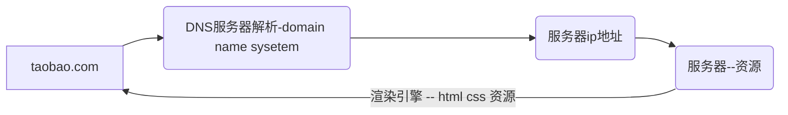
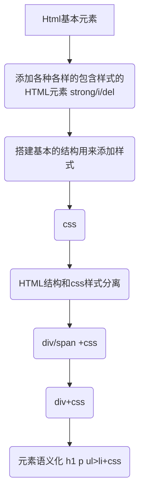

* **什么是网页**
    * 网页的专业术语叫做 <font color=#FF0000>Web Page</font>;
    * 打开浏览器<font color=#FF0000>查看到的页面</font>，是网络中的<font color=#FF0000>一“页”</font>；
    * 网页的内容可以非常丰富：包括<font color=#FF0000>文字、链接、图片、音乐、视频</font>等等
* **网站是什么呢？**
    * 网站是由<font color=#FF0000>多个网页组成</font>的；网站=网页+后端
    * 通常一个网站由N个网页组成（N >= 1）；

网页的显示过程 – 用户角度

1. 用户在浏览器<font color=#FF0000>输入一个网站</font>；
2. 浏览器会找到对应的<font color=#FF0000>服务器地址</font>，请求<font color=#FF0000>静态资源</font>（可以存放在世界上任何一个地方）；
3. 服务器<font color=#FF0000>返回静态资源给浏览器</font>；
4. 浏览器<font color=#FF0000>对静态资源进行解析和展示</font>；




**问题：静态资源来自哪里？**

1. <font color=#FF0000>开发项目</font>（HTML/CSS/JavaScript/Vue/React）
2. <font color=#FF0000>打包、部署项目</font>到服务器里面


**问题：服务器是什么？**

* 我们**日常生活**接触到的基本都属于**客户端、前端**的内容：
  * 比如<font color=#FF0000>浏览器、微信、QQ、小程序</font>； 
* 我们知道自己的**手机并不可能存放哪些多的数据和资源**：
  * 比如你用《网易云听音乐》，音乐数据大部分都是存在<font color=#FF0000>“服务器”</font>中的；
* **那么服务到底是什么呢？**
  * 服务器本质上也是<font color=#FF0000>一台类似于你电脑一样的主机</font>；
    * 但是这个主机有<font color=#FF0000>几个特点</font>：
        1. 二十四小时不关机的（稳定运行）；
        2. 没有显示器的；
        3. 一般装的是Linux操作系统（比如centos）；
* **那么我以后到公司是不是就看得见服务器了呢？**
  * 目前公司大部分用的是<font color=#FF0000>云服务器</font>（比如阿里云、腾讯云、华为云）；

## 网页的组成

Web标准要求页面实现：结构、表现、行为三层分离


**认识HTML**

* **超文本标记语言**（英语：HyperText Markup Language，简称：HTML）是一种用于创建网页的标准标记语言。
  * HTML元素是构建网站的基石；
* **什么是标记语言（markup language ）？**
  * 由无数个<font color=#FF0000>标记（标签、tag)</font>组成；
  * 是对<font color=#FF0000>某些内容进行特殊的标记</font>，以供其他<font color=#FF0000>解释器识别处理；</font>
  * 比如使用<font color=#FF0000><h2></h2></font>标记的文本会被识别为<font color=#FF0000>“标题”</font>进行<font color=#FF0000>加粗、文字放大</font>显示；
  * 由<font color=#FF0000>标签和内容</font>组成的称为<font color=#FF0000>元素（element）</font>
* **什么是超文本（ HyperText ）呢？**
  * 表示不仅仅可以插入<font color=#FF0000>普通的文本(Text)</font>，还可以插入<font color=#FF0000>图片、音频、视频</font>等内容；
  * 还可以表示<font color=#FF0000>超链接（HyperLink）</font>，从一个网页跳转到另一个网页；

### HTML页面固定结构

* 网页类似于一篇文章：
  * 每一页文章内容是有固定的结构的，如：开头、正文、落款等……
* 网页中也是存在固定的结构的，如：整体、头部、标题、主体
* 网页中的固定结构是要通过特点的 <font color=#FF0000>HTML标签</font> 进行描述的


### 认识元素

* 我们会发现HTML本质上是由一系列的元素（Element）构成的；
* **什么是元素（Element）呢？**
  * <font color=#FF0000>元素</font>是网页的一部分；
  * 一个元素可以<font color=#FF0000>包含一个数据项，或是一块文本，或是一张照片，亦或是什么也不包含</font>；

* **那么HTML有哪些元素呢？**
  * https://developer.mozilla.org/zh-CN/docs/Web/HTML/Element
* 我们会发现元素非常非常的多，这么多能记得住吗？
  * 常用的，用的多自然就记住了；
  * 不常用的，知道在哪里查找即可；
### 元素的组成
**剖析一个HTML元素的组成：**


* 这个元素的主要部分有：
  <font color=#FF0000>1. 开始标签（Opening tag）</font>：包含元素的名称（本例为 p），被左、右尖括号所包围。表示元素从这里开始或者开始起作用 ——
  在本例中即段落由此开始。
  <font color=#FF0000>2. 结束标签（Closing tag）</font>：与开始标签相似，只是其在元素名之前包含了一个斜杠。这表示着元素的结尾 —— 在本例中即段落
  在此结束。初学者常常会犯忘记包含结束标签的错误，这可能会产生一些奇怪的结果。
  <font color=#FF0000>3. 内容（Content）：</font>元素的内容，本例中就是所输入的文本本身。
  <font color=#FF0000>4. 元素（Element）</font>：开始标签、结束标签与内容相结合，便是一个完整的元素。
  alt+shift+下箭头=复制当前行
### 元素的属性

元素也可以拥有属性（Attribute）：


* 属性包含元素的额外信息，这些信息不会出现在实际的内容中。
* **一个属性必须包含如下内容**：
  <font color=#FF0000>1. 一个空格</font>，在属性和元素名称之间。(如果已经有一个或多个属性，就与前一个属性之间有一个空格。)
  <font color=#FF0000>2. 属性名称</font>，后面跟着一个等于号。
  <font color=#FF0000>3. 一个属性值</font>，由一对引号“ ”引起来。

* 创建一个超链接元素a：


### 属性的分类
* 有些属性是公共的，每一个元素都可以设置
  * 比如class、id、title属性
* 有些属性是元素特有的，不是每一个元素都可以设置
  * 比如meta元素的charset属性、img元素的alt属性等
* 不用去记忆，后续学到的时候自然就知道了
### 单标签元素 – 双标签元素
* 双标签元素：我们会发现前面大部分看到的元素都是双标签的；
  * `html、body、head、h2、p、a`元素；
* 单标签元素：也有一些元素是只有一个标签；
* `br、img、hr、meta、input`；


* 注意事项：
* HTML元素不区分大小写，但是推荐小写


### 认识URL

* URL代表着是**统一资源定位符**
* 通俗点说:URL无非就是一个给定的**独特资源**在Web上的**地址**
  * 理论上说,每个有效的URL都指向一个唯一的资源
  * 这个资源可以是一个HTML页面,一个CSS文档,一副图像,等等;


* URL的标准如下:


**端口号**:对应服务器提供具体服务的应用程序

**查询:** 服务器的额外参数

**片段ID:** 跳动到指定锚点(网页位置)

### 和URL的区别


## HTML的元素
### 结构元素
**一个完整的HTML结构包括哪几部分呢？**

* 文档声明  `<!DOCTYPE html>`

  * HTML文档声明，告诉浏览器当前页面是**HTML5页面**；

  * 让浏览器用**HTML5的标准去解析识别**内容；

  *  必须放在**HTML文档的最前面，不能省略**，省略了会出现兼容性问题；
  * HTML5的文档声明比HTML 4.01、XHTML 1.0简洁非常多(了解即可)

#### html元素

* html元素
  ✓ head元素
  ✓ body元素


* `<html>` 元素 表示一个 HTML 文档的根（顶级元素），所以它也被称为根元素。

  * 所有其他元素必须是此**元素的后代**。

  

* W3C标准建议为html元素增加一个**lang属性**，作用是

  * 帮助**语音合成工具**确定要使用的发音;
  * 帮助**翻译工具**确定要使用的翻译规则;

* 比如常用的规则：

  * **lang=“en”** 表示这个HTML文档的语言是英文；

  * **lang=“zh-CN**”表示这个HTML文档的语言是中文；

#### head元素

* **HTML head 元素** 规定文档相关的**配置信息（也称之为元数据）**，包括文档的**标题**，**引用的文档样式**和**脚本**等。

  * 什么是元数据（meta data），是描述数据的数据；
  * 这里我们可以理解成对**整个页面的配置**：

  

*  **常见的设置有哪些呢？一般会至少包含如下2个设置**。

* 网页的标题：**title元素**

  

* 网页的编码：**meta元素**

  * 可以用于设置网页的**字符编码**，让浏览器更精准地显示每一个文字，**不设置或者设置错误会导致乱码**；
  * 一般都使用**utf-8编码**，涵盖了世界上几乎所有的文字；

  

#### body元素

* body元素里面的内容将是你在浏览器窗口中看到的东西，也就是网页的具体内容和结构。
  * 之后学习的**大部分HTML元素都是在body中编写**呈现的；


HTML元素本身很多，但是常用的元素就是那么几个。

* https://developer.mozilla.org/zh-CN/docs/Web/HTML/Element
* 我们只需要记住**常用**的，不常用的学会查看文档即可；

### 常见元素

#### h元素

在一个页面中通常会有一些比较重要的文字作为标题，这个时候我们可以使用h元素。

* `<h1>–<h6> `标题 (Heading) 元素呈现了六个不同的级别的标题

  * Heading是头部的意思，通常会用来做标题
  * `<h1> 级别最高，而 <h6> 级别最低。</h1>`==原理h不同级别分别设置了CSS==

  

  * 注意：**h元素通常和SEO优化有关系**（什么是SEO，后续再介绍）

#### p元素

* 如果我们想表示一个**段落**，这个时候可以使用**p元素。**

* HTML `<p>`元素（或者说 HTML 段落元素）表示文本的一个段落。

  * p元素是paragraph单词的缩写，是**段落、分段**的意思；
  * p元素多个段落之间会有一定的**间距**；

  

#### img元素

* 我们应该如何告诉浏览器来显示一张图片呢？使用**img元素**。

* HTML  元素将一份**图像嵌入文档**。

  * img是image单词的所以，是**图像、图像**的意思；

  * 事实上img是一个==可替换元素（replaced element ）==；

  

* img有两个常见的**属性**：

  * **src属性**：source单词的缩写，表示源
    ✓ 是必须的，它包含了你想嵌入的图片的文件路径。
  * **alt属性**：不是强制性的，有两个作用
    ✓ 作用一：当图片加载不成功（错误的地址或者图片资源不存在），那么会**显示这段文**本；
    ✓ 作用二：屏幕阅读器会将这些描述读给需要使用阅读器的使用者听，让他们知道图像的含义； 
	- referrerpolicy:设置成`no-referrer`: 请求不附带Referer header，可以强制拿取一些网站的图片
```html
 
<!--  -->
<!-- alt是替换文本，图片加载失败才显示 -->
<!-- src标签属性 ./相对路径 title鼠标悬停才显示 -->
<!-- 只调节一个度 默认等比例 -->
```

* 设置img的src时，需要给图片设置路径：

  * **网络图片**：一个URL地址（后续会专门讲URL）；
    ✓ 网络图片的设置非常简单，给一个地址即可；
  * **本地图片**：本地电脑上的图片，后续会和html一起部署到服务；

* 本地图片的路径有两种方式：

  * 方式一：**绝对路径**（几乎不用）；
    ✓ 从电脑的根目录开始一直找到资源的路径；

  

  * 方式二：**相对路径**（常用）；
    ✓ 相当于当前文件的一个路径；
    ✓ . 代表当前文件夹（1个.），可以省略
    ✓ .. 代表上级文件夹（2个.）

  

* 对于网页来说，不管什么操作系统（Windows、Mac、Linux），路径分隔符都是 /，而不是 \

#### a元素(超链接)

* 网页中我们经常需要**跳转**到另外一个链接，这个时候我们使用a元素；

* HTML `<a>` 元素（或称锚（anchor）元素）：
  * 定义**超链接**，用于打开新的**URL**；
* a元素有两个常见的属性：
  * **href**：Hypertext Reference的简称
    - 指定要打开的URL地址；
    - 也可以是一个本地地址；
  * **target**：该属性指定在何处显示链接的资源。
    - `_self`：默认值，在当前窗口打开URL；
    - `_blank`：在一个新的窗口中打开URL；
    - 其他不常用, 后面iframe可以讲一下；
* 锚点链接可以实现：跳转到网页中的**具体**位置 ^miaodian
* 锚点链接有两个重要步骤：
  * 在要跳到的元素上定义一个**id属性**；
  * 定义a元素，并且a元素的**href指向对应的id**；


**其他URL地址**

*  a元素一定是用来跳转到新网页的么？

  * https://github.com/coderwhy/HYMiniMall/archive/master.zip

  * mailto:12345@qq.com

```html
<a href=" https://github.com/coderwhy/HYMiniMall/archive/master.zip">下载zip包</a>
<a href="mailto:12345@qq.com">发邮件到12345邮箱</a>
```

#### iframe元素

* 利用iframe元素可以实现：在一个HTML文档中**嵌入其他**HTML文档
* frameborder属性
  * 用于规定是否显示边框
    ✓ 1：显示
    ✓ 0：不显示
* a元素target的其他值:
  * _parent：在父窗口中打开URL
  * `_`top：在顶层窗口中打开URL

#### div、span元素

* 在HTML中有两个特殊的元素div元素、span元素：
  * **div元素**：division，分开、分配的意思；
  * **span元素**：跨域、涵盖的意思；
* 这两个元素有什么作用呢？**无所用、无所不用**。
  产生的历史：
  * 网页的发展早期是没有**css**，这个时候我们必须通过**语义化元素**来告知浏览器一段文字如何显示；
  * 后来出现了css，结构和样式需要**分离**，这个时候html只需要负责**结构**即可；
  * 比如h1元素可以是一段普通的文本+CSS修饰样式；
  * 这个时候就出现了d**iv、span来编写HTML结构所有的结构，样式都交给css来处理**；
* 所以，理论上来说：
  * 我们的页面可以没有**div、span**；
  * 我们的页面也可以**全部都是div、span**；



**div元素、span元素的区别**

* div元素和span元素都是“**纯粹的” 容器**，也可以把他们理解成“**盒子**”，它们都是用来**包裹内容**的；

* div元素：多个div元素包裹的内容会在==不同的行==显示；
  - 一般作为其他元素的**父容器**，把其他元素包住，代表一个整体
  - 用于把网页分割为多个独立的部分
  - 本质是通过[[display-block]]

* span元素：多个span元素包裹的内容会在==同一行==显示；

  ✓ 默认情况下，跟普通文本几乎没差别
  ✓ 用于区分**特殊文本**和普通文本，比如用来显示一些关键字

### 不常用元素
#### video元素
- video元素：定义视频。支持的音频格式:MP4，WebM、OGG
	```html
	<video src="./video.mp4" controls autoplay muted></video>
	<!-- muted 静音播放 谷歌浏览器 自动播放必须静音 -->
	```
	- src:规定视频的 URL
	- controls:显示播放控件
#### audio元素
- audio:定义音频。支持的音频格式:MP3、WAV、OGG
	```html
		<audio src="./music.mp3" controls autoplay loop></audio>
		<!-- controls 显示播放控件 loop 循环播放 -->
	```
	- src:规定音频的 URL
	- controls:显示播放控件
#### strong元素
* **strong元素**：内容加粗、强调；
  * 通常加粗会使用css样式来完成；
  * 开发中很偶尔会使用一下；
#### i元素
* **i元素**：内容倾斜；
  * 通常斜体会使用css样式来完成；
  * 开发中偶尔会用它来做字体图标（因为看起来像是icon的缩写）；
```css
ul > li .icon {
      position: relative;
      top: 2px;
      left: 4px;
      display: inline-block;
      width: 16px;
      height: 16px;
      background-image: url(../images/new_icon.svg);
    }
```
#### code元素
* **code元素**：用于显示代码
  * 偶尔会使用用来显示等宽字体；
#### br元素
* **br元素**：换行元素
  * 开发中已经不使用；
#### center元素
* **center元素**：定义文本居中
* 更多元素详解，查看MDN文档：

## 列表标签
### 1.列表的应用场景
- 场景:在网页中按照行展示关联性的内容，如:新闻列表、排行榜、账单等
- 特点:按照行的方式，整齐显示内容
- 种类:无序列表、有序列表、自定义列表
- 
### 2.无序列表
场景:在网页中表示一组无顺序之分的列表，如:新闻列表。标签组成:


|标签名| 说明 |
|:-:|:-:|
|`ul`| 表示无序列表的整体，用于包裹li标签 |
|`li`| 表示无序列表的每一项，用于包含每一行的内容 |

- 显示特点:
	- 列表的每一项前默认显示圆点标识
- 注意点:
	- ul标签中只允许包含li标签
	- li标签可以包含任意内容
### 3.有序列表
场景:在网页中表示一组有顺序之分的列表，如:排行榜。


| 标签名 | 说明 |
|:-:|:-:|
|`ol`| 表示有序列表的整体，用于包裹li标签 |
|`li`| 表示有序列表的每一项，用于包含每一行的内容 |

- 显示特点:
	- 列表的每一项前默认显示圆点标识
- 注意点:
	- ol标签中只允许包含li标签
	- li标签可以包含任意内容
### 4.自定义列表
场景:在网页的底部导航中通常会使用自定义列表实现。标签组成:


| 标签名 | 说明 |
|:-:|:-:|
|`dl`| 表示自定义列表的整体，用于包裹dt/dd标签 |
|`dt`| 表示自定义列表的主题 |
|`dd`| 表示自定义列表的针对主题的每一项内容 |

- 显示特点:
	- dd前会默认显示缩进效果
- 注意点:
- dl标签中只允许包含dt/dd标签
- dt/dd标签可以包含任意内容
### 列表的实现方式
- 事实上现在很多的列表功能采用了不同的方案来实现:
	- 方案一:使用`div`元素来实现(比如汽车之家,知乎上的很多列表)
	- 方案二:使用列表元素,使用元素语义化的方式实现;
- 事实上现在很多的网站对于列表元素没有很强烈的偏好，更加不拘一格,按照自己的风格来布局:
	- 原因我认为是列表元素默认的CSS样式,让它用起来不是非常方便;
	- 比如列表元素往往有很多的限制, ul/ol中只能存放li, li再存放其他元素;
	- 虽然我们可以通过重置来解决,但是我们更喜欢自由的div;
	**重置列表的默认样式**
```css
ul, body, h1, p,ol,li {
      list-style-type: none;//有序列表的序号样式设置
      padding: 0;
      margin: 0;
      list-style: none;//无序列表的样式
    }
```

代码逻辑
```
    1. 先完成结构
    2. 重置样式(body/a/ul)
    3. 先整体, 后局部
      * 顺序: 按照从外往里. 从上往下
    4. 去除重复的代码(css)
      * 将重复的逻辑放到一个单独的class中(.icon)
      * 不同的代码抽到不同的class(.new .hot)
```
cellspacing## 表格标签
### 表格的基本标签和相关属性
- 基本标签:

|标签名| 说明 |
|:-:|:-:|
|`table`|表格整体，可用于包裹多个`tr`|
|`tr`|表格单元格，可用于包裹内容,代表一行|
|`td`| 表格每一单元格的具体内容 |

- 表格相关属性
| 属性名 | 属性值     | 效果           |
|:-:|:-:|:-:|
|`border`| 数字       | 边框宽度       |
|`width`| 数字       | 表格宽度       |
|`height` | 数字       | 表格高度       |
|`cellspacing`|数字|单元格间距|
|`cellpadding`|数字|单元格内边距|

场景:在表格中表示整体大标题和一列小标题其他标签:

| 标签名 |名称| 说明                                                       |
|:-:|:-:|:-:|
| `caption` | 表格大标题    | 表示表格整体大标题，默认在表格整体顶部居中位置显示      |
| `th`     | 表头单元格    | 表示一列小标题，通常用于表格第一行，默认内部文字加粗并居中显示 |

- 注意点:
	- caption标签书写在table标签内部
	- th标签书写在tr标签内部（用于==替换td标签==)
### 表格的结构标签（了解)

场景:让表格的内容结构分组，突出表格的不同部分(头部、主体、底部），使语义更加清晰
**结构标签:**

| 标签名 | 名称     |
|:-:|:-:|
| `thead` | 表格头部 |
| `tbody` | 表格主体 |
| `tfoot` | 表格底部 |

以上是HTML表格中常见的三个部分。`thead`用于表示表格的头部，通常包含表格列的列名；`tbody`用于表示表
- 注意点:
	- 表格结构标签内部用于包裹tr标签
	- 表格的结构标签可以省略
- 示例代码：
	```html
	<table border="1">
	        <caption>
	            <h2>学生成绩单 </h2>
	        </caption>
	        <!-- caption表格大标题 位于table标签内部 -->
	        <thead>
	            <tr>
	                <th>姓名</th>
	                <th>成绩</th>
	                <th>评语</th>
	                <!-- th表头单元格  自动加黑-->
	            </tr>
	        </thead>
	        <tbody>
	            <tr>
	                <td>张三</td>
	                <td>100分</td>
	                <td>真棒，第一名</td>
	            </tr>
	            <tr>
	                <td>李四</td>
	                <td>97分</td>
	                <td>不错</td>
	            </tr>
	        </tbody>
	        <!-- tbodey 表格主体 -->
	        <tfoot>
	            <tr>
	                <td>总结</td>
	                <td>郎才女貌</td>
	                <td>郎才女貌</td>
	            </tr>
	        </tfoot>
	        <!-- tfoot 表格底部 -->
	</table>
	```
	


### 合并单元格
- 合并单元格步骤
	1. 明确合并哪几个单元格
	2. 通过左上原则，确定保留谁删除谁
		- 上下合并→只保留最上的，删除其他
		- 左右合并→只保留最左的，删除其他
	3. 给保留的单元格设置:跨行合并(rowspan）或者跨列合并(colspan)

|属性名| 属性值       |说明|
|:-:|:-:|:-:|
| `rowspan` | 合并单元格数 | 跨行合并，将多行单元格合并 |
| `colspan` | 合并单元格数 | 跨列合并，将多列单元格合并 |
- 注意点:
	- 只有同一个结构标签中的单元格才能合并，不能跨结构标签合并（不能跨: thead、tbody、tfoot)
	📢扩展
	`border-collapse: collapse`：相邻单元格的边框会合并成一个单一的边框，这样可以使表格看起来更连贯、更紧凑。在某些情况下，这也可以提高渲染性能。

## 表单标签
### input系列标签
input系列标签的基本介绍
场景:在网页中显示收集用户信息的表单效果，如∶登录页、注册页>


- 标签名:input
	- input标签可以通过<font color=#ff0000>type属性值的不同</font>，展示不同效果type属性值:
	标签名
- type属性值、

| 标签名称 | 输入类型 | 说明                         |
|:-:|:-:|:-:|
| `input`  | `type="text"`     | 单行文本，用于输入普通文本 |
| `input`  | `type="password"` | 密码框，用于输入密码       |
| `input`  | `type="radio"`    | 单选框，用于从多个选项中选择一个|
| `input`  | `type="checkbox"` | 多选框，用于从多个选项中选择多个|
| `input`  | `type="file"`     | 文件选择，用于上传文件      |
| `input`  | `type="submit"`   | 提交按钮，用于提交表单数据   |
| `input`  | `type="reset"`    | 重置按钮，用于重置表单数据   |
| `input`  | `type="button"`   | 普通按钮，默认无功能，之后配合js添加功能|
#### 文本框
场景:在网页中显示输入单行文本的表单控件type属性值:text
常用属性:

| 属性名称      | 说明                   |
|:-:|:-:|
|`placeholder`|占位符。提示用户输入内容的文本|
**(拓展)value属性和name属性作用介绍**
- value属性:用户输入的内容，提交之后会发送给后端服务器,url显示的值
- name属性:当前控件的含义，提交之后可以告诉后端发送过去的数据是什么含义
后端接收到数据的格式是:name的属性值= value的属性值
#### 密码框
场景:在网页中显示输入密码的表单控件type属性值:password
常用属性:

| 属性名称      | 说明                   |
|:-:|:-:|
|`placeholder`|占位符。提示用户输入内容的文本|

- 注意点:
	- type属性值不要拼错或者多加空格，否则相当于设置了默认值状态: text→文本框
- 示例代码
	```html
	你的用户名：<input type="text" value="陈佳辉" name="nickname" placeholder="请输入用户名">
	    <!-- value代表预输入的值 -->
	    <!-- placeholder 占位符 提示用户输入文本 -->
	    密码框：<input type="text" placeholder="请输入你的密码">
	    <br>
	```
	
#### 单选框
场景:在网页中显示<font color=#ff0000>多选一</font>的单选表单控件type属性值:radio
常用属性:

| 属性名称   | 说明                                         |
|:-:|:-:|
| `name`     |分组。有相同name属性值的单选框为一组|
| `checked`  |默认选中 |

- 注意点:
	- name属性对于单选框有分组功能
	- 有相同name属性值的单选框为一组，一组中只能同时有一个被选中
#### 复选框
场景:在网页中显示多选多的多选表单控件
常用属性（同单选框):

| 属性名称   | 说明                                         |
|:-:|:-:|
| `checked`  |默认选中|
- 示例代码及效果
	```html
	<p> 性别：<input type="radio" name="sex" checked> 男 <input type="radio" name="sex"> 女
	        <!-- 有相同name的属性值的单选框为一组 -->
	        <!-- checked 默认选中 -->
	</p>
	   请说出你的爱好运动（最多3个）：<input type="checkbox" name="hobby" > 篮球
	   <input type="checkbox" name="hobby" > 足球
	   <input type="checkbox" name="hobby" > 羽毛球
	   <input type="checkbox" name="hobby" > 排球
	   <input type="checkbox" name="hobby" > 乒乓球
	   <input type="checkbox" name="hobby" > 棒球
	```
	
	1.6 input系列标签-文件选择
	场景:在网页中显示<font color=#ff0000>文件选择</font>的表单控件
	type属性值:file
	常用属性:
	
|属性名称|说明|
|:-:|:-:|
| `multiple` |多文件选择|

1.7 input系列标签-按钮
场景:在网页中显示<font color=#ff0000>不同功能的按钮</font>表单控件type属性值:

| 标签名 | type属性值 | 说明                                           |
|:-:|:-:|:-:|
| `input`  | `submit`     | 提交按钮。点击之后提交数据给后端服务器           |
| `input`  | `reset`      | 重置按钮。点击之后恢复表单默认值                  |
| `input`  | `button`    | 普通按钮。默认无功能，之后配合js添加功能         |

- 注意点:
	- 如果需要实现以上按钮功能，需要配合form标签使用
	- form使用方法:用form标签把表单标签一起包裹起来即可
### button按钮标签
场景:在网页中显示用户点击的按钮
标签名: button
type属性值（同input的按钮系列):

| 标签名 | type属性值 | 说明                                    |
| :----: | :--------: | :-------------------------------------: |
| `button` | `submit`   | 提交按钮。点击之后提交数据给后端服务器    |
| `button` | `reset`    | 重置按钮。点击之后恢复表单默认值           |
| `button` | `button`   | 普通按钮。默认无功能，之后配合js添加功能 |

我们可以通过form标签知道button的不同属性的具体体现
```html
<form action="">
        用户名：<input type="text" placeholder="请输入你的用户名">
        <br> <br>
        密码：<input type="password" placeholder="请输入你的密码">
        <br> <br>
        <input type="submit" value="免费注册">
        <input type="reset">
        <input type="button" value="普通按钮">
    </form>
```
- 注意点:
	- 谷歌浏览器中button默认是提交按钮
	- button标签是双标签，更便于包裹其他内容:文字、图片等
### select下拉菜单标签
- 场景:在网页中提供多个选择项的下拉菜单表单控件标签组成:
	- select标签:下拉菜单的整体
	- option标签:下拉菜单的每一项 
- 常见属性:
	- selected:下拉菜单的默认选中
- 
### textarea文本域标签
- 场景:在网页中提供可输入多行文本的表单控件>标签名: textarea
- 常见属性:
	- cols:规定了文本域内可见宽度
	- rows:规定了文本域内可见行数 
- 注意点:
	- 右下角可以拖拽改变大小
	- 实际开发时针对于样式效果推荐用CSS设置
- 

### label标签
- 场景∶常用于绑定内容与表单标签的关系
- 标签名: label
- 使用方法1:
	1．使用label标签把内容（如:文本)包裹起来
	2. 在表单标签上添加id属性
	3. 在label标签的for属性中设置对应的id属性值
- 使用方法2:
	1. 直接使用label标签把内容（如:文本）和表单标签一起包裹起来
	2. 需要把label标签的for属性删除即可

```html
 性别：<input type="radio" id="nan" name="sex"> <label for="nan">男</label>
    <label > <input type="radio" name="sex"> 女</label>
```
### form标签
- **form通常作为表单元素的父元素:**
	- form可以将整个表单作为一个**整体**来进行操作;
	- 比如对整个表单进行**重置**;
	- 比如对整个表单的数据进行**提交**;
- form常见的属性如下:
	- `action`
		- 用于提交表单数据的==请求URL==
	- `method`
		- 请求方法(get和post)，默认是get
	- `target`
		- 在什么地方打开URL(参考a元素的target)
		**请求方式的对比**
		


📗扩展: ^postandget
1. **http协议**分为2类
	- 请求报文协议(浏览器发送给服务器的数据 )：
		- 请求行 
			1. 请求路径
			2. 请求方式
			3. 请求协议 / http
		- 请求头 
			- 都录以`key:yalue`组成的内容,描述的是客户端的一些信息。后台会跟据`key`获取`value`
		- 请求体
			- 存放的是浏览器客户端向服务器发送的请求参数或者数据
	- 响应报文协议(服务器发送给浏览器的数据)：
		- 响应行 
		- 响应头 
		- 响应体
	- 特点
		- 先有请求
		- 再有响应
		- 一个请求对应一个响应
2. 分别用get请求和post请求进行<font color=#ff0000>抓包</font>(对浏览器和服务器之间的数据传输进行捕获和分析的过程)
	```html
	  <h2>GET请求</h2>
	  <form action="/getServlet" method="get">
	    用户名：<label>
	      <input type="text" name="username" value="zhangsan" />
	    </label><br>
	    密码：<label>
	      <input type="text" name="pwd" value="123" />
	    </label><br>
	    <input type="submit" value="提交" />
	  </form>
	  <h2>POST请求</h2>
	  <form action="/postServlet" method="post">
	    用户名：<label>
	      <input type="text" name="username" value="zhangsan" />
	    </label><br>
	    密码：<label>
	      <input type="text" name="pwd" value="123" />
	    </label><br>
	    <input type="submit" value="提交" />
	  </form>
	```
	
	在F12的网络中可以看到请求的报文,
	get请求的报文
	
	post请求的报文
	
	[[spring#^e462cf|post请求体的数据类型]]
	✍️get与post区别：
		1. get请求的请求参数位于请求的ur1后面
		`http://ip地址:端口号/资源?key=value&key=value&key=value`
		特点:
			1.不宏全
			2.只能传的字符数据,不能传输<font color=#ff0000>字节</font>数据(图片,视频等)
			3.具有大小限制
		2. post请求的请求参裁位于<font color=#ff0000>请求体</font>中。
			特点:
			1.安全
			2.可以传输较大教据,
			3.可以传输字节数据,一般用来提交form表单数据

**常见的HTTP请求头:**
- **Host**:表示请求的主机名
- **User-Agent**:浏览器版本，例如Chrome浏览器的标识类似Mozilla/5.0 ...Chrome/79，IE浏览器的标识类似Mozilla/5.0 (Windows NT ...) like Gecko;
- **Accept**:表示浏览器能接收的资源类型，如`text/*,image/*或者*/*表示所有;`
- **Accept-Language**:表示浏览器偏好的语言，服务器可以据此返回不同语言的网页;
- **Accept-Encoding**:表示浏览器可以支持的压缩类型，例如gzip, deflate等。


## 语义化标签

## HTML全局属性

* 我们发现某些**属性**只能设置在特定的元素中：
  * 比如img元素的src、a元素的href；
* 也**有一些属性是所有HTML都可以设置和拥有的**，这样的属性我们称之为 “**全局属性**（Global Attributes）”
  * 全局属性有很多：https://developer.mozilla.org/zh-CN/docs/Web/HTML/Global_attributes
* 常见的全局属性如下：
  * **id**：定义唯一标识符（ID），该标识符在整个文档中必须是唯一的。其目的是在==链接==（使用片段标识符），==脚本==或==样式==（使用 CSS）时**标识**元素。
  * **class**：一个以空格分隔的元素的类名（classes ）列表，它允许 CSS 和 Javascript 通过**类选择器**或者DOM方法来选择和**访问特定**的元素；
  * **style**：给元素添加**内联样式**；
  * **title**：包含表示与其所属元素相关**信息的文本**。 这些信息通常可以作为提示**呈现给用户**，但不是必须的。

## 字符实体

* 思考：我们编写的HTML代码会被浏览器解析。
* 如下代码是如何被解析的呢？
  * 如果你使用小于号（<），浏览器会将其后的文本解析为一个tag。
  * 但是某些情况下，我们确实需要编写一个小于号（<）；
  * 这个时候我们就可以使用字符实体；


* HTML 实体是一段以连字号（&）开头、以分号（;）结尾的文本（字符串）：
  * 实体常常用于显示保留字符（这些字符会被解析为 HTML 代码）和不可见的字符（如“不换行空格”）；
  * 你也可以用实体来代替其他难以用标准键盘键入的字符；


**常见字符实体**

|      |  描述  | 实体名称  | 实体编号 |
| :--: | :----: | :-------: | :------: |
|      |  空格  | `&nbsp;`  | `&#160;` |
| `<`  | 小于号 |   `&lt`   |  `&#60`  |
| `>`  | 大于号 |   `&gt`   |  `&#62`  |
| `&`  |  和号  |  `&amp`   | `&#38;`  |
| `"`  | 双引号 |  `&quot`  |  `&#34`  |
|`'`| 单引号 |  `&apos`  |  `&#39`  |
| `×`  |  乘号  | `&times`  | `&#215`  |
| `÷`  |  除号  | `&divide` | `&#247`  |

## 元素的语义化

* 元素的语义化：用正确的元素做正确的事情。
* 理论上来说，所有的HTML元素，我们都能实现相同的事情：


* 标签语义化的好处
  * 方便代码维护；
  * 减少让开发者之间的沟通成本；
  * 能让语音合成工具正确识别网页元素的用途，以便作出正确的反应；
  * 有利于SEO；

## SEO

* 搜索引擎优化（英语：search engine optimization，缩写为SEO）是通过了解搜索引擎的**运作规则**来调整网站，
  以及提高网站在有关搜索引擎内排名的方式。
* 蛋糕网站为例


* 在后续我们还会讲解SPA以及SSR相关的概念
  * 它们也有SEO、首屏渲染速度有关；
  * 到时候会具体补充；

## 字符编码

* 计算机是干什么的?
  * 计算机一开始发明出来时是用来解决数字计算问题的，后来人们发现，计算机还可以做更多的事，例如文本处理。
  * 但计算机其实挺笨的，它只“认识”010110111000…这样由0和1两个数字组成的二进制数字；
  * 这是因为计算机的底层硬件实现就是用电路的开和闭两种状态来表示0和1两个数字的。
  * 因此，计算机只可以直接存储和处理二进制数字。
* 为了在计算机上也能表示、存储和处理像文字、符号等等之类的字符，就必须将这些字符转换成二进制数字。
  * 当然，肯定不是我们想怎么转换就怎么转换，否则就会造成同一段二进制数字在不同计算机上显示出来的字符不一样的情况，因此必须得定一个统一的、标准的转换规则


## link元素

- link元素是<font color=#ff0000>外部资源链接</font>元素，规范了<font color=#ff0000>文档与外部资源</font>的关系
	- link元素通常是在head元素中
- 最常用的链接是<font color=#ff0000>样式表(CSS)</font> ;
	- 此外也可以被用来创建<font color=#ff0000>站点图标</font>（比如“favicon”图标);
- **link元素常见的属性:**
- <font color=#ff0000>href:</font>此属性指定被链接资源的URL。URL可以是绝对的，也可以是相对的。
- <font color=#ff0000>rel:</font>指定链接类型，常见的链接类型:[HTML 属性：rel - HTML（超文本标记语言） | MDN](https://developer.mozilla.org/zh-CN/docs/Web/HTML/Attributes/rel)
	- icon:站点图标;
	- stylesheet: CSS样式;
## 浏览器开发者工具


## 浏览器渲染的流程


浏览器的解析式逐行的，当解析到到CSS样式时，==一边加载CSS样式，一边解析下面的HTML==--解析的是树形的结构标签嵌套元素，这个树叫做`DOM Tree` 树中的每一个节点叫做`DOM Node`,等CSS解析后，记载后到每个`DOM Node`，这棵树就成了`Render Tree`,这才是浏览想要渲染的树。


浏览器渲染的流程包含以下几个步骤：

1. 解析 HTML 文件：浏览器从服务器接收到 HTML 文件后，会对其进行解析，形成 DOM 树。在解析 HTML 的过程中，如果遇到外部样式表和页面内嵌的样式，会发起新的请求去下载和解析 CSS 文件。

2. 解析 CSS 文件：当浏览器下载完外部样式表和页面内嵌的样式，就开始解析 CSS 文件，并将解析结果记录在内存中，在这个过程中，浏览器使用的是CSS解析器来生成CSS规则，CSS规则是由选择器和声明块组成的，每个声明块又由属性和值组成。

3. 创建渲染树：在构建完 DOM 树和解析完 CSS 文件之后，浏览器会将它们结合起来创建 Render Tree。Render Tree 是由 DOM 树中所有需要显示在屏幕上的节点与 CSS 样式表中相关样式信息组合而成的一棵树，但是这个过程中被忽略了一些不可见元素，如`<head>`标签内部的内容、隐藏的 DOM 元素等。

4. 布局和绘制：在生成了 Render Tree 之后，浏览器会根据**布局算法**计算出每个节点在屏幕上的位置，并确定每个节点的具体大小和渲染顺序。然后，浏览器会将每个节点绘制在屏幕上。

5. 浏览器执行 [[JavaScript：]]如果 HTML 文档中包含了 JavaScript 代码，则浏览器在 DOM 和 CSSOM 构建完成之后会执行 JavaScript 代码，可能会导致一些页面的重新渲染过程。同时，JavaScript 可以修改 DOM 或者 CSSOM 树，从而触发重新构建 Render Tree 和重绘，导致页面的变化。

6. 浏览器不断重绘和回流：当用户进行交互或者操纵页面时，经常需要调整元素的位置或大小，这就会导致浏览器重新计算页面中部分元素的尺寸和位置，即回流（Reflow），然后重新绘制这些元素，即重绘（Repaint）。因为回流和重绘是非常消耗计算资源的操作，所以应该尽量减少它们的发生次数，避免出现性能问题。
